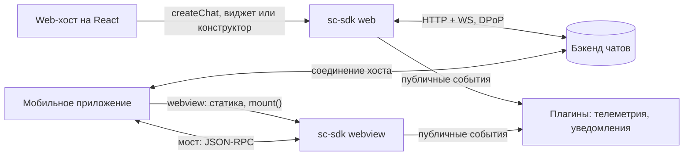
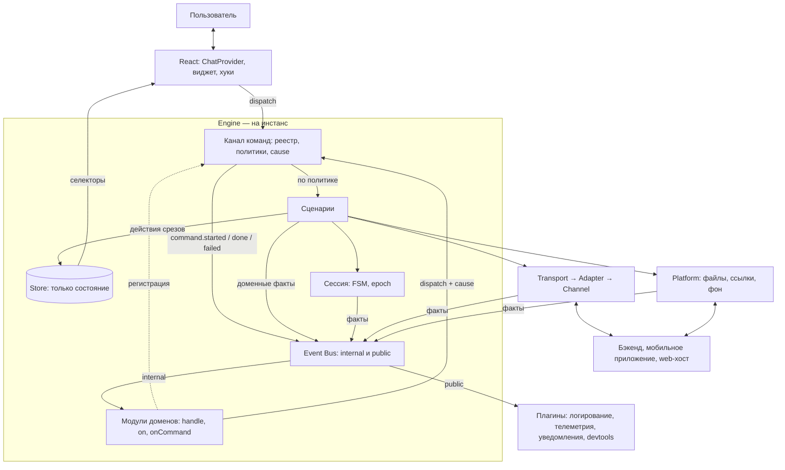
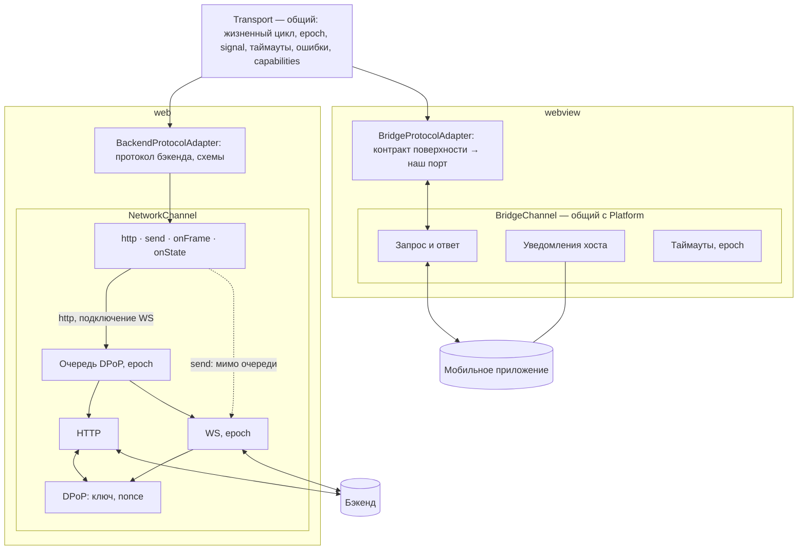
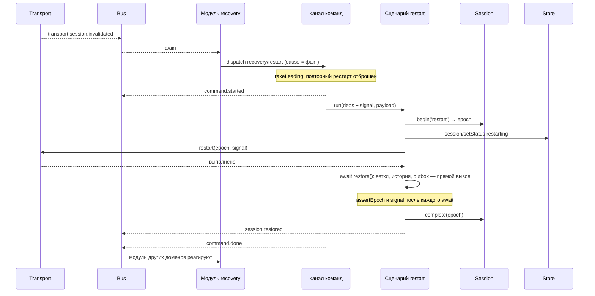

# sc-sdk: архитектура

> Рабочий документ. Версия 5 от 05.10.2026: модули доменов, канал команд без результата, политики-описатели, факты жизненного цикла команд, `signal` во всех операциях транспорта.
> Пометки: **[решено]** — подтверждено командой; **[предложение]** — рекомендация, ждёт ADR или проверки на скелете; **[вопрос N]** — зависит от ответа из раздела 20.
> Прежние версии — `archive/`. Контракт транспорта — `contracts/transport.md`. ТЗ на скелет — `specs/demo-skeleton.md`. Отклонённые варианты — раздел 18.

## 1. Контекст и ограничения

- sc-sdk — платформа чатов, встраиваемая в продукты разных поверхностей.
- Поставка **[решено]**: готовый виджет и конструктор (хуки и компоненты).
- Два режима **[решено]**:
  - **web** — React-библиотека, React в `peerDependencies`, хосты только на React. SDK сам работает с бэкендом по HTTP + WS с DPoP;
  - **webview** — статика внутри мобильного приложения, React в бандле, `mount()`. Единственный рабочий режим — relay: хост держит соединение, SDK запрашивает у него доменные операции через мост и в сеть не ходит. Опции инициализации — только через мост.
- Ограничения **[решено]**: малый бандл (не подходят RTK + saga, RxJS, MobX); запрещён любой persist, включая IndexedDB; на команды хостов влиять нельзя; SDK в webview лежит статикой в приложении; телеметрия внешняя; SDD — spec-driven development.
- Стек **[решено]**: React 18, Zustand (v5), styled-components, TypeScript, ESLint, Vitest, Playwright.
- Браузеры: Chromium, Яндекс Браузер; в webview — WKWebView (WebKit) и Android System WebView.
- Команда: архитектор, тимлид, 2 middle. Всё, что требует постоянного сопровождения, вводим, только если окупается сразу.

## 2. Ключевые решения

1. **Engine** — инстанс ядра: стор, канал команд, шина, сессия, модули доменов. Создаётся `createEngine` на каждый инстанс; на уровне модуля ничего не живёт. Внешнее — через порты. **[решено]**
2. **Запись и чтение.** UI и подписки пишут только через `dispatch(type, payload)`, который ничего не возвращает; результат UI читает из стора селекторами. Хостам `await` не нужен: web-хост работает через компоненты и хуки, webview-хост — через мост. **[решено]**
3. **Сценарий — обычная функция `(deps, payload)`**; эффекты (вызовы портов) есть только в сценариях. Стор — только состояние: сценарий меняет его исключительно действиями срезов, `setState` ему недоступен по типу. Последовательность шагов внутри процесса — прямым вызовом функции другого сценария с `await`; `d.dispatch` только запускает независимую работу. **[решено]**
4. **Канал команд** — реестр «ровно один обработчик на команду», политика на обработчик, зависимости на вызов (`signal`, `cause`), факты жизненного цикла `command.started` / `done` / `failed`. **[решено]**
5. **Политики — описатели:** `takeEvery` (по умолчанию), `takeLatest`, `takeLeading`, `takeQueued`, `silent`. Описатель — данные, исполняет политику канал команд. **[решено]**
6. **Модули доменов** (`entities/*/model/domain.ts`, `features/*/model/domain.ts`): в `setup(ctx)` регистрируют обработчики (`ctx.handle`), подписки на факты (`ctx.on`) и на исходы чужих команд (`ctx.onCommand`); всё снимается `teardown`. Сущность слушает только факты сервисов и регистрирует свои команды; фича слушает доменные факты и исходы команд, вызывает чужие команды. **[решено]**
7. **Реестры типов через declaration merging** (`ChatState`, `ActionMap`, `DomainEventMap` в `shared/engine`): хуки и модули на любом слое FSD типизированы без импорта из `app`. **[решено]**
8. **Event Bus на инстанс** — наш интерфейс `Bus` (`emit`, `on`, `onAny`, `dispose`), реализация на nanoevents с изоляцией ошибок. `internal`: факты сервисов, доменные факты, факты команд; `public`: стабильная проекция для плагинов. **[решено]**
9. **Порты:** `Transport` (данные чата) и `Platform` (возможности окружения). В webview оба работают поверх одного `BridgeChannel`. Все операции транспорта принимают `signal`. **[решено]**
10. **Transport в три слоя:** общий `Transport` → адаптер чужого протокола (`BackendProtocolAdapter` / `BridgeProtocolAdapter`) → канал (`NetworkChannel` / `BridgeChannel`). Транспорт не видит стор и не подписывается на шину. **[решено]**
11. **Контракт моста публикует поверхность**; он один и согласованный. Мы держим копию его схем, адаптер-переводчик и consumer-driven набор проверок. **[решено]**
12. **Сессия** — машина состояний без ввода-вывода, epoch и single-flight. Ввод-вывод рестарта — в сценариях `recovery/*`. **[решено]**
13. **Структура файлов** — FSD без страниц: `app`, `widgets`, `features`, `entities`, `shared`; UI-кит в `shared/ui-kit`. **[решено]**
14. **Конфиг:** значения по умолчанию → удалённый → хост; хост может переписать что угодно. **[решено]**
15. **DevTools** — свой плагин: одна лента на инстанс (факты, команды с исходами и `cause`, действия срезов), только для чтения; в webview — встроенная debug-панель на тех же хуках. **[решено]**
16. **Проверка гипотез** — ходячий скелет с фейковым бэкендом по ТЗ `specs/demo-skeleton.md`; там же сравнение альтернатив для процессов (раздел 17.5). **[решено]**

## 3. Схемы

### 3.1. Контекст



### 3.2. Общая схема



Правила, которые видны на схеме:
- UI знает только `dispatch` и селекторы; `dispatch` ничего не возвращает.
- Эффекты — только в сценариях; стор меняется только действиями срезов.
- Сервисы (сессия, Transport, Platform) принимают вызовы и публикуют факты; на шину не подписываются, друг о друге и о сторе не знают.
- Подписки на шину — только в модулях доменов; подписка переводит факт в `dispatch` и ничего больше не делает.
- Плагины видят только `public` и ничего не пишут.
- Токены web-хост передаёт каналу транспорта в Composition Root, мимо движка.

### 3.3. Транспорт



### 3.4. Рестарт сессии (web)



В webview фазу «restart(epoch) → выполнено» делает хост и присылает `transport.session.restarted`; модуль `recovery` запускает `recovery/hostRestarted`, дальше всё одинаково.

## 4. Файловая структура: FSD без страниц **[решено]**

```
sc-sdk/
├─ contracts/                       документы контрактов (SDD) для людей: transport.md, platform.md, public-api.md
├─ specs/                           ТЗ: demo-skeleton.md
├─ adr/
├─ archive/                         прежние версии документов
├─ src/
│  ├─ app/
│  │  ├─ engine/                    createEngine, сборка стора, канал команд, шина, сессия, установка модулей и плагинов
│  │  ├─ entries/                   web.ts, webview.ts, dev.ts — Composition Root и публичный экспорт
│  │  ├─ plugins/                   logging, telemetry, host-notifications, devtools, debug-panel
│  │  └─ providers/                 ChatProvider
│  ├─ widgets/                      составные компоненты конструктора и виджет
│  │  ├─ feed/  composer/  thread-list/
│  │  └─ chat/                      виджет — сборка по умолчанию
│  ├─ features/                     пользовательские и междоменные сценарии и реакции
│  │  ├─ lifecycle/  recovery/  open-thread/  load-older/  send-message/  retry-message/  flush-outbox/  attach-file/
│  │  └─ composer-clear/            пример реакции на исход чужой команды: только domain.ts
│  ├─ entities/                     состояние домена и его реакции на факты сервисов
│  │  ├─ message/                   model/ (срез, мутаторы, селекторы, buildFeed, сценарии receive и ack, domain.ts), ui/, @x/
│  │  ├─ thread/  file/  banner/  config/  composer/
│  │  └─ session/                   model/ (публичный статус, реакции на соединение и фон, domain.ts), ui/
│  └─ shared/
│     ├─ engine/                    registry.ts (ChatState, ActionMap), events.ts (InternalEventMap, DomainEventMap, PublicEventMap, CommandFactMap),
│     │                             deps.ts, domain.ts (defineEntity, defineFeature, контексты), policies.ts (take*), bus.ts (интерфейс Bus),
│     │                             context.ts, hooks.ts
│     ├─ api/
│     │  ├─ transport/              port.ts, create-transport.ts, adapter.ts, errors.ts, network/, bridge/, mock/
│     │  ├─ platform/               port.ts, web/, bridge/
│     │  └─ bridge-channel/         транспорт моста — общий для transport и platform
│     ├─ contracts/                 схемы valibot: домен, протокол бэкенда, копия контракта моста
│     ├─ lib/                       emitter (nanoevents + изоляция), fsm, backoff, single-flight, timers, memoize-last, ids, clock, logger
│     └─ ui-kit/                    примитивы, тема — не знают о чате
├─ dev/fake-backend/                фейковый бэкенд в памяти (раздел 17)
└─ tests/                           contracts/, scenarios/, fuzz/, memory/, e2e/
```

Правила:
- Слои импортируют только вниз: `app` → `widgets` → `features` → `entities` → `shared`.
- Между слайсами одного слоя — только через `index.ts`; связки сущностей — через `@x` (FSD 2.1).
- Сегменты слайса: `ui`, `model`, `api`, `lib`.
- Сценарий и его регистрация живут в слое по смыслу: реакция одного домена на факты сервисов — `entities/<домен>/model`; пользовательское действие или работа с несколькими доменами — `features/<поведение>/model`. Префикс действия — домен (`message/receive`); у междоменных процессов свой префикс (`recovery/restart`, `lifecycle/start`, `outbox/flush`).
- Подписки на шину и регистрация обработчиков — только в `domain.ts` слайса, только внутри `setup(ctx)`.
- `zustand` разрешён только в `app/engine`, `entities/*/model` и `shared/engine/hooks.ts`.
- Прямые `fetch`, `XMLHttpRequest`, `WebSocket` — только в `shared/api/transport/network/channel.ts`.
- Транспорт и платформа видят только свои порты и `shared/contracts`.
- Изменяемые переменные верхнего уровня модуля, `create()` Zustand на уровне модуля и `setTimeout` мимо `d.timers` запрещены линтером.
- Проверка — Steiger и `eslint-plugin-boundaries`. Юнит-тесты лежат рядом с кодом, в `tests/` — то, что проверяет несколько модулей.

Если `@x` окажется неудобным на скелете — запасной вариант: раскладка по доменам (`messages/state.ts`, `scenarios.ts`, `domain.ts`, `hooks.ts`, `ui/`) с теми же правилами по ролям файлов.

## 5. Транспорт

### 5.1. Устройство **[решено]**

- **Порт** — один для обоих режимов, на языке домена: без HTTP, WS, DPoP и моста. Сценарии объявляют нужные части в `Pick<Deps, …>`.
- **Каждая операция принимает `signal`** (`opts?: { signal?: AbortSignal }`): отмена политикой `takeLatest`, `stop` или `dispose` реально прерывает запрос, а не только игнорирует результат.
- **Три слоя:**
  - `Transport` — одна реализация порта для обоих режимов (`createTransport(adapter)`): `not_started` и `disposed`, идемпотентные `start` и `restart`, таймауты, `signal`, отмена вызовов старого epoch, отбрасывание старых событий, приведение ошибок к `TransportError`, `capabilities`, публикация фактов `transport.*` в шину. Гарантии контракта проверяются один раз на нём.
  - **Адаптер чужого протокола** — переводит опубликованный кем-то контракт в наш порт: `BackendProtocolAdapter` (протокол бэкенда: эндпоинты, кадры, ack, `token_error` → refresh → `session.invalidated`) и `BridgeProtocolAdapter` (контракт моста поверхности). Интерфейс узкий: `call(op, params, ctx)` и `onEvent`.
  - **Канал** — доставка: `NetworkChannel` (очередь DPoP, HTTP, WS, epoch, переподключение) и `BridgeChannel` (запрос-ответ, уведомления, таймауты).
- **Транспорт не имеет доступа к стору и не подписывается на шину.** Влияет только через результаты вызовов, факты и ошибки с кодами.
- **Экземпляр на инстанс движка**, создаётся в Composition Root.
- Очередь DPoP с приоритетами и отменой — кандидат на `p-queue` вместо самописной; проверить совместимость отмены ожидающих задач с epoch на скелете **[предложение]**.

Полный контракт — `contracts/transport.md`.

### 5.2. API канала (web)

```ts
export interface NetworkChannel {
  /** Через очередь DPoP: строго по одному, расходует nonce. */
  http<T>(req: HttpRequest, opts: { priority: Priority }): Promise<T>;
  /** Мимо очереди: кадр по открытому сокету, nonce не трогает. Нет соединения → TransportError('not_connected'). */
  send(frame: WsFrame): void;
  onFrame(fn: (f: WsFrame) => void): () => void;
  onState(fn: (s: WsState) => void): () => void;
  /** Подключение WS — внутренняя задача очереди, завершается после DPOP_NONCE. */
  start(ctx: Ctx): Promise<void>;
  /** Отмена очереди, закрытие сокета, новое подключение через очередь. */
  restart(ctx: Ctx): Promise<void>;
  close(): void;
}
```

Путь каждого метода фиксирован, вызывающий его не выбирает. Правило маршрутизации — «трогает ли операция nonce» — записано комментарием рядом с кодом канала.

### 5.3. Единая очередь DPoP **[решено]**

- Через очередь: HTTP-запросы и подключения WS (включая переподключение). `DPOP_NONCE` приходит только после подключения и может сделать недействительным значение HTTP-запроса в полёте — поэтому очередь одна.
- Мимо очереди: кадры по открытому WS — proof для них не нужен. Сообщение пользователя не ждёт загрузок и истории; без соединения оно ждёт в outbox, а не в очереди.
- Приоритеты ожидающих задач: рестарт → подключение WS → refresh токена → ветки и история → загрузка файлов. Выполняющаяся задача не прерывается.
- Устаревший nonce: `token_error` в REST, `update_token_error` в WS — при единой очереди это ошибка SDK, логируется с номером звена. `token_error` → один refresh → повтор; повторный `token_error` или `update_token_error` → `session.invalidated` **[вопрос 37]**.
- Цена: долгая загрузка задерживает переподключение WS и входящие. Принять или отменять загрузку при обрыве — решаем на скелете.
- Длительности — User Timing во вкладке Performance.

### 5.4. Загрузка файлов

- Web: `<input type="file">` → `Blob` в сервисе файлов → multipart через очередь с низшим приоритетом, прогресс через `XMLHttpRequest` → `fileId` → кадр `UPLOAD_FILE_API_REQUEST` → `file.uploadConfirmed`.
- Webview **[допущение, вопрос 14]**: файл выбирает хост, в SDK приходит `{ kind: 'host', hostFileId, … }`, загрузку делает хост, прогресс и подтверждение — уведомлениями.
- Общее: `uploadId` задаёт SDK; отмена через `signal`; `capabilities.maxFileSizeBytes` проверяется до загрузки; срез файлов в сторе от режима не зависит.

### 5.5. Контракт моста **[решено]**

- **Издатель — поверхность.** Контракт один и согласованный между поверхностями и SDK; мы — потребитель **[вопросы 13, 17 закрыты]**.
- Следствия:
  - схемы моста в `shared/contracts` — наша копия опубликованного контракта, источник правды для них — документ поверхности, а не наш порт;
  - `BridgeProtocolAdapter` переводит методы, события и ошибки контракта в наш порт; домен и гарантии от формы контракта не зависят. Пока реального контракта нет, его форма в скелете совпадает с портом — это допущение;
  - версия контракта явная; SDK лежит статикой в приложении, поэтому совместимость фиксируется сборкой приложения, а SDK при старте проверяет версию и логирует расхождение. Необязательные операции — через `capabilities`;
  - epoch передаётся хосту при `start` и `restart` и возвращается в уведомлениях — если контракт это поддерживает; иначе адаптер эмулирует отбрасывание сам.
- **Consumer-driven набор:** список методов, полей и событий, на которые опирается SDK, плюс сценарии «запрос → ожидаемый ответ / событие» из фикстур фейкового хоста. Поверхность прогоняет набор перед изменением контракта. Диагностический режим SDK проверяет реальный трафик по схемам на debug-сборках.
- **Формат** **[предложение]**: при следующем согласовании предложить AsyncAPI 3 или JSON Schema как формат контракта — типы для мобильных платформ и сверка наших схем без ручного переноса. Имеет смысл, только если издатель ведёт документ сам **[вопрос 44]**. CloudEvents не нужен: формат событий задан контрактом.

## 6. Platform **[решено]**

Порт описывает не «что умеет хост», а «чем отличается окружение»:

```ts
export interface Platform {
  readonly capabilities: { customFilePicker: boolean; haptics: boolean };
  pickFiles(opts: PickOptions): Promise<FileRef[]>;
  openLink(url: string): void;
  openFile?(file: FileAttachment): void;
  on<K extends keyof PlatformEventMap>(type: K, fn: (e: PlatformEventMap[K]) => void): () => void;   // app.resumed, app.paused, network.changed
}
```

- **Web** — браузер: `<input type="file">`, `visibilitychange` и `pageshow`, `online` и `offline`, `window.open`. Необязательные переопределения из опций хоста: свой выбор файлов, перехват ссылок, просмотр вложений **[вопрос 40]**.
- **Webview** — методы платформы из контракта поверхности на общем `BridgeChannel`.
- Выбор файла — вызов с ответом, а не факт. Фактами в шину Platform публикует только жизненный цикл приложения и сеть.
- Что не относится к Platform: токены (зависимость канала транспорта), опции инициализации (аргумент `createChat`), уведомления хосту (плагин на публичных событиях).

## 7. Сессия **[решено]**

### 7.1. Зачем машина состояний

У сессии много источников событий в любом порядке: обрыв WS, `update_token_error`, `session.restarted` от хоста, `chat.restart()`, возврат из фона, истёкший refresh-токен, `dispose`. Флаги допускают невозможные сочетания и гонки (переподключение поверх рестарта, оживление после `dispose`, «готово» после `failed`). Таблица переходов решает их по построению: всё, чего нет в таблице, отбрасывается и логируется.

```ts
const transitions = {
  idle:         ['starting', 'disposed'],
  starting:     ['ready', 'failed', 'disposed'],
  ready:        ['reconnecting', 'restarting', 'disposed'],
  reconnecting: ['ready', 'restarting', 'failed', 'disposed'],
  restarting:   ['ready', 'failed', 'disposed'],
  failed:       ['starting', 'disposed'],
  disposed:     [],
} as const satisfies Record<SessionState, readonly SessionState[]>;
```

Дополнительно: один источник правды для статуса в UI; тесты таблицей без моков; таблица — готовая диаграмма. xstate не нужен. Та же техника — для статуса сообщения (`pending → sent | failed`, `failed → pending`). Больше машин состояний не вводим.

### 7.2. Устройство

- **Сессия без ввода-вывода:** переходы, epoch, single-flight. Методы `begin('start' | 'restart')`, `complete`, `fail`, `connection`, `stop`, `dispose`, `assertEpoch`; факт `session.status.changed` — в шину.
- **Ввод-вывод — в сценариях:** реакции на соединение и фон — в `entities/session` (`session/connectionChanged`, `session/resumed`); рестарт и восстановление — в `features/recovery` (`recovery/restart` по `transport.session.invalidated`, `recovery/hostRestarted` по `transport.session.restarted`, оба под `takeLeading`). Рестарт: `begin` → статус → `transport.restart(epoch, signal)` с backoff → `await restore()` прямым вызовом: ветки → история открытых веток с первой страницы (слияние по id) → outbox с теми же `clientMessageId` → `complete` → доменный факт `session.restored`. После каждого ожидания — `assertEpoch` и проверка `signal` (помощник `d.step`).
- Подписка `features/recovery` на сервисные факты `transport.session.*` — единственное явное исключение из правила «фичи слушают только доменные факты»; объявлено списком `serviceFacts` в `defineFeature` (9.5).
- Два уровня восстановления: `reconnecting` (WS с теми же учётными данными, делает канал) и `restarting` (полный рестарт). В webview рестарт делает хост и присылает `session.restarted`.
- Состояние `stopped` — обратимая остановка (StrictMode, размонтирование провайдера); `disposed` — окончательная.
- При рестарте клиентский стор не очищается. Статус сессии означает «соединение готово», загрузка истории видна по срезу `history`.

### 7.3. Epoch

Номер поколения сессии, растёт при каждом `start` и `restart`.
- Канал помечает им всё входящее: HTTP-запрос помнит поколение очереди, сокет — своё поколение, в webview epoch передаётся хосту и возвращается в уведомлениях. Старое отбрасывается, вызов отклоняется с `aborted_by_restart`.
- Сценарии проверяют epoch после каждого ожидания.
- Отмена (`AbortController`) останавливает то, что ещё можно остановить; epoch отбрасывает то, что не успели.
- В стор не попадает.

## 8. Авторизация (только web)

**[решено]**
- SDK генерирует пару ECDSA P-256 (`extractable: false`) и считает thumbprint по RFC 7638; эндпоинта регистрации ключа нет.
- Persist запрещён → ключ только в памяти, при каждом запуске новый.
- Значение цепочки одноразовое; источники — ответы HTTP и `DPOP_NONCE` по WS после подключения; proof для кадров по открытому WS не нужен.

**[предложение]**
- Привязка, вероятно, стандартная: proof несёт публичный ключ, сервер привязывает токен к thumbprint при выдаче. Кто получает стартовые токены — **[вопрос 1]**.
- Токены — зависимость канала: стартовые и новые при `auth_required` приходят из опций web-хоста в Composition Root, движок о них не знает.
- Плановое обновление access-токена: срок по монотонным часам (`performance.now()` + `expires_in`), задача очереди с высоким приоритетом за запас до истечения; донести до WS кадром обновления или переподключением **[вопрос 38]**. При возврате из фона — сначала проверить срок.
- Refresh — single-flight. Истёк refresh-токен → `failed` с причиной `auth_required` и колбэк хосту **[вопрос 39]**.
- Порядок в HTTP-цепочке: логирование → очередь → refresh при 401 → access-токен → DPoP-подпись → запрос.
- В логи — только номер звена цепочки, не значение.

## 9. Ядро: стор, сценарии, канал команд, шина, модули доменов, плагины

### 9.1. Стор **[решено]**

- Один Zustand-стор со срезами на инстанс (`createStore` из `zustand/vanilla` + контекст). Никаких `create()` на уровне модуля.
- **Только состояние:** действия срезов — синхронные `set(чистый мутатор)` через нашу фабрику действий, которая задаёт имя `домен/действие` и сообщает о действии плагину DevTools. Middleware `devtools` Zustand не используем — нужна одна лента с командами и фактами (14).
- Мутаторы — чистые функции; аргументы сериализуемы; реакции нескольких сущностей на один факт — композицией мутаторов в одном `set` через `@x` (атомарно).
- Сценарии видят стор как `{ getState(): ChatState }`: вызывают действия срезов, `setState` недоступен по типу. `setState` вне `app/engine` и `entities/*/model` запрещён линтером.
- Срезы: `session` (публичный статус), `config`, `threads`, `banner`, `messages` (порядок, метаданные, тексты, outbox, статусы), `history`, `files`, `clock`, `composer` (черновики — только в памяти **[решено]**), `ui`.
- Результаты команд для UI — в срезах: статус отправки сообщения, `loading` и `error` истории, статус сессии. Это замена возвращаемому значению `dispatch`.
- Вне стора: секреты (канал), очереди (сервисы), Blob файлов, производные данные (селекторы), локальное состояние компонентов (`useState`).
- Подписки на стор — только для вывода наружу (в плагинах), без вызова действий.

### 9.2. Сценарии и канал команд **[решено]**

```ts
// shared/engine/registry.ts — наполняется через declare module
export interface ChatState {}
export interface ActionMap {}
export type Dispatch = <T extends ActionType>(type: T, ...args: DispatchArgs<T>) => void;

// entities/message/model/receive.ts — обычная функция
export function receiveMessage(d: Pick<Deps, 'store' | 'events'>, p: { message: Message }) {
  if (d.store.getState().messagesActions.receive(p.message)) {
    d.events.emit('message.received', { threadId: p.message.threadId, messageId: p.message.id });
  }
}
declare module '@/shared/engine/registry' { interface ActionMap { 'message/receive': typeof receiveMessage } }
```

- **Сценарий** — обычная функция `(deps, payload) => Promise<R> | R | void`: без функций высшего порядка, классов и генераторов. Зависимости — узкие (`Pick<Deps, …>`).
- **`dispatch` ничего не возвращает:** ставит команду в канал. Результат для UI — в срезах (9.1); для других доменов — в факте `command.done` (`result` — возвращаемое значение сценария).
- **Последовательность — прямым вызовом.** Если шаг процесса должен завершиться до следующего, сценарий вызывает функцию другого сценария с `await` (`await restore(d, …)`): внешний процесс уже под своей политикой. `d.dispatch` из сценария — только запуск независимой работы в другом домене.
- **Канал команд** (около 40 строк поверх эмиттера):
  - реестр: ровно один обработчик на команду; дубль при регистрации и вызов без обработчика — ошибка;
  - политика обработчика (9.3);
  - зависимости на вызов: свой `signal`, `dispatch` с `cause` = id этой команды;
  - факты `command.started` перед запуском, `command.done` с результатом или `command.failed` с кодом после; отменённые и отброшенные вызовы `done` не публикуют, их исход виден только в DevTools;
  - причинная цепочка: глубина больше 5 или повтор типа в одной цепочке — ошибка в dev, лог в prod.
- **Полнота:** `createEngine` в dev сверяет зарегистрированные обработчики с ключами `ActionMap` (через список, который генерирует сборка, или тест); расхождение — ошибка.
- **Тесты сценариев** вызывают функцию напрямую и ждут её результат; канал команд для этого не нужен.
- **Цена:** на действие — `declare module` и `ctx.handle` в `domain.ts`; закрывается шаблоном и правилом SDD.

### 9.3. Политики-описатели **[решено]**

```ts
ctx.handle('message/receive', receiveMessage);                              // takeEvery по умолчанию
ctx.handle('thread/open', takeLatest(openThread));                          // новый вызов отменяет предыдущий через signal
ctx.handle('history/loadOlder', takeLeading(loadOlder, (p) => p.threadId)); // пока идёт — новые по тому же ключу отбрасываются
ctx.handle('recovery/restart', takeLeading(restart));                       // single-flight
ctx.handle('outbox/flush', takeQueued(flushOutbox));                        // строго по одному
ctx.handle('composer/setDraft', silent(setDraft));                          // не писать в DevTools
```

- Описатель — данные `{ run, concurrency, key?, silent? }`, без состояния; исполняет политику канал команд. Описатели комбинируются: `silent(takeEvery(setDraft))`.
- Обёрнутый сценарий — объект, его нельзя случайно вызвать напрямую в обход политики; голая функция остаётся доступной для тестов и прямых вызовов внутри процессов.
- Политика действует только при вызове через `dispatch`.
- Названия совпадают с redux-saga — знания переносятся в обе стороны.
- `race`, `fork`, каналы не вводим: «ack или таймаут» — `Promise.race` с `signal` внутри сценария; ожидание с отменой — `d.step(promise)`.

### 9.4. Event Bus **[решено]**

```ts
// shared/engine/bus.ts — наш интерфейс; реализация — nanoevents с изоляцией ошибок
export interface Bus {
  emit<K extends keyof Facts>(type: K, payload: Facts[K]): void;
  on<K extends keyof Facts>(type: K, fn: (payload: Facts[K], meta: { id: string }) => void): () => void;
  onAny(fn: (fact: Fact<Facts>) => void): () => void;
  dispose(): void;
}
type Facts = InternalEventMap & DomainEventMap & CommandFactMap;   // + отдельный public с PublicEventMap
```

Правила:
1. В шине только факты — о том, что произошло. Команды идут через канал команд, а не через шину.
2. Сервисы публикуют только `transport.*`, `platform.*`, `session.*`; сценарии — доменные факты (`d.events` типизирован по `DomainEventMap`) и публичные события; канал команд — `command.*`.
3. Подписываются только модули доменов в `setup(ctx)` и плагины на `public`; сервисы и сценарии на шину не подписываются.
4. Защита от циклов — причинная цепочка `cause` в канале команд.
5. Эмиттер на инстанс; каждая подписка обёрнута в `try/catch` с логированием; `dispose` очищает подписки.
6. Имена: `домен.сущность.прошедшее_время`; в событиях нет текстов сообщений и токенов.
7. При подключении RxJS меняется только реализация `Bus` (`Subject` вместо nanoevents, плюс `facts$`/`ofType` для цепочек операторов); модули доменов и канал команд не меняются.

### 9.5. Модули доменов **[решено]**

```ts
// entities/message/model/domain.ts — свои команды, только факты сервисов
export const messageEntity = defineEntity('message', (ctx) => {
  ctx.handle('message/receive', receiveMessage);
  ctx.handle('message/ack', ackMessage);
  ctx.on('transport.message.received', ({ message }, { dispatch }) => dispatch('message/receive', { message }));
  ctx.on('transport.message.acked', ({ ack }, { dispatch }) => dispatch('message/ack', { ack }));
});

// features/recovery/model/domain.ts — исключение объявлено списком
export const recovery = defineFeature('recovery', { serviceFacts: ['transport.session.invalidated', 'transport.session.restarted'] as const }, (ctx) => {
  ctx.handle('recovery/restart', takeLeading(restart));
  ctx.handle('recovery/hostRestarted', takeLeading(hostRestarted));
  ctx.on('transport.session.invalidated', ({ reason }, { dispatch }) => dispatch('recovery/restart', { reason }));
  ctx.on('transport.session.restarted', ({ epoch }, { dispatch }) => dispatch('recovery/hostRestarted', { epoch }));
});

// features/composer-clear/model/domain.ts — реакция на исход чужой команды
export const composerClear = defineFeature('composer-clear', {}, (ctx) => {
  ctx.onCommand('message/send', 'started', ({ payload }, { dispatch }) => dispatch('composer/clear', { threadId: payload.threadId }));
});
```

- **Контекст регистрации `ctx`** живёт только внутри `setup`: `handle`, `on`, `onCommand`. Своего `dispatch` у `ctx` нет — при сборке модуль ничего не запускает, поэтому порядок установки модулей не важен. `dispatch` приходит вторым аргументом реакции, уже с `cause` = id факта.
- **Сущность (`defineEntity`)** регистрирует только свои команды (префикс домена) и слушает только факты сервисов. Междоменная подписка в сущности не компилируется.
- **Фича (`defineFeature`)** регистрирует свои команды, слушает доменные факты и исходы чужих команд (`onCommand`, по умолчанию `done` и `failed`; `started` — для оптимистичного UI), вызывает любые команды. Сервисные факты — только из явного списка `serviceFacts`.
- **В реакции нет логики и состояния:** подписка, перекладка полей, `dispatch`. Условия и счётчики — в срезах и мутаторах, время — в сценариях через `d.timers`.
- **Факт команды или доменный факт.** Если смысл — «в домене что-то произошло» независимо от источника — нужен явный доменный факт (`message.received`). Если смысл — «завершилась конкретная операция» — факт команды (`thread/open done`). Подписка на исход — реакция, а не шаг процесса.
- `app/engine` устанавливает модули из `index.ts` слайсов (`installModule` на инстанс) и снимает всё при `dispose`. Карта «факт → команда» — скрипт `routes:map`, данные пишет `ctx.on` при регистрации; часть ревью для PR с новыми подписками.
- Тесты: каждый `domain.ts` — на фейковой шине со шпионом на `dispatch`.

### 9.6. Плагины **[решено]**

```ts
export interface EnginePlugin {
  name: string;
  setup(ctx: { events: { on: PublicBus['on']; onAny: PublicBus['onAny'] }; select<T>(sel: (s: ChatState) => T): T; logger: Logger }): () => void;
}
```

- Встроенные: `logging`, `telemetry`, `host-notifications` (web — колбэки из опций; webview — через мост), `devtools` и `debug-panel` (только dev и debug-сборки; получают служебные хуки движка, 14).
- Плагины только читают; не вызывают `dispatch`; не зависят друг от друга и от порядка; ошибки изолированы.

### 9.7. Перерисовки

- Селектор возвращает примитив, ссылку из стора или мемоизированный результат; несколько полей — `useShallow`; производные — именованный мемоизированный селектор (reselect пока не используем).
- Мутаторы сохраняют ссылки на неизменённые части; строки ленты — `memo` с примитивными пропсами; частые обновления (прогресс) троттлятся.
- Проверка — пачка из 50 сообщений в скелете.

### 9.8. Жизненный цикл и память **[решено]**

- Всё создаётся в `createEngine` на инстанс: стор, шина, канал команд, сессия, транспорт, платформа, модули доменов, плагины, таймеры. На уровне модуля нет изменяемого состояния.
- `ChatProvider` создаёт движок один раз (`useState(() => createEngine(...))`) и кладёт ссылку в контекст; эффект делает `start` и `stop`. `dispose` снимает модули и подписки, закрывает каналы и таймеры, отменяет текущие команды через их `signal` — после него движок полностью собирается сборщиком мусора.
- Таймеры — только через `d.timers` (снимаются при `stop` и `dispose`).
- Проверка — тест утечек: 500 циклов `createEngine → start → отправка → dispose` в Node с `--expose-gc`; `FinalizationRegistry` подтверждает сбор всех движков, число слушателей на `window` и `document` и активных таймеров возвращается к исходному.

## 10. Чтение и публичный API

- Внутри SDK — стандартный Zustand: `useChatStore(selector)` через контекст, именованные селекторы рядом со срезами. Собственной абстракции над подпиской нет.
- Хуки сущностей и фич (`useThread`, `useFeed`, `useMessage`, `useComposer`, `useSessionStatus`) возвращают уже выбранные значения и стабильные действия (`useCallback` над `dispatch`). Действия ничего не возвращают — `await` хостам не нужен **[решено]**; результат виден в возвращаемых значениях хука (статус сообщения, `loading`, `error`). Методы-селекторы в возвращаемом объекте запрещены (правила хуков).
- Для хостов **[предложение]**: виджет (`<Chat />`, `mount(el)`), составные компоненты (`widgets/*`), именованные хуки. `useChatStore`, `dispatch` и `ChatState` наружу не уходят. Экспорт — явным списком в `app/entries`, отчёт api-extractor в репозитории.
- Опции читаются при создании движка. Новые опции — смена `key` у провайдера; на лету — только белый список (`chat.update({ theme, locale })`).
- Публичные события для хостов — через плагин уведомлений.

## 11. Лента

- Группировка по дням — проекция `buildFeed(order, meta, view): FeedRow[]`, мемоизированный селектор; плоский список под виртуализацию, стабильные ключи, в строке только id.
- В полночь меняются только подписи разделителей; на часы подписан только разделитель. Тикер до полуночи + перепроверка по `app.resumed`.
- Серверного времени нет — время устройства. Относительное время — общий тикер для видимых меток.
- Якорение скролла при подгрузке вверх; выбор виртуализатора — на скелете.
- Разделители или сворачивание, часовой пояс — **[вопрос 22]**.

## 12. Конфиг

1. Константы сборки — подставляет бандлер.
2. Опции инициализации — разбираются строго в `createChat`, неизменяемы; в webview — только через мост.
3. Удалённый конфиг — разбирается терпимо, итог в срезе `config`.
4. Состояние сессии — не конфиг.

- Приоритет **[решено]**: значения по умолчанию → удалённый → хост; хост может включить выключенное сервером, SDK логирует расхождение.
- Доступность = флаг ∧ возможность платформы — одна чистая функция.
- На лету — только белый список (`chat.update({ theme, locale })`).
- Старт webview: `mount()` → ожидание моста → `init.getOptions` с таймаутом → `createChat`; нет ответа — экран ошибки.

## 13. Код **[решено]**

- Чистые функции — мутаторы, селекторы, `buildFeed`, `resolveConfig`, мапперы, таблицы переходов. Время и id — аргументами.
- Эффекты — только сценарии; сервисы (каналы, сессия, платформа) — тонкие объекты на инстанс, зависимости — параметрами, фабрики вместо классов (исключение — `TransportError`) **[вопрос 35 закрыт]**.
- DI без контейнера: ручная сборка в `createEngine`; сценарии получают зависимости первым аргументом, модули доменов — контекст регистрации.
- Хуки — только клей; `useEffect` — только для DOM и жизненного цикла движка в провайдере.
- Тесты: чистые функции — таблицами; сценарии — прямым вызовом с фейковым бэкендом; `domain.ts` — на фейковой шине; канал команд — тестами политик; хуки почти не тестируются; UI — компонентные тесты и Playwright с WebKit; утечки — отдельным тестом (9.8).

## 14. Отладка

- **Redux DevTools — одна лента на инстанс** через свой плагин `devtools` (соединение `sc-sdk:<instanceId>`):
  - факты `internal` с `id`;
  - команды: `▶ start` и `■ done | failed | superseded | deduplicated` с `cause`, `id`, длительностью;
  - действия срезов с состоянием после них.
  Порядок записей сохраняется, поэтому цепочка читается целиком: `• transport.session.invalidated → ▶ recovery/restart → session/setStatus … → ■ recovery/restart done → • session.restored`.
- Источник — служебные хуки движка (`onSliceAction`, `onCommandStart`, `onCommandEnd`, `bus.onAny`); маскирование текстов и токенов — в плагине; `silent`-команды не пишутся; `latency: 100` для пачек.
- **Только чтение:** `JUMP_TO_STATE` и `IMPORT_STATE` игнорируются — транспорт, сессия, очередь и таймеры вне стора и не откатываются. В демо откат можно разрешить флагом с предупреждением.
- Не пишутся в ленту: публичные события (дубль фактов), кадры WS и очередь DPoP — для них логгер `sc:transport` и User Timing; при необходимости — отдельное соединение `sc-sdk:transport:<id>` по флагу.
- **Webview:** расширения Redux DevTools там нет. Основной вариант — плагин `debug-panel` в debug-сборке: та же лента поверх чата на тех же хуках. Запасные — удалённые DevTools (`@redux-devtools/remote`) и Safari Web Inspector / `chrome://inspect` для консоли.
- `routes:map` — карта «факт → команда» для ревью и документации.
- User Timing во вкладке Performance — команды, очередь DPoP, рестарт, загрузки.
- Logger с пространствами имён и маскированием.
- Инварианты в dev после каждого действия среза: нет дублей `clientMessageId`, переходы сессии и статусов сообщений по таблицам.
- Журнал для воспроизведения — позже, в памяти, с маскированием **[вопрос 30]**.

## 15. Контракты и DX

- Дорогие контракты: мост (издатель — поверхность, 5.5), протокол бэкенда (издатель — бэкенд), конфиг, публичный API (виджет, компоненты, хуки, публичные события).
- Схемы valibot в `shared/contracts` — источник правды для наших типов и копия чужих контрактов; golden fixtures из реального трафика; tolerant reader; api-extractor и semver для публичного API.
- Общие контрактные наборы тестов для транспорта и платформы — один раз на общий `Transport`; consumer-driven набор для поверхности; MockAdapter и Test Data Builder.
- Шаблон новой фичи: `model/<сценарий>.ts` + `declare module` + `model/domain.ts` (`ctx.handle` с политикой, подписки) + хук + `index.ts`. README и генератор.
- Компилятор как чеклист: union типов сообщений + карта рендереров через `satisfies`; типы контекстов `defineEntity` / `defineFeature`; полнота обработчиков — проверкой в dev и тестом.

## 16. Сборка и инфраструктура

- Две сборки: web (библиотека, React peer **[вопрос 33]**) и webview (статика с React, без сети и DPoP).
- Бюджет бандла — числом, size-limit в CI **[вопрос 32]**.
- Зависимости ядра: Zustand, nanoevents. Самописное: обёртка эмиттера с изоляцией ошибок, канал команд с политиками, fsm, backoff, single-flight, timers, memoize-last; очередь DPoP — в канале (кандидат — `p-queue`), request-reply — в `BridgeChannel`. Кандидаты на замену утилитами: `p-retry`, `p-timeout`, `abort-controller-x` — если их отмена совместима с epoch **[предложение]**.
- Стили — styled-components, только в UI; `StyleSheetManager` с `namespace`, тема через CSS-переменные; кандидат на замену — Linaria **[вопрос 34]**.
- SSR у web-хостов — **[вопрос 27]**.

## 17. Проверка гипотез: ходячий скелет **[решено]**

### 17.1. Гипотезы

1. FSD без страниц и правила границ работают, включая `@x` и модули доменов по слоям.
2. Канал команд, сценарии `(deps, payload)`, описатели политик и реестры типов не дают лишнего шаблонного кода и сохраняют типизацию.
3. Один стор не вызывает лишних перерисовок.
4. Единая очередь DPoP исключает гонки за nonce.
5. Машина сессии, epoch, `signal` и политики переживают обрывы и рестарты без ручных ошибок отмены.
6. Общий `Transport` над двумя адаптерами взаимозаменяем.
7. Отладка отвечает на вопрос «почему не ушло сообщение».
8. Движок не течёт при многократном создании и удалении.

### 17.2. Объём

Входит: одна ветка, текстовые сообщения; отправка, приём, история; статусы и повтор; рестарт и переподключение; оба режима; простая лента с базовой виртуализацией; `shared/ui-kit` с двумя-тремя примитивами.
Не входит: файлы (вторая итерация), несколько веток, баннер, конфиг, реальный бэкенд, стили.

### 17.3. Фейковый бэкенд в памяти

```
dev/fake-backend/
├─ model.ts         состояние и правила протокола: одноразовый nonce, DPOP_NONCE после подключения,
│                   пагинация с состоянием, дедупликация по clientMessageId, update_token_error
├─ chaos.ts         dropWs(), tokenError(), delay(ms), burst(n), restartFromHost()
├─ adapters/
│  ├─ msw-http.ts   REST поверх модели
│  ├─ ws.ts         WS поверх модели (перехват WebSocket в MSW 2.x или mock-socket)
│  └─ fake-host.ts  мост на JSON-RPC поверх модели — для webview
└─ fixtures/
```

- Одна модель, три адаптера: один сценарий прогоняется в обоих режимах.
- Моделируется только то, что зафиксировано в `contracts/transport.md` и журнале ответов.
- Против расхождения с реальностью: golden fixtures из реального трафика и периодический прогон контрактных тестов против стенда.
- Позже модель можно обернуть в Node-сервер для мобильных команд без переписывания.
- Демо-страница на Vite: переключатель режима и кнопки хаоса.

### 17.4. Критерии

Полный список — в ТЗ `specs/demo-skeleton.md`, раздел 9. Ключевые:
1. Контрактные тесты проходят для web, webview и Mock.
2. Случайное чередование истории, переподключений и рестартов (сотни прогонов) — ни одного `token_error`.
3. Сообщение, отправленное во время рестарта, доставлено ровно один раз; страница прошлого epoch не попадает в стор; после `dispose` во время рестарта — тишина.
4. Пачка из 50 сообщений перерисовывает только ленту и новые строки.
5. Steiger и boundaries проходят; намеренно неверный импорт и междоменная подписка в `defineEntity` падают.
6. Фича «повторить отправку» — не больше четырёх файлов.
7. Middle добавляет сущность `banner` и фичу `delivery-problem-banner` по шаблону — замеряем время и вопросы.
8. В единой ленте DevTools видна цепочка «обрыв → рестарт → переотправка → ack» с `cause` и исходами команд.
9. size-limit фиксирует вес сборок; в webview нет DPoP и сети.
10. 500 циклов создания и удаления движка — все собраны сборщиком мусора.

Время — одна-две недели, архитектор и middle в паре; второй middle подключается на пункте 7. Итог — отчёт по каждому критерию и правки в этот документ.

### 17.5. Альтернативы для процессов — сравнение на скелете **[предложение]**

Основной путь — `async/await`, `d.step` и описатели политик. Если fuzz-тест и разбор багов покажут, что главная боль — ручная отмена (устаревшие данные после рестарта, `d.step` расползается), на одном вертикальном срезе (`recovery/restart`, `message/send`, `outbox/flush`) сравнить:
- **redux-saga через `runSaga`** — ядро `@redux-saga/core` не зависит от Redux; структурированная отмена, `takeLeading`/`takeLatest`, `sagaMonitor` для ленты DevTools. Цена — генераторы, типизация через `yield*`.
- **RxJS** — `Subject` вместо nanoevents в `Bus`, канал команд на операторах (`mergeMap`, `switchMap`, `exhaustMap`, `concatMap`), `NetworkChannel` с `retry`; цепочки времени в реакциях фич. Цена — порог входа, правила (`defer`, `catchError` внутри, `takeUntil`), вес.
- **Effection** — самый лёгкий вариант структурированной отмены на генераторах с `yield*`; малое сообщество.

Критерии: объём кода процесса, результаты fuzz-теста, понятность для middle, лента DevTools, вес и время запуска на слабом Android WebView. Подключение любой альтернативы меняет реализацию `Bus` и канала команд, но не модули доменов, сценарии простых реакций, стор и порты.

## 18. Рассмотрено и отклонено

- **Событийное ядро** (команда → событие → `applyEvent`) — избыточно; вернуться, если понадобится точное воспроизведение по журналу.
- **Собственный фасад чтения** (`useQuery`, `defineQuery`) — дублировал подписку Zustand.
- **Название CQRS** — отдельных моделей нет.
- **reselect** — пока не нужен.
- **Несколько сторов** — нет атомарности между доменами.
- **Действия стора, вызывающие порты** — стор зависел бы от ввода-вывода; эффекты — в сценариях.
- **Связка (`wiring`) как отдельный слой**, затем **слой «команд»** (v3) — лишний уровень и файлы; заменены сценариями с прямым доступом к зависимостям и правилом «стор — только через действия срезов».
- **Сценарии как функции высшего порядка** `(deps) => (args) => …` — заменены `(deps, payload)`.
- **Зависимости из React-контекста в сценариях** — сценарии стали бы хуками и привязались к рендеру.
- **Диспетчер с промисом результата** (v4) — хостам `await` не нужен (web — через компоненты и хуки, webview — через мост); последовательности внутри процессов — прямыми вызовами. Мост «вызов → промис», отклонение отброшенных вызовов и словарь текущих промисов не окупались.
- **Центральный реестр сценариев и маршруты в отдельных файлах** (v4) — заменены модулями доменов `domain.ts`: обработчики, политики и подписки домена в одном месте. Плата — полнота обработчиков проверяется в dev и тестом, а не компилятором.
- **Политика в обёртке с собственным состоянием** (`takeLeading` как замыкание, по образцу `debounce`) — общее состояние между инстансами при создании на уровне модуля, канал команд не знает исходов; выбраны описатели-данные.
- **Подписка на сам вызов `dispatch`** (`after('message/send')`) — подписываемся на факты жизненного цикла `command.*` с результатом.
- **Команды и факты на одном эмиттере** — подписка на команду как на событие; команды — отдельный канал с ровно одним обработчиком.
- **Все подписки в одном файле `app`** и **разбиение по источнику** — файл трогали бы все домены; подписки по слоям и подписчику.
- **Логика и состояние в подписках** — не видны в DevTools и тестах.
- **Middleware `devtools` Zustand** — отдельная лента без команд и фактов; свой плагин с единой лентой.
- **Перемотка состояния в DevTools** — транспорт, сессия и таймеры вне стора не откатываются.
- **Хореография для всего** — порядок неявен; последовательности — сценарии.
- **Сессия, вызывающая транспорт, и сессия, пишущая в стор** — нарушение SRP; сессия без ввода-вывода.
- **Публичные события как канал внутренней координации** — плагины видели бы внутреннюю кухню.
- **Общая шина на всё приложение** — шина только на инстанс.
- **Host как порт** — переименован в Platform; уведомления хосту — плагин; токены — зависимость канала.
- **Слияние Platform в Transport** — в web смешало бы DOM с сетью; общий только канал в webview.
- **Протокол, реализующий порт напрямую** (v3) — гарантии пришлось бы писать дважды; общий `Transport` над адаптерами.
- **Свой контракт моста и RPC-клиент, генерируемый из наших схем** — издатель контракта — поверхность; `BridgeProtocolAdapter` переводит её контракт в наш порт.
- **Профиль адаптера на каждую поверхность** — контракт один и согласованный.
- **CloudEvents** — формат событий задан контрактом, внутренние события устройство не покидают; вернуться, если телеметрия принимает CloudEvents **[вопрос 43]**.
- **Effector** — статический граф юнитов на уровне модуля; динамические модели на инстанс требуют ручной очистки, у scope нет явного `dispose`. Для SDK с многократным монтированием — риск утечек.
- **Reatom** — замена стора, меньше сообщество, API менялся между версиями.
- **MobX** — глобальное состояние реактивности конфликтует с хостами на MobX (та же проблема, что с Redux).
- **Redux** (включая RTK listener middleware) — проблемы совместимости с хостами. Ядро redux-saga от Redux не зависит и остаётся кандидатом (17.5).
- **starfx** — свой стор на Immer (замена Zustand), API не устоялся.
- **Effect** — смена парадигмы ядра и высокий порог входа; рассматривать только как отдельное решение уровня ADR.
- **mediatr-ts и подобные шины команд** — классы и декораторы, нет политик, малое сообщество.
- **Стор на `BehaviorSubject` или `useState`** — пришлось бы переписать привязку к React (селекторы, `useSyncExternalStore`, DevTools), которую Zustand даёт в 1 КБ; `useState` в провайдере перерисовывает всех потребителей контекста.
- **Группировка API канала (`serial`, `live`)** — путь метода фиксирован, достаточно плоского API.
- **Стратегии авторизации (`AuthStrategy`), `TokenSource`** — DPoP только в web.
- **Мост только для токенов**, **relay на уровне сырых HTTP и WS** — не используются.
- **Hexagonal-раскладка папок** — сложно сопровождать команде; выбран FSD без страниц.
- **Монорепо с пакетами** — накладные расходы; раскладка позволяет разрезать позже.
- **Источники данных как React-провайдеры**, **RxJS как обязательная часть ядра**, **DI-контейнер**, **xstate для сессии**, **ConfigProvider, глобальный конфиг, эндпоинты из env**, **заглушки эндпоинтов и отдельный мок-сервер для скелета** — причины в прежних версиях (`archive/`).

## 19. Журнал ответов

30.09.2026:
- DPoP: значение одноразовое, параллельно нельзя; при обрыве — ошибка и повторная инициализация. Ключ генерирует SDK.
- seq и курсора нет, пагинация через `hasNext`. Сервер дедуплицирует по `clientMessageId`.
- Спецификации API нет. Серверного времени нет. По WS только новые сообщения.
- Лимиты на файлы и rate limit есть. SDK в приложении статикой; на хосты влиять нельзя.
- Zustand последний; Chromium и Яндекс Браузер; styled-components; команда из четырёх.
- SDD — spec-driven development; телеметрия внешняя; persist запрещён полностью; React — peer для web, в статике для webview.

01.10.2026:
- Поставка: виджет и конструктор; web-хосты только React; несколько лент возможны, но не используются.
- Конфиг хоста может переписать удалённый. Черновики — в памяти Zustand.
- Ключ: ECDSA P-256, thumbprint RFC 7638, без регистрации.
- WS: подключение обновляет nonce (`DPOP_NONCE`), может сделать недействительным значение HTTP-запроса → единая очередь; `DPOP_NONCE` только после подключения; proof для кадров не нужен; переподключение с теми же учётными данными; `update_token_error` → полный рестарт; устаревший nonce → `token_error` в REST.
- Загрузка файлов — в той же цепочке. Ветки — REST, новые — WS; пагинация на ветку. `UPLOAD_FILE_API_REQUEST` → событие хосту.
- Webview: опции только через мост; relay — единственный рабочий режим, мост на уровне доменных операций.
- Решения: reselect пока не используем; ядро без событийного ядра; FSD без страниц; UI-кит в `shared/ui-kit`; скелет с фейковым бэкендом в памяти.
- Ядро: диспетчер вместо слоя команд; сценарии `(deps, payload)` с доступом к стору (через действия срезов), сессии, транспорту и платформе; DI ручной в `createEngine`; хуки возвращают значения и действия; транспорт в три слоя.

02.10.2026:
- Контракт моста публикует поверхность; контракт один и согласованный.
- Подписки: реакции домена — в `entities`, связи между доменами — в `features`; поведение с несколькими событиями — один `routes.ts`.
- Effector ранее не взяли из-за того, что модель живёт в памяти и не очищается.
- На исходы команд иногда нужно подписываться из других доменов.

05.10.2026:
- Хостам `await` на действиях не нужен; хост webview приходит через мост, а не через JS API SDK.
- Политики объявляются обёрткой у сценария (`takeLeading(restart)`).

## 20. Открытые вопросы

Бэкенд (web):
1. Кто и каким запросом получает стартовые токены, как они привязываются к ключу? Где SDK использует thumbprint?
3. Как передаётся DPoP-proof при подключении WS?
4. При полном рестарте нужны новая пара ключей и новые токены?
5. Страницы истории от новых к старым? Как начать с первой? Есть ли серверное время в сообщении, монотонен ли id?
6. Одно WS-соединение на все ветки?
7. Rate limit: значения, проявление, рвёт ли 429 цепочку?
8. Лимиты файлов.
9. Счётчики непрочитанного и признак прочтения?
10. Меняется ли удалённый конфиг во время сессии? Перечитывать ли после рестарта?
11. Ротация refresh-токенов и запрос обновления.
12. Статусы доставки и прочтения, правки и удаления — планируются?
37. Различает ли `token_error` истёкший токен и неверный nonce?
38. Как обновлённый токен доходит до открытого WS; закрывает ли сервер WS при истечении; время жизни токенов, `expires_in`?
39. Что делать при истёкшем refresh-токене — колбэк хосту за новыми стартовыми токенами?

Мобильные команды (мост):
14. Как передаётся файл при загрузке: ссылка и загрузка хостом или байты через мост?
15. Сигналы о соединении от хоста; может ли SDK попросить рестарт?
16. `UPLOAD_FILE_API_REQUEST`: что хост делает, формат, нужно ли в web?
18. Минимальные версии iOS и Android WebView.
19. Бывают ли хосты, грузящие SDK по сети?
20. Сигналы сворачивания и возврата приложения.
21. Формат опций инициализации через мост; поведение без ответа.
44. В каком формате ведётся согласованный контракт моста; готов ли издатель вести его в AsyncAPI или JSON Schema; где лежит текущая версия?

Продукт и web-хосты:
22. Группировка по дням или сворачивание; часовой пояс.
23. Ошибка отправки: «повторить» или автоповтор, сколько попыток.
24. Неизвестный формат сообщения: скрыть или заглушка.
25. Доступность и локализация.
26. Типы сообщений на год вперёд.
27. SSR у web-хостов.
28. Приоритеты для конструктора: какие компоненты и пропсы нужны первыми. (Ответ 05.10: `await` на действиях хостам не нужен.)
40. Нужно ли web-хостам перехватывать ссылки, свой выбор файлов, просмотр вложений средствами хоста?

Безопасность:
29. Inline-стили в CSP хостов.
30. Журнал действий в памяти в prod-сборке по флагу хоста.
41. Безопасность отображения сообщений: ссылки, разметка, XSS, вложения неизвестных типов.

Команда SDK и смежные системы:
31. Миграция: сохраняем API текущих хостов или новая мажорная версия?
32. Бюджет: допустимое время запуска SDK на эталонном слабом Android-устройстве и сколько КБ web-хосты готовы добавить к своему бандлу; текущий вес.
33. Версии React у web-хостов.
34. styled-components: peer или внутри; замена.
42. Политика outbox: число повторов, порядок pending относительно подтверждённых, судьба pending при `auth_required`.
43. В каком формате внешняя телеметрия принимает события (CloudEvents, свой формат)?

Закрыты: 2, 13 и 17 (контракт моста — один, согласованный, издатель — поверхность), 35 (фабрики), 36.

## 21. Следующие шаги

1. Скелет по ТЗ `specs/demo-skeleton.md`: фейковый бэкенд, оба транспорта, сессия, канал команд, модули доменов, отправка и приём, DevTools-лента, критерии.
2. На скелете — сравнение альтернатив для процессов (17.5), если основная схема покажет проблемы с отменой.
3. Разослать вопросы: бэкенду — 1, 3–12, 37–39; мобильным — 14–16, 18–21, 44; продукту — 22–28, 40; безопасности — 29, 30, 41; телеметрии — 43; команде — 32 (время запуска вместо килобайт), опыт с RxJS и генераторами.
4. Получить текущую версию контракта моста и сверить с портом: нужен ли переводчик или хватит совпадения один к одному.
5. Контракты по образцу `contracts/transport.md`: `contracts/platform.md` и `contracts/public-api.md`; схемы в `shared/contracts`.
6. ADR: Engine и FSD без страниц; канал команд, политики и модули доменов; Event Bus и факты команд; транспорт в три слоя; сессия-FSM; Platform; контракт моста от поверхности; DevTools.
7. С тимлидом — стратегия миграции (вопрос 31).
