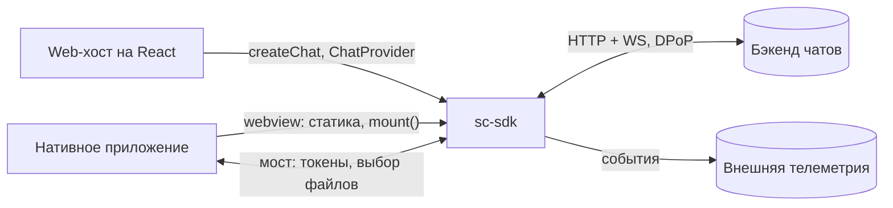
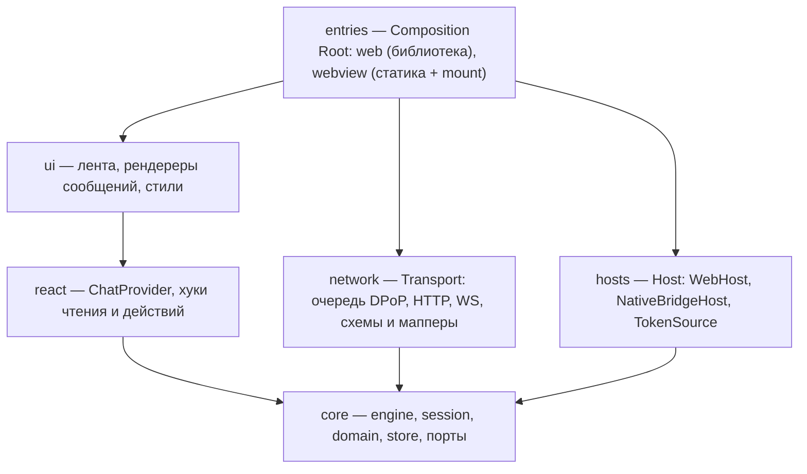
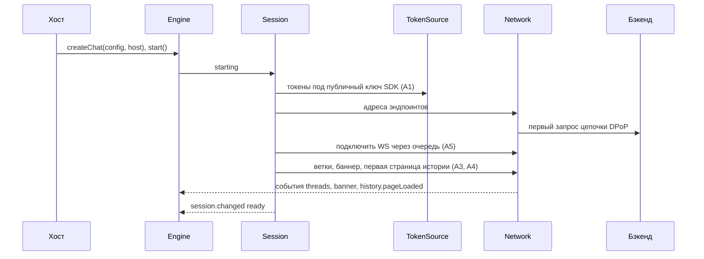
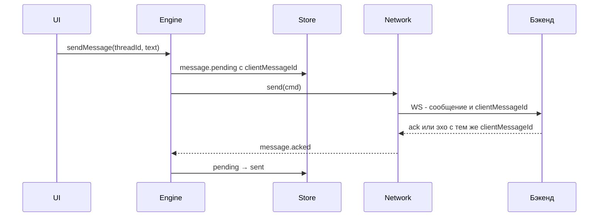
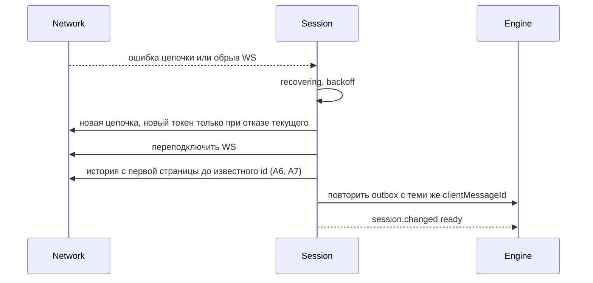
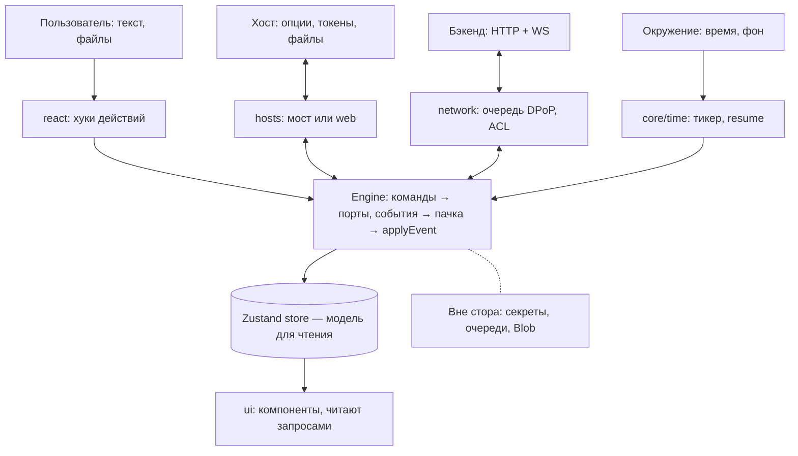
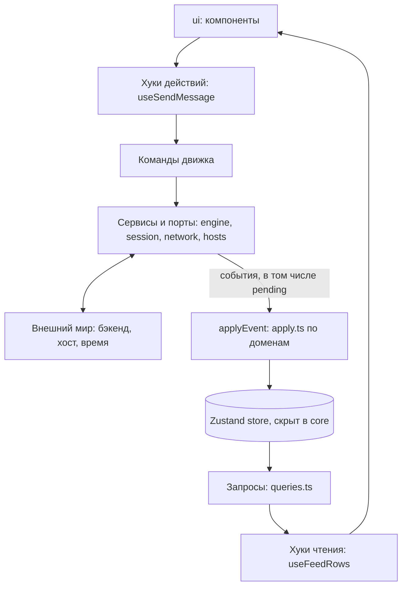

# sc-sdk: находки по архитектуре

> Черновик. Создан 30.09.2026, обновлён 01.10.2026: потоки данных, команды и запросы, конфиг, код (0.7–0.10), стор и чтение (8.6–8.9), отладка (раздел 12).
> Это предложения, а не принятые решения. По каждой развилке нужен ADR. Раздел 0 — сводка верхнего уровня и рабочие допущения, открытые вопросы — в разделе 15.

## 0. Верхнеуровневая архитектура

> Сводка верхнего уровня. Детали — в разделах ниже. Рабочие допущения (0.5) помечены кодами A1–A12: при других ответах пересматривается указанная часть.

### 0.1. Контекст

- sc-sdk встраивается в web-хосты (React-библиотека) и в нативные приложения (статика в webview).
- В обоих режимах SDK сам работает с бэкендом по HTTP + WS. От хоста он получает токены, а в webview ещё и выбор файлов — через мост.
- Главные ограничения: DPoP-цепочка (строго последовательные запросы), запрет любого persist, малый бандл, несогласуемые команды хостов.



### 0.2. Модули и зависимости



Стрелка означает «зависит от / импортирует». core ни от кого не зависит: он объявляет порты, network и hosts их реализуют, entries собирают всё вместе.

Ответственность:
- `core/engine` — Mediator: принимает команды, вызывает порты, превращает входящее в события и применяет их пачкой через `applyEvent`.
- `core/session` — машина состояний сессии, старт и восстановление.
- `core/domain` — messages (outbox, статусы), feed (проекция ленты), threads, files, banner. В каждом домене `apply.ts` (запись) и `queries.ts` (чтение) — только они знают форму состояния.
- `core/store` — `zustand/vanilla`, отдельный стор на инстанс. Скрыт: наружу из core уходят только `engine.read` и `engine.subscribe`.
- `network` — единственное место, где есть `fetch` и `WebSocket`: очередь под цепочку, интерсепторы, схемы и мапперы ответов.
- `hosts` — различия окружений: откуда токен, как выбрать файл, какие возможности есть у хоста.
- `react` — ChatProvider раздаёт инстанс; `useQuery` подписывается через `useSyncExternalStore`; публичные хуки читают именованными запросами и пишут командами движка.
- `ui` — компоненты; единственный слой, который знает о стилях.
- `entries` — `createChat` собирает движок, NetworkTransport и выбранный хост. Web: React в peer. Webview: React внутри, `mount()`.

Исправление к прежнему дереву: Composition Root живёт в `entries`, а не в `core` — иначе core импортировал бы network. В core остаётся `createEngine(ports)`. Дерево в разделе 10 поправлено.

### 0.3. Порты

- `Transport` — данные: старт сессии, отправка, история, входящие события (подробнее — 4.1).
- `Host` + `TokenSource` — окружение: токены, выбор файлов, возможности, жизненный цикл (подробнее — 5.1).
- `Logger`, `Telemetry`, `Inspector` — наблюдаемость и отладка; по умолчанию noop.

С учётом допущений по веткам (A3) Transport получает `threadId`:

```ts
interface Transport {
  start(ctx: SessionContext): Promise<void>;
  send(cmd: OutboundCommand): Promise<Ack>;                  // cmd.threadId, cmd.clientMessageId
  loadHistory(threadId: ThreadId, opts?: { fromStart?: boolean }): Promise<HistoryPage>; // следующая страница, hasNext
  subscribe(onEvent: (e: InboundEvent) => void): () => void; // события всех веток, у каждого threadId
  dispose(): void;
}
```

### 0.4. Ключевые потоки

Старт:



Отправка сообщения:



Восстановление сессии:



### 0.5. Рабочие допущения

Приняты, чтобы работа не стояла. Каждое пересматривается по ответу на соответствующий вопрос из раздела 15.

- **A1. Токены и ключ.** SDK генерирует ключ при старте и отдаёт публичную часть хосту; хост получает токены под неё и передаёт в SDK (web — через асинхронный колбэк конфига, webview — через мост).
  Если неверно: меняются TokenSource, сценарий старта и контракт моста.
- **A2. Refresh в webview.** Токен обновляет хост и передаёт новый событием моста; его запрос не сдвигает цепочку SDK.
  Если неверно: в мост добавляется подпись proof по запросу хоста или передача значения цепочки.
- **A3. Ветки и WS.** Один WS на сессию для всех веток; у событий есть `threadId`; отправка и история принимают `threadId`; позиция пагинации на сервере своя для каждой ветки.
  Если неверно: меняются сигнатуры Transport и модель подписок.
- **A4. Ветки и баннер.** Список веток и баннер загружаются при старте по HTTP, обновления приходят по WS.
  Если неверно: меняется последовательность старта и события доменов threads и banner.
- **A5. Подключение WS расходует значение цепочки** и поэтому идёт через ту же очередь (худший случай).
  Если неверно: переподключение не ждёт очередь — только упрощение.
- **A6. Переинициализация** = новая цепочка без повторного получения адресов; токены обновляются, только если текущие отвергнуты; позиция пагинации сбрасывается (худший случай).
  Если неверно: восстановление упрощается.
- **A7. Страницы истории идут от новых к старым.**
  Если неверно: дозагрузка «до известного id» не работает, нужен другой способ восполнять пропуски.
- **A8. Режима, где хост транслирует сообщения через мост, больше нет.**
  Если неверно: у Transport появляется вторая реализация, ось вариативности частично возвращается.
- **A9. Файлы в webview.** Хост выбирает файл и отдаёт SDK его содержимое или ссылку для чтения; загружает всегда SDK — один путь загрузки в обоих режимах.
  Если неверно: загружает хост, в домене files появляется второй путь.
- **A10. Публичный API для web:** `createChat`, `ChatProvider`, готовый виджет и небольшой набор хуков; отдельные ui-компоненты не публичны. Публичную поверхность проще расширить позже, чем сузить: сужение — breaking change.
  Если неверно: публичным становится слой ui, растёт зона semver.
- **A11. Миграция:** новая мажорная версия без слоя совместимости; старый SDK живёт параллельно, пока хосты не перейдут.
  Если неверно: нужен фасад старого API поверх нового движка — отдельная работа для команды из 4 человек.
- **A12. В webview SDK всегда лежит статикой в приложении.**
  Если неверно: для хостов с удалённой загрузкой возвращается согласование версий моста.

### 0.6. Вопросы по веткам и поверхности

Модель веток почти не обсуждалась, а от неё зависит форма Transport. Вопросы добавлены в раздел 15 под номерами 31–36:
- откуда берётся список веток и как появляются новые;
- один WS на все ветки или по соединению на ветку;
- позиция пагинации — своя для каждой ветки или одна на сессию;
- есть ли счётчики непрочитанного и откуда они приходят;
- откуда приходит верхний баннер и как обновляется;
- бывают ли хосты, которые грузят SDK в webview по сети, а не статикой.

### 0.7. Источники и потребители данных



Откуда приходит:
- Пользователь: намерения (отправить, прикрепить, долистать историю, переключить ветку, развернуть день, повторить отправку) и данные (текст, файлы). Набираемый текст до отправки живёт в UI. Blob файла — в сервисе files, в сторе только метаданные и прогресс.
- Хост: опции инициализации, токены (в webview — обновления через мост), выбранные файлы, возможности, тема и локаль на лету.
- Бэкенд: конфиг поверхности и флаги, ветки и баннер (A4), страницы истории, новые сообщения и подтверждения по WS, значения цепочки DPoP, результаты загрузки.
- Окружение: смена суток, уход в фон и возврат, online/offline, `crypto` для ключа.

Входящий контур: источник → адаптер → разбор и проверка (ACL) → доменное событие → очередь движка → пачка за микротаск → `applyEvent` → стор. Ни один адаптер не пишет в стор напрямую.

Исходящий контур: UI → хук → команда движка, дальше два действия:
1. Сразу событие `message.pending` во входящий контур — UI отвечает мгновенно.
2. Вызов порта (`transport.send`, `host.pickFiles`). Ответ возвращается событием (`acked`, эхо, `failed`), контур замыкается.

Наружу также уходят колбэки хосту (`onError`, «нужны новые токены») и телеметрия через порт, который подключает хост.

Правило подписок: `store.subscribe` допустим только для вывода наружу (например, счётчик непрочитанного в колбэк хоста). Отправлять из такой подписки событие обратно нельзя — это и запускает лавину.

### 0.8. Команды и запросы

- Проблема прежнего варианта: запись шла доменными командами, а чтение — селекторами по форме стора (`useChat(s => s.messages.byId[id])`). Zustand оказывался на двух уровнях абстракции.
- Принцип: уровень определяется словарём, а не механизмом. Именованный запрос `feedRows(threadId)` — тот же уровень, что команда `sendMessage`. Хук — адаптер к React, его уровень равен уровню того, что он оборачивает.
- Слои сверху вниз:
  1. `ui` — знает только хуки.
  2. `react` — хуки-адаптеры; знают команды и запросы ядра, не знают ни форму состояния, ни Zustand.
  3. API ядра — `engine.commands`, `engine.read(query, ...args)`, `engine.subscribe`.
  4. Домен — `apply.ts` (запись) и `queries.ts` (чтение); только они знают форму состояния.
  5. Инфраструктура — Zustand vanilla и очередь событий; наружу не видны.



- Публичный API для хостов — именованные хуки и запросы; `ChatState` наружу не уходит, поэтому рефакторинг стора не ломает semver.
- Подробности: закрытый стор — 8.6, что в сторе и вне — 8.7, запросы и хуки — 8.8, сравнение с Redux — 8.9.

### 0.9. Конфиг

Четыре вида по источнику и времени жизни:
1. Константы сборки (версия SDK, цель web или webview, dev или prod) — подставляет бандлер, в рантайм-конфиг не входят.
2. Опции инициализации от хоста (адрес эндпоинтов, хост-адаптер, колбэки, локаль, тема, ограничения функций) — разбираются строго в `createChat`, неизменяемы, живут в замыкании движка (там функции).
3. Удалённый конфиг (настройки поверхности, feature flags) — разбирается терпимо, итог лежит в сторе в срезе `config`, UI читает его запросами.
4. Состояние сессии (токены, эндпоинты, цепочка, ключ) — не конфиг: только в `session` и `network`, в стор не попадает никогда.

```ts
// entries/web.ts — Composition Root
export function createChat(options: ChatOptions): Chat {
  const init = parseInitOptions(options);   // valibot: понятная ошибка до любого запроса
  const transport = createNetworkTransport({ endpointsUrl: init.endpointsUrl, tokens: init.host.tokens, logger: init.logger });
  return createEngine({ transport, host: init.host, init });
}

// core/config/resolve.ts — чистая функция
export function resolveConfig(defaults: Defaults, remote: RemoteConfig, init: InitOptions): ResolvedConfig

// core/config/availability.ts — чистая функция
export const isAvailable = (f: Feature, cfg: ResolvedConfig, caps: HostCapabilities) =>
  cfg.features[f] && (requires[f] === undefined || caps.has(requires[f]));
```

Порядок: опции разбираются синхронно в `createChat` → сессия стартует → эндпоинты → удалённый конфиг (или объект от хоста, та же схема) → `resolveConfig` → событие `config.resolved` → стор → `useFeature('attachments')`.

Правила:
- Приоритет явный и под тестами: значения SDK по умолчанию → удалённый конфиг → опции хоста.
- По умолчанию хост может только выключать функции (вопрос 39).
- Доступность функции = флаг ∧ возможность хоста — одна чистая функция, а не условия по компонентам.
- `ChatOptions` — входной, частичный, публичный (semver), держать маленьким. `ResolvedConfig` — внутренний и полный.
- На лету меняются только поля из белого списка: `chat.update({ theme, locale })` → событие `config.updated`. Остальное — пересоздание инстанса.
- Опции хоста разбираются строго, удалённый конфиг — терпимо.
- Как статика в webview получает опции — открытый вопрос (37). Предпочтительно через мост; токены никогда не попадают в URL.

Отвергнуто:
- ConfigProvider в React-контексте — core его не видит, в webview при `mount()` пришлось бы дублировать сборку;
- глобальный `config.ts` с `setConfig` — ломает несколько инстансов и изоляцию тестов;
- эндпоинты из env при сборке — их даёт хост в рантайме.

### 0.10. Код: чистые функции и сервисы

Принцип — functional core, imperative shell.
- Чистые функции — большая часть логики: `apply` по доменам, `buildFeed` и запросы, `resolveConfig`, `isAvailable`, парсеры и мапперы, правила outbox, таблицы переходов, форматирование дат. Время и id получают аргументами.
- Сервисы — только где есть состояние, ввод-вывод или жизненный цикл: `engine`, `session`, serial queue, HTTP- и WS-клиенты, хост-адаптеры, источник токенов, тикер дня, телеметрия. Сервис тонкий: ввод-вывод, вызов чистых функций, события. Доменное `if` в сервисе — повод вынести функцию.
- Сервис — объект на инстанс, создаётся в `createChat`, зависимости получает параметрами. Не синглтон и не сервис DI-контейнера.
- Фабрики (`createSession(deps)`) предпочтительнее классов: методы движка уходят в компоненты (`onClick={engine.commands.sendMessage}`), и у методов класса теряется `this`. Решение за командой (вопрос 43).
- Хуки — только клей: подписка на запрос или возврат команды. Без `fetch`, `WebSocket`, доменных условий и `useEffect` с бизнес-логикой; `useEffect` — только для DOM (скролл, фокус, размеры).
- Тесты: чистые функции — таблицы; сервисы — MockTransport, FakeHost, fake timers; хуки почти не тестируются; UI — компонентные тесты и Playwright.

## 1. Главное

- В обоих режимах (web и webview) SDK сам получает данные по HTTP + WS. Мост — не источник данных, а канал возможностей хоста: токены, выбор файлов, возможно что-то ещё.
- Отсюда ось вариативности — хост, а не источник данных: порт `Host` с адаптерами Web и NativeBridge. Транспорт данных один — Network (+ Mock для тестов).
- Самое жёсткое ограничение — DPoP-цепочка: HTTP-запросы строго последовательны, любая ошибка ведёт к переинициализации соединения. Сетевой слой строится вокруг очереди запросов и машины состояний сессии.
- Внутри — команды и запросы на одном уровне: UI пишет командами, читает именованными запросами; состояние меняет только `applyEvent`; Zustand — скрытый контейнер в core (0.8).
- Главный нерешённый риск — как токены привязываются к ключу DPoP, который генерирует SDK, особенно когда токены обновляет хост (раздел 7). Persist запрещён полностью, поэтому ключ новый при каждом запуске.
- Правило против over-engineering: точка расширения появляется, только когда есть ≥2 реальные реализации или подтверждённый роадмап.
  - оправданы: хост (Web, NativeBridge), источник токенов (SDK сам / хост), рендереры типов сообщений;
  - порт Transport — одна реальная реализация + Mock; держим тонким, ради тестов и изоляции сетевой сложности;
  - не оправданы: плагины стора, универсальная плагин-система.
- Команда — 4 человека (архитектор, тимлид, 2 middle). Всё, что требует постоянного сопровождения (генераторы, дублирующие проверки архитектуры, объёмные ADR), — только если окупается сразу.

## 2. Ответы на вопросы (30.09.2026)

Бэкенд:
- DPoP: значение одноразовое, параллельные запросы невозможны.
- Если сервер обработал запрос, а клиент не получил ответ, клиенту приходит ошибка, соединение нужно инициировать заново.
- Ключевую пару DPoP генерирует SDK.
- Ротация refresh-токенов — ответ «бек»; понято как «ротацию ведёт бэкенд», уточнить.
- seq и курсора нет. История грузится повторными запросами на один и тот же адрес, в payload `hasNext: bool`.
- Сервер дедуплицирует по `clientMessageId` и возвращает его.
- WS авторизуется через DPoP.
- Спецификации API нет.
- По WS приходят только новые сообщения; редактирования и удаления пока нет.
- Серверного времени нет.
- Есть лимиты на файлы и rate limit (значения не уточнены).

Мост и хосты:
- В webview данные тоже идут через WS + HTTP из SDK; хост следит за обновлением токена.
- Через мост: запросы на выбор файлов (webview ограничен), передача токена, возможно что-то ещё.
- «Да» на вопрос про ответы на запросы через мост — понято как «ответы есть».
- SDK обычно размещён статикой внутри приложения.
- На хосты влиять нельзя: много команд с разных поверхностей, скоординировать сложно.

Команда SDK:
- Zustand — последняя версия (v5).
- Браузеры: Chromium, Яндекс Браузер.
- Стили: styled-components.
- Команда: архитектор, тимлид, 2 middle.
- SDD — spec-driven development.
- Телеметрия — внешняя.
- Запрещён любой persist, включая IndexedDB.
- React: peer dependency для web; в webview входит в статику.

Решения 01.10.2026:
- reselect пока не используем: запросы — свой `defineQuery` (8.8).
- Предварительно: без событий в ядре — Zustand-стор с action'ами, чистые мутаторы, стандартные селекторы, один стор со срезами и хуками по доменам. Разделы 0.8, 8.6–8.9 ещё описывают событийный вариант и будут переписаны.

Ответы 01.10.2026:
- Форма поставки: и готовый виджет, и конструктор (хуки и компоненты). Допущение A10 неверно — публичным становится и слой ui.
- Web-хосты — только React.
- Несколько лент на странице архитектурно возможны, но не используются.
- Конфиг хоста может переписать удалённый конфиг, включая включение выключенного сервером. Правило «хост только выключает» снято.
- Черновики — только в памяти, в Zustand.
- Ключ: SDK генерирует пару ECDSA P-256 и считает thumbprint по RFC 7638; отдельного эндпоинта регистрации ключа нет.
- Webview: DPoP не задействован, мост передаёт готовые токены для WS и HTTP.
- WS: подключение не расходует nonce, а обновляет его — сразу после подключения сервер шлёт `{ type: DPOP_NONCE, dpopNonce }`.
- Переподключение WS — с теми же учётными данными. При `update_token_error` — полный рестарт сессии с потерей серверного состояния истории.
- Загрузка файлов — в той же цепочке DPoP.
- Список веток — по REST, новые ветки — по WS.
- Пагинация — своя на каждую ветку.
- Файл грузится по REST; затем по WS приходит `UPLOAD_FILE_API_REQUEST`, и SDK передаёт событие хосту.
- Статика SDK в webview получает опции инициализации только через мост.
- Relay — единственный рабочий режим webview: хост держит соединение и транслирует через мост сообщения и HTTP-запросы. SDK в webview в сеть не ходит вообще. Это отменяет ответ 30.09 «в webview данные идут через WS + HTTP из SDK» и ответ про готовые токены от моста: оба, видимо, о неиспользуемом режиме — подтвердить.

## 3. Потоки данных

### 3.1. Одна точка записи

- Писать можно только командами движка; состояние в сторе меняет только `applyEvent` (8.6).
- Читать — только именованными запросами из домена через хуки; форма стора наружу не видна (0.8, 8.8).
- Хуки делятся на чтение (`useFeedRows`, `useMessage`) и действия (`useSendMessage`) — оба в словаре домена.
- Вместо защиты трёх входов (setter'ы Zustand, providers, instance движка) — оставить один.

### 3.2. Однонаправленный поток

- Входящее: транспорт → событие → `applyEvent` → стор.
- Исходящее: команда → движок → транспорт или хост.
- Стор не подписан на отправку в транспорт; транспорт не пишет в стор мимо событий.
- Лавина взаимных подписок устраняется этой схемой, а не дедупликацией.

### 3.3. Команды и события

- Команда — намерение, может быть отклонена: `message.send`, `history.load`, `file.pick`, `file.upload`.
- Событие — факт: `message.received`, `message.acked`, `message.failed`, `history.pageLoaded`, `session.changed`.
- Именование: команды в повелительном наклонении, события в прошедшем времени, префикс домена.

### 3.4. Local — не поставщик данных, а outbox

- Network даёт подтверждённое состояние. Оптимистичные сообщения — очередь исходящих поверх него (как незапушенные коммиты поверх origin).
- При отправке генерируется `clientMessageId` — ключ идемпотентности. Эхо через WS снимает pending-запись по этому id. Лента = подтверждённые ∪ pending.
- Сервер дедуплицирует по `clientMessageId` → повторная отправка outbox после восстановления сессии безопасна.
- Проверка LSP: в интерфейсе `Transport` у Local все методы были бы заглушками.
- Альтернатива: декоратор `withOptimistic(transport)`. Но он размазывает доменную логику (статусы, ретраи, порядок) между декоратором и стором. Предпочтение — outbox в core.

## 4. Сетевой слой

### 4.1. Порт Transport

```ts
interface Transport {
  start(): Promise<void>;
  send(cmd: OutboundCommand): Promise<Ack>;             // cmd.clientMessageId — ключ идемпотентности
  loadHistory(q: HistoryQuery): Promise<HistoryPage>;
  subscribe(onEvent: (e: InboundEvent) => void): () => void;
  dispose(): void;
}
```

- Реализации: `NetworkTransport` и `MockTransport` (vitest, Playwright, Storybook). Порт оправдан тестами и изоляцией сетевой сложности, а не вариативностью режимов.
- Прямые `fetch` и `new WebSocket` вне сетевого модуля запрещены правилом eslint (`no-restricted-globals` / `no-restricted-syntax`): любой запрос в обход очереди рвёт цепочку DPoP.

### 4.2. Очередь под DPoP-цепочку

- Все HTTP-запросы сессии проходят через одну последовательную очередь. Утилита serial-queue нужна сразу.
- Ожидающие запросы можно переупорядочивать по приоритету: восстановление сессии → отправка → история → загрузка файлов. Выполняющийся запрос не прерывается.
- Риск: загрузка большого файла блокирует историю и, если подключение WS расходует значение цепочки, переподключение. Варианты: загрузка частями с запросами истории между частями; отдельный адрес загрузки вне цепочки. Зависит от бэкенда.
- Rate limit: неясно, продолжает ли ответ 429 цепочку или рвёт её.

### 4.3. Сессия как машина состояний

```ts
const sessionTransitions = {
  idle:       ['starting'],
  starting:   ['ready', 'failed'],
  ready:      ['recovering', 'disposed'],
  recovering: ['ready', 'failed', 'disposed'],
  failed:     ['starting', 'disposed'],
  disposed:   [],
} as const satisfies Record<SessionState, readonly SessionState[]>;
```

- `starting`: адреса эндпоинтов → первый запрос цепочки → подключение WS → первая страница истории.
- `recovering`: любая ошибка цепочки или обрыв WS. Новая цепочка (и новые токены, если нужно) → переподключение WS → дозагрузка пропущенного (4.5) → повторная отправка outbox с теми же `clientMessageId`.
- `failed`: токены недействительны и получить новые не удалось. В webview — запрос к хосту, в web — ошибка хосту через `onError`.
- Восстановление — с backoff и лимитом попыток, иначе при недоступном бэкенде получится цикл переинициализаций.
- Машина сессии заменяет прежнюю машину соединения: соединение — часть сессии.

### 4.4. WS

- RFC 9449 описывает DPoP только для HTTP. Браузерный `WebSocket` не умеет произвольные заголовки: доступны только URL, subprotocol или первое сообщение после подключения. Как именно передаётся proof и расходует ли подключение значение цепочки — уточнить.
- По WS приходят только новые сообщения → события `message.received` и `message.acked`.

### 4.5. История без курсора

- Пагинация на сервере с состоянием: один адрес, `hasNext`.
- Склейка с живым потоком: открыть WS и буферизовать → загрузить историю → слить с дедупликацией по id.
- Дозагрузка после восстановления: грузить страницы от новых к старым, пока не встретится уже известный id. Условия: страницы идут от новых к старым, и пагинацию можно начать заново с первой страницы.
- Сортировка без seq: серверное время сообщения, при равенстве — id. Если id монотонный — сортировать по нему.

### 4.6. Инстанс живёт вне React

```tsx
const chat = createChat({
  endpointsUrl,
  host: createNativeBridgeHost(window.nativeBridge),   // или createWebHost({ tokens })
});

<ChatProvider chat={chat}><App /></ChatProvider>
```

- Не делать источники данных React-компонентами:
  - StrictMode в dev дважды монтирует эффекты → двойной старт сессии и сдвиг цепочки DPoP;
  - перемонтирование дерева хостом рвёт соединение;
  - порядок слияния данных неявно задаётся вложенностью JSX;
  - без React не тестируется.
- Если хост создаёт инстанс внутри компонента (`useState(() => createChat(...))`): `createChat` без побочных эффектов, `start()`/`dispose()` идемпотентны, после `dispose()` возможен повторный `start()`.
- Слово Provider оставить за React-контекстом.

## 5. Хост и мост

### 5.1. Порт Host

```ts
interface Host {
  readonly capabilities: ReadonlySet<HostCapability>;  // 'files.pick', 'app.lifecycle', ...
  readonly tokens: TokenSource;
  pickFiles?(opts: PickOptions): Promise<PickedFile[]>;
  onResume?(cb: () => void): () => void;
}

interface TokenSource {
  getAccessToken(): Promise<string>;               // web: SDK обновляет сам; webview: запрос к хосту
  onUpdated(cb: (t: Tokens) => void): () => void;  // webview: хост обновил токен сам
}
```

- `WebHost`: SDK обновляет токены сам (single-flight), файлы — через `<input type="file">`.
- `NativeBridgeHost`: токены и выбор файлов — через мост.
- Пересмотр прежнего вывода: «стратегия авторизации» теперь оправдана — у токенов два реальных источника.

### 5.2. Мост

- Request/Reply: у запроса correlation id, ответ ссылается на него; нет ответа за N секунд — ошибка, а не вечное ожидание.
- При старте — запрос возможностей хоста вместо согласования версий. Нет ответа (старый хост) → минимальный набор.
- Нет возможности → функция скрыта (например, кнопка вложения), а не ошибка.
- Поверхность моста — минимальная: каждый новый метод означает согласование с множеством команд на месяцы.
- Комплект для интеграторов: типизированный контракт моста, эталонные реализации для iOS и Android, диагностический режим SDK, который проверяет методы моста и выдаёт отчёт. Команды хостов проверяют себя сами, без координации.
- Как содержимое выбранного файла попадает в SDK — открытый вопрос: base64 через мост дорог для больших файлов.

### 5.3. Следствия размещения SDK статикой в приложении

- SDK и хост выпускаются вместе → расхождение версий SDK и моста в рантайме маловероятно. Согласование версий протокола не нужно, достаточно проверки возможностей.
- Исправления доходят до пользователей только с релизами приложений; в проде одновременно живут много версий SDK.
- Передавать версию SDK заголовком (например, `X-SC-SDK-Version`): бэкенд видит, какие версии живы, и держит совместимость.
- Публичный API SDK и контракт моста — строгий semver; в changelog — «требуется, начиная с версии».

## 6. Стили

- Сейчас styled-components. Для SDK, встраиваемого в чужие приложения, у него есть издержки:
  - рантайм и вес: по памяти порядка 12–15 КБ gzip — ощутимо при требовании малого бандла;
  - стили вставляются в рантайме: при строгом CSP хоста нужен nonce или `'unsafe-inline'` для `style-src`;
  - если хост тоже на styled-components, возможны два экземпляра библиотеки и пересечение `ThemeProvider`; сделать её peer dependency — значит связать версии с множеством несогласованных команд;
  - насколько известно, с 2025 года проект в режиме поддержки — проверить актуальный статус.
- Если оставляем сейчас: `StyleSheetManager` с `namespace` (префикс селекторов) и при необходимости `target` для Shadow DOM; тема — через CSS-переменные, а не через контекст хоста.
- Кандидаты на замену (без рантайма): Linaria (похожий API — проще миграция), vanilla-extract (стили на TS), CSS Modules + CSS-переменные.
- Не менять одновременно с рефакторингом ядра: при слоях `core → … → ui` стили живут только в `ui`, решение обратимо и откладывается без потерь.

## 7. Авторизация и DPoP

- Цепочка подтверждена → очередь (4.2) и восстановление сессии (4.3).
- Ключ генерирует SDK. Без persist он живёт в памяти; после перезагрузки — новый ключ.
- Противоречие, которое нужно снять в первую очередь:
  - токены, которые хост передаёт при старте, должны быть привязаны к ключу SDK — как хост получает токены под ключ, которого не знает?
  - в webview токен обновляет хост — чем он подписывает proof для refresh, если приватный ключ у SDK?
  - сдвигает ли запрос хоста цепочку, которую держит SDK?
  - варианты: SDK отдаёт хосту публичный ключ до получения токенов; хост просит SDK подписать proof через мост; refresh не привязан к ключу. Выбор — за бэкендом.
- Владельцы токенов: web — SDK (refresh сам, single-flight: N параллельных 401 → один refresh); webview — хост (SDK получает токен через мост).
- Persist запрещён полностью, включая IndexedDB → ключ живёт только в памяти, каждый запуск означает новый ключ и новые токены под него. Генерировать ключ с `extractable: false`: при XSS атакующий сможет подписывать, пока страница открыта, но не вынесет ключ.
- `crypto.subtle` доступен только в secure context. SDK подписывает DPoP в обоих режимах, а в webview грузится статикой из приложения (file:// или кастомная схема) → проверить доступность на iOS и Android. Без неё DPoP не подписать.
- Порядок HTTP-интерсепторов (снаружи внутрь): логирование → очередь → восстановление сессии при ошибке цепочки → refresh при 401 → access-токен → DPoP-подпись → fetch.
  - DPoP после токена: proof содержит хэш токена;
  - refresh снаружи обоих: после обновления запрос переподписывается;
  - простого retry нет: при цепочке ошибка означает переинициализацию (4.3).

## 8. Состояние

### 8.1. Zustand + applyEvent

- Zustand — внутренний контейнер состояния: хранение и подписки. `applyEvent(state, event)` — как событие меняет состояние. Это не конкуренты. Наружу из core Zustand не виден (8.6).
- Развилка «событие → изменение» неизбежна: транспорт присылает данные, а не вызовы функций. Вопрос только в том, где она живёт.
- Почему `applyEvent`, а не action'ы в сторе:
  - пакетирование: пачка событий → один `setState`;
  - одна точка записи: в сторе нет ничего вызываемого, UI не может обойти движок и outbox;
  - журнал событий: баг из webview воспроизводится прогоном журнала в тесте, без устройства и сети;
  - полнота: union событий + `switch` + `assertNever` в одной функции.
- Не называть «reducer» (ассоциация с Redux) — `applyEvent`. Redux-middleware Zustand не нужен. Immer — позже, если spread'ы станут неудобны (цена — несколько КБ).
- `applyEvent` делегирует по доменам: `messages.apply`, `session.apply`, `threads.apply`.
- Всё, что лежит в сторе, включая UI-срез (развёрнутые дни, активная ветка, черновики по веткам), меняется только событиями. Чисто локальное состояние компонента (меню, фокус, текст во время набора) — `useState`, в стор не попадает. Исправление 01.10: прежний гибрид с прямыми `set` для UI-среза противоречил одной точке записи.
- Условие пересмотра: если пачек событий нет и журнал не нужен, вариант «action'ы вне стора» (no store actions) почти равноценен.

### 8.2. Пакетирование в движке

```ts
function enqueue(e: ChatEvent) {
  queue.push(e);
  if (!scheduled) { scheduled = true; queueMicrotask(flush); }
}

function flush() {
  scheduled = false;
  const batch = queue.splice(0);
  store.setState(s => batch.reduce(applyEvent, s));
}
```

На автоматический батчинг React 18 не полагаемся: с `useSyncExternalStore` каждое изменение стора прогоняет все селекторы.

### 8.3. Инстансы

- `create()` в Zustand — модульный синглтон. Для SDK это ловушка: две ленты на странице, микрофронтенды, тесты текут друг в друга.
- Стор — `createStore` из `zustand/vanilla` на каждый инстанс движка + React context.

### 8.4. Стабильный снимок

- `useSyncExternalStore` (как и Zustand v5) требует, чтобы при неизменных данных снимок возвращал ту же ссылку, иначе — бесконечный цикл перерисовки. В нашей схеме это обеспечивают мемоизированные запросы (8.8); `useShallow` не нужен, Zustand в React-слое не используется.

### 8.5. Статусы сообщений

- Пока: pending → sent | failed. Доставки и прочтения нет (по WS только новые сообщения) — уточнить планы.
- Политику ретраев и отображение failed определить; повторная отправка безопасна благодаря дедупликации по `clientMessageId`.
- xstate не нужен: таблицы переходов достаточно.

### 8.6. Инкапсуляция стора

Правило: всё, что лежит в сторе, меняется только через `applyEvent` внутри core. Снаружи нельзя ни вызвать `setState`, ни мутировать полученный объект. Читать можно сколько угодно.

Как обеспечить:
1. Стор не экспортируется: создаётся внутри `createEngine`.
2. Наружу уходит отдельный объект только для чтения — ограничение и в типах, и в рантайме.
3. В dev-сборке состояние заморожено; замораживаются только новые объекты.
4. Линтер: импорт `zustand` только в `core/store`, обращение к `setState` вне его запрещено.

```ts
// core/store/create-store.ts
export function createChatStore(initial: ChatState, inspector: Inspector) {
  const store = createStore<ChatState>()(() => initial);

  const apply = (events: ChatEvent[]) => {
    let s = store.getState();
    for (const e of events) {
      s = applyEvent(s, e);
      inspector.trace({ kind: 'event', event: e, cause: e.meta?.cause, at: Date.now() }, s);
    }
    store.setState(import.meta.env.DEV ? freezeNew(s) : s, true);
  };

  const readonly = {
    getState: store.getState,
    getInitialState: store.getInitialState,
    subscribe: store.subscribe,
  };

  return { apply, readonly };   // apply остаётся в движке
}
```

```js
// eslint, вне core/store/**
'no-restricted-imports': ['error', { paths: [
  { name: 'zustand', message: 'Стор создаётся только в core/store' },
  { name: 'zustand/vanilla', message: 'Стор создаётся только в core/store' },
] }],
'no-restricted-properties': ['error', { property: 'setState', message: 'Запись только через applyEvent' }],
```

Подводные камни:
- Обобщённое событие вроде `state.patched { path, value }` — замаскированный `setState`. Запретить сразу.
- События от действий пользователя применяются сразу; пакетируются только входящие из сети и моста. Иначе код «отправил и прокрутил к новому сообщению» получит задержку в тик.
- Церемония: новое поле UI-состояния = событие + `apply` + метод движка. Смягчается колокацией по домену.
- Тесты UI получают состояние из событий через MockTransport; для больших фикстур — опция `initialState` только из тестовой точки входа.
- Перемотка в Redux DevTools — обход записи, но только в dev; используем лишь для просмотра.

Альтернатива при дорогой церемонии: два стора — закрытый доменный и открытый UI-стор с обычными action'ами. Минусы: `buildFeed` читает из двух сторов, журнал не воспроизводит вид ленты. Начинаем с одного.

### 8.7. Что в сторе и что вне

В сторе (срезы):
- `session` — только публичный статус и код ошибки;
- `config` — итоговый конфиг и возможности хоста;
- `threads`, `banner`;
- `messages` — порядок, метаданные, тексты, outbox, статусы;
- `history` — `hasNext` и признак загрузки по веткам;
- `files` — метаданные и прогресс, отдельно, потому что меняются часто;
- `clock` — `dayKey`;
- `ui` — развёрнутые дни, активная ветка, черновики по веткам (если черновик должен пережить переключение ветки — вопрос 42).

Вне стора:
- секреты: токены, ключ DPoP, значение цепочки, адреса эндпоинтов — в `session` и `network`;
- опции с функциями и хост-адаптер — в замыкании движка;
- очереди: HTTP, события, ожидающие ответы моста — внутри сервисов;
- Blob выбранных файлов — в сервисе files;
- производные данные (строки ленты, доступность функций) — вычисляются запросами;
- локальное состояние компонента (фокус, меню, текст во время набора) — `useState`.

Сервисы могут читать состояние через те же запросы из домена (`engine.read`), но не писать.

Границы данных:
- секреты — ни в стор, ни в события, ни в логи, ни в телеметрию;
- пользовательский контент — в стор и UI; в телеметрию и логи — нет; в журнал отладки — только с маскированием;
- на диск — ничего;
- проверка: данные бэкенда и моста — терпимо, опции хоста — строго; внутри ядра типам доверяем.

### 8.8. Запросы и хуки чтения

Три слоя: именованные запросы в домене → внутренний `useQuery` → публичные хуки. Компонент видит только хуки.

Требования:
- стабильный снимок: при неизменных данных — та же ссылка, иначе `useSyncExternalStore` уходит в бесконечную перерисовку;
- минимум перерисовок: новое сообщение — лента и одна-две строки, смена статуса — одна строка;
- дешёвая проверка: после пачки движок один раз уведомляет подписчиков, каждый смонтированный хук сравнивает входы;
- форма стора не видна выше домена.

Запрос = дешёвая выборка входов + дорогой расчёт только при смене входов по ссылке.

```ts
// core/lib/query.ts
export function defineQuery<A extends unknown[], I extends readonly unknown[], R>(
  select: (s: ChatState, ...args: A) => I,
  compute: (...inputs: I) => R,
  equals: (a: R, b: R) => boolean = Object.is,
): QueryDef<A, R> {
  return {
    instantiate() {
      let has = false, lastInputs: I, lastResult: R;
      return (s: ChatState, ...args: A): R => {
        const inputs = select(s, ...args);
        if (has && shallowEqualArrays(inputs, lastInputs)) return lastResult;
        const next = compute(...inputs);
        const result = has && equals(next, lastResult) ? lastResult : next;
        has = true; lastInputs = inputs; lastResult = result;
        return result;
      };
    },
  };
}

export const pick = <A extends unknown[], R>(fn: (s: ChatState, ...args: A) => R) =>
  defineQuery((s: ChatState, ...args: A) => [fn(s, ...args)] as const, (r) => r);
```

```ts
// core/domain/feed/queries.ts
export const feedRows = defineQuery(
  (s: ChatState, threadId: ThreadId) => [s.messages.order[threadId], s.messages.meta, s.ui.expandedDays] as const,
  (order, meta, expanded) => buildFeed(order ?? EMPTY, meta, { expanded }),
  rowsEqual,
);

// core/domain/messages/queries.ts
export const messageById = pick((s, id: MessageId) => s.messages.byId[id]);
export const messageStatus = pick((s, id: MessageId) => s.messages.status[id]);
```

```ts
// react/use-query.ts — внутренний, из пакета не экспортируется
export function useQuery<A extends unknown[], R>(def: QueryDef<A, R>, ...args: A): R {
  const engine = useEngine();
  const instance = useMemo(() => def.instantiate(), [def]);
  const getSnapshot = () => engine.read(instance, ...args);
  return useSyncExternalStore(engine.subscribe, getSnapshot, getSnapshot);
}

// react/hooks/feed.ts — публичные хуки
export const useFeedRows = (threadId: ThreadId) => useQuery(feedRows, threadId);
export const useMessage = (id: MessageId) => useQuery(messageById, id);
export const useSendMessage = () => useEngine().commands.sendMessage;
```

Правила:
- Запрос — именованная функция из домена. Анонимные функции в `useQuery` запрещены линтером (`no-restricted-syntax`: `CallExpression[callee.name='useQuery'] > ArrowFunctionExpression`).
- Аргументы — примитивы (id, ключи).
- Хук возвращает примитив, ссылку из стора или мемоизированный результат. Новый объект без `equals` — ошибка.
- Нужно несколько значений — несколько хуков или составной запрос со своим `equals`.
- В хуках чтения нет `useEffect`, команд и эффектов.
- Загрузка и ошибки — явные статусы в запросах, без Suspense.

Подводные камни:
- `select` только достаёт, не вычисляет: `filter` или `map` внутри делают входы «новыми» на каждой пачке.
- Общий `meta` на все ветки пересчитывает `feedRows` при сообщении в любой ветке. Если на экране несколько лент — разложить `meta` по веткам.
- Экземпляр кэша на компонент: тяжёлый запрос в нескольких компонентах для одной ветки считается несколько раз.
- SSR у web-хостов (вопрос 40): нужны `'use client'` на точке входа и `getServerSnapshot`, `createChat` без побочных эффектов.

Решение 01.10: reselect пока не используем, запросы — свой `defineQuery`. Вернуться, если понадобится общий кэш по аргументам или dev-проверки стабильности входов. API почти тот же, замена не затронет хуки.

### 8.9. Сходство с Redux

По форме совпадает: событие ≈ action, `applyEvent` ≈ reducer, стор ≈ store, запросы ≈ selectors, сервисы ≈ thunks / listener middleware / саги. Ближе всего схема к Elm Architecture и к «functional core, imperative shell».

Отличия:
1. UI не вызывает dispatch: вызывает команды, события создаёт только движок. Одна точка записи держится архитектурой, а не договорённостью.
2. Эффекты в сервисах с явными портами, без цепочки middleware и саг.
3. Стор на инстанс, форма скрыта, публичного dispatch нет.
4. Нет церемонии RTK: union событий и `apply` по доменам.
5. Вес: Zustand около 1 КБ + свой код против RTK + react-redux (по памяти около 15 КБ gzip — проверить).

Почему оправдано здесь: поток событий по WS, пачки после переподключения, оптимистичный outbox, восстановление сессии, журнал для воспроизведения багов. Для CRUD на REST это было бы избыточно.

Признаки, что пишем свой Redux и пора остановиться:
- хелперы в духе `createSlice` или генераторы action creators;
- цепочка middleware вокруг применения событий;
- событие «записать значение по пути» или публичный `dispatch`;
- локальное состояние компонентов в сторе.

Альтернативы:
- RTK без саг: проверенные паттерны, `createEntityAdapter` под нормализованные сообщения, знаком команде; минусы — вес, immer, `dispatch` придётся прятать, тяга к глобальному стору;
- упрощение до action'ов Zustand без событий: меньше сущностей, но теряются пакетирование и журнал.

Решение: оставить текущую схему и перепроверить её по признакам выше после вертикального среза, учитывая стоимость онбординга двух middle.

## 9. Лента

### 9.1. Группировка — проекция, а не action

- Три источника изменений: доменные события, время (`clock.dayChanged`), UI (`feed.dayToggled`, `feed.jumpToUnread`). Все идут через `applyEvent`. Команды «перегруппировать» нет.
- `buildFeed(order, meta, view): FeedRow[]` — чистая функция.

```ts
type FeedRow =
  | { kind: 'day'; key: `day:${string}`; dayKey: string }
  | { kind: 'unread'; key: 'unread' }
  | { kind: 'message'; key: string; id: string; position: 'single' | 'first' | 'middle' | 'last' };
```

- Плоский список — под виртуализацию; вложенные группы перерисовываются целиком.
- Стабильные ключи: `day:2026-09-29`, а не «Вчера».
- В строке только id: строка подписана на своё сообщение через `useMessage(id)`.
- `position` — склейка подряд идущих сообщений одного автора. Новое сообщение меняет `position` у предыдущего → перерисовываются две строки.
- Группировка по календарной дате не зависит от текущего времени: в полночь меняются только подписи. На часы подписан только разделитель:

```tsx
function DaySeparator({ dayKey }: { dayKey: string }) {
  const today = useToday();   // публичный хук над запросом clock.dayKey
  return <Divider>{formatDayLabel(dayKey, today)}</Divider>;
}
```

- Если нужно сворачивать прошедшие дни: `collapsed = dayKey < today && !view.expanded.has(dayKey)` — пересчёт раз в сутки по одному событию.

### 9.2. Время

- Серверного времени нет → порт `Clock` не нужен: время устройства, в тестах — fake timers vitest. Если часы устройства врут, «Сегодня» будет смещено — принимаем.
- `Lifecycle`: `visibilitychange` / `pageshow` + опционально возможность хоста `onResume`. Надёжность событий в WKWebView проверить на устройствах.
- Day ticker в `core/time`: таймер до полуночи + перепроверка при возврате на экран (таймеры в фоне и в свёрнутом webview засыпают).
- Относительное время («5 минут назад») — не через стор: общий тикер, подписаны только метки видимых строк.

### 9.3. Данные по частоте изменений

- `order` и `meta` (автор, время, dayKey) меняются только при добавлении — это входы `buildFeed`.
- Статус и прогресс загрузки файла — отдельные срезы, на структуру ленты не влияют.

### 9.4. Пакетные события

- `history.pageLoaded { messages[] }` вместо N `message.received`.
- Сообщения неизменяемы (правок и удалений нет) → при слиянии достаточно id: `next[m.id] = prev[m.id] ?? m`. Поле `version` не нужно, пока не появятся правки.
- `messages.readUpTo` и `thread.snapshot` сейчас не нужны: прочтений нет, мост не передаёт списки сообщений.

### 9.5. UI

- Якорение скролла при подгрузке истории вверх: react-virtuoso умеет из коробки (`firstItemIndex`), TanStack Virtual — вручную, но легче. Выбирать виртуализатор с учётом этого.
- Полный пересчёт `buildFeed` — O(n). Инкрементальный — только если профилирование покажет проблему.

## 10. Паттерны и где они живут

```
src/
├─ core/                                чистый TS, без React и DOM
│  ├─ create-engine.ts                  Factory: движок из переданных портов
│  ├─ engine.ts                         Mediator + Facade для команд; очередь событий
│  ├─ ports/                            transport, host, token-source, logger, telemetry, inspector (+ noop — Null Object)
│  ├─ session/                          State Machine сессии, восстановление
│  ├─ domain/
│  │  ├─ messages/                      commands, events, apply, queries, outbox, status
│  │  ├─ feed/                          buildFeed — проекция ленты
│  │  └─ threads/ files/ banner/        та же раскладка, только нужные файлы
│  ├─ time/day-ticker.ts                источник clock.dayChanged
│  └─ lib/                              emitter (Observer), serial-queue, request-reply, single-flight, query (defineQuery)
├─ network/
│  ├─ network-transport.ts              Adapter (HTTP + WS снаружи как одно целое)
│  ├─ http/interceptors/                Chain of Responsibility
│  ├─ ws/                               подключение, DPoP при подключении
│  └─ mappers/                          ACL + схемы валидации
├─ hosts/
│  ├─ web/                              Adapter: свой refresh, <input type="file">
│  └─ native-bridge/                    Adapter: Request/Reply, capabilities, диагностика
├─ testing/                             MockTransport, FakeHost — Test Double со сценариями
├─ react/                               ChatProvider (Context как DI), useQuery (useSyncExternalStore), публичные хуки
├─ ui/messages/renderers.ts             Registry (закрытый union + satisfies)
├─ entries/                            Composition Root: web.ts (библиотека), webview.ts (статика + mount)
└─ devtools/                           Inspector для Redux DevTools — отдельная точка входа, не в prod
test/
├─ contracts/                           Contract Test для Transport и Host
└─ builders/                            Test Data Builder
```

Вводить сразу:
- Port/Adapter для Transport и Host, Factory + Composition Root, Mediator;
- Strategy для источника токенов (две реализации);
- Serial Queue и State Machine сессии;
- Request/Reply для моста;
- команды/события + `applyEvent`, Observer, Outbox;
- ACL-мапперы со схемами;
- хуки-фасады и Context;
- MockTransport, FakeHost и контрактные тесты.

По мере надобности:
- приоритеты в очереди — если загрузка файлов начнёт мешать истории;
- Decorator над транспортом — метрики и отладочные обёртки;
- Compound Components (`<Chat.Root>`, `<Chat.Thread>`, `<Chat.Composer>`) — после решения о форме публичного API.

Не брать:
- Singleton — ни `create()` на уровне модуля, ни состояния в модулях;
- Service Locator — зависимости передаются параметрами и контекстом;
- наследование реализаций и Template Method — общий код в функциях `lib/`; классы через `implements`, не `extends`;
- Strategy как иерархию классов — стратегия в TS это функция или объект с интерфейсом;
- Builder для конфига — объектный литерал с дефолтами (Builder только в тестах);
- Visitor — discriminated union + `switch`/`satisfies`;
- DI-контейнер (inversify, tsyringe) — декораторы, reflect-metadata, вес, непрозрачность для middle;
- полноценный event sourcing и эффекты в стиле saga;
- согласование версий протокола моста — SDK выпускается вместе с хостом, хватает проверки возможностей.

Риск Mediator — «божественный объект». Правило: движок только маршрутизирует команды и события, логика — в `apply`, outbox и сессии. Порядок «что движок делает до `applyEvent`, что после» зафиксировать схемой потока в README движка.

## 11. Контракты

Контракт = форма (типы) + поведение (инварианты, порядок, ошибки) + эволюция (как меняется без поломки). Типы закрывают только форму, поведение — контрактные тесты, эволюцию — политика версий.

### 11.1. По цене изменения

- Дорогие: HTTP/WS API (бэкенд), контракт моста (множество несогласованных команд хостов), схема конфига и feature flags, публичный API SDK (в проде одновременно много версий SDK).
- Дешёвые: Transport и Host внутри SDK, команды и события, рендереры.
- Строгость и версионирование — там, где дорого. Внутри — TS-типы и компилятор.

### 11.2. API бэкенда без спецификации

- Спецификацию пишем сами: схемы valibot в `network/mappers` — источник правды, типы выводятся из схем (`v.InferOutput`).
- Валидация на границе обязательна: без спецификации изменения бэкенда никто не анонсирует.
- Golden fixtures — записанные реальные ответы (HAR); из них же MSW-хендлеры для тестов.
- Предложить бэкенду считать эти схемы контрактом (consumer-driven): изменения — через PR в них.
- Это же первый артефакт для SDD.

### 11.3. Контракт моста

- Конверт: `{ id, type, payload }` (+ `v`, если понадобится).
- Проверка возможностей вместо номеров версий.
- Tolerant reader: неизвестные поля и типы логируем и пропускаем. Только добавление; удаление — через новую возможность.
- Минимальная поверхность, эталонные реализации, диагностический режим (5.2).

### 11.4. Внутренние контракты

- Discriminated unions + проверка полноты.
- Инварианты Transport (проверяются контрактным набором тестов):
  - ack приходит с тем же `clientId`;
  - после `dispose()` событий нет;
  - сессия меняет состояние только по таблице переходов;
  - неизвестный payload не бросает исключение;
  - ошибки — данными в событиях (`message.failed { reason }`), а не исключениями через границу порта.
- Инварианты Host: нет ответа моста за N секунд → ошибка; отсутствующая возможность не вызывается.
- Инвариант движка: сообщение с данным `clientMessageId` появляется в ленте не более одного раза.
- id выдаёт сервер, клиент — только `clientMessageId`. Сортировка — по серверному времени сообщения, при равенстве — по id.

### 11.5. Публичный API

- api-extractor: отчёт `.api.md` в репозитории, изменения публичных типов видны в диффе PR.
- Semver и политика deprecation (например, `@deprecated` держится один минорный релиз). При статическом размещении SDK в приложениях это особенно важно: команды хостов обновляются несинхронно.

## 12. DX расширения

Цель: добавить новую сущность = одна папка + одна строка регистрации; что забыто — показывает компилятор или красный тест.

1. Компилятор как чеклист:

```ts
const renderers = {
  text: TextMessage,
  file: FileMessage,   // добавили 'card' в Message['kind'] и забыли сюда → ошибка компиляции
} satisfies { [K in Message['kind']]: ComponentType<{ message: Extract<Message, { kind: K }> }> };
```

2. Контрактные наборы тестов для Transport и Host — исполняемая документация портов. Автор адаптера пишет только харнесс, имитирующий удалённую сторону:

```ts
export function transportContract(name: string, setup: () => TransportHarness) {
  describe(`${name}: контракт Transport`, () => {
    it('ack приходит с тем же clientId', ...);
    it('после dispose событий нет', ...);
    it('сессия меняется только по таблице переходов', ...);
    it('неизвестный payload не бросает исключение', ...);
  });
}

transportContract('network', () => createNetworkHarness(mswServer, mockWs));
hostContract('native-bridge', () => createBridgeHarness(fakeNativeBridge()));
```

3. Хелперы `define*` (`defineMessageType({ type, schema, render })`): функция-тождество с дженериками, даёт автокомплит и вывод типов.
4. MockTransport и FakeHost со сценариями + Test Data Builder: `mock.emit(events.messageReceived(aMessage().fromBot().build()))`.
5. Devtools: свой Inspector показывает в Redux DevTools команды, события и эффекты одной лентой (см. «Отладка» ниже). Только в dev-сборке.
6. Колокация по домену: команды, события, `apply`, селекторы — в одной папке. Для маленьких доменов — один-два файла.
7. Шаблон + README в каждой точке расширения: контракт, инварианты, пример, ссылка на контрактный набор.

Под команду из 4 человек:
- без генераторов кода — шаблона и README достаточно;
- первый вертикальный срез делается в паре (архитектор или тимлид + middle), дальше middle ведут адаптеры по контрактным тестам;
- обучающий минимум: одна схема потока данных и короткий туториал «как добавить тип сообщения».

Цена событийного подхода: читать проще (понятно, откуда состояние), добавлять фичу — несколько мест. Проверить на вертикальном срезе до раскатки.

### Отладка

Все потоки проходят через движок, поэтому наблюдатель один — порт `Inspector`. К нему подключаются Redux DevTools, журнал, консоль, отладочная панель. В prod — noop.

```ts
// core/ports/inspector.ts
export type Trace =
  | { kind: 'command'; id: string; type: string; at: number }
  | { kind: 'event'; event: ChatEvent; cause?: string; at: number }
  | { kind: 'effect'; port: 'network' | 'host'; op: string; cause?: string; at: number }
  | { kind: 'session'; from: SessionState; to: SessionState; at: number };

export interface Inspector { trace(t: Trace, state: ChatState): void }
```

Пачка событий попадает в стор одним `setState`, но инспектор видит состояние после каждого события (код — в 8.6).

Redux DevTools:
- Свой мост через `Inspector` (около 30 строк) вместо middleware Zustand. Middleware видит только `setState` — одна запись на пачку. Мост даёт единую ленту: `cmd/message.send` → `message.pending` → `effect/network.send` → `message.acked`.

```ts
// devtools/redux-devtools-inspector.ts — отдельная точка входа, в prod-бандл не попадает
export function reduxDevtoolsInspector(name = 'sc-sdk'): Inspector {
  const ext = (globalThis as any).__REDUX_DEVTOOLS_EXTENSION__;
  if (!ext) return noopInspector;
  const conn = ext.connect({ name, maxAge: 300, stateSanitizer: trimLongThreads });
  let started = false;
  return {
    trace(t, state) {
      if (!started) { conn.init(state); started = true; }
      conn.send({ type: label(t), ...t }, state);
    },
  };
}
```

- Большие состояния: `maxAge` и `stateSanitizer` (в DevTools — последние N сообщений ветки).
- Перемотка откатывает только стор; outbox в полёте, очередь и сессия остаются как были. Используем только для просмотра UI. Обратную отправку действий из DevTools не поддерживаем.

Цепочка «причина → следствие»:
- События и эффекты несут `meta.cause` — id породившей команды. Связка: id команды → `clientMessageId` → id запроса в очереди → correlation id моста.
- Пример «сообщение не ушло»: `cmd/message.send` → `message.pending` → `effect/network.send` → `session ready → recovering` → `effect/network.send` → `message.acked`.
- Поле `cause` закладываем во все порты сразу, включая мост.

Журнал событий:
- кольцевой буфер в памяти, 500–1000 записей (persist запрещён);
- выгрузка только по явному действию: `chat.debug.exportJournal()` → JSON хосту или в буфер обмена;
- `replay(journal)` в тестах прогоняет события через `applyEvent` и даёт то же состояние, что было у пользователя; дальше vitest, Storybook и Playwright через MockTransport;
- маскирование при записи: в prod тексты и имена файлов — длина и хэш, полностью — только в dev;
- журнал в prod-сборке — решение безопасности (вопрос 41).

Webview:
- Safari Web Inspector для WKWebView (флаг `isInspectable` в debug-сборке хоста, iOS 16.4+) и `chrome://inspect` для Android WebView (`setWebContentsDebuggingEnabled`); флаги включают команды хостов;
- своя отладочная панель в webview-сборке (по опции хоста, только не-prod): журнал, состояние сессии, длина очереди, последние ошибки, выгрузка журнала; совмещается с диагностикой моста;
- удалённые Redux DevTools (`@redux-devtools/remote`) — позже.

Остальное:
- logger с пространствами имён `sc:session`, `sc:network`, `sc:bridge`, уровнями и маскированием;
- DPoP в логах — только порядковый номер звена (`chain#17 → GET history`), не значение;
- в dev после каждого `applyEvent` — `assertInvariants(state, event)`: нет дублей `clientMessageId`, у pending есть ветка, переход сессии допустим по таблице;
- перерисовки — React DevTools Profiler.

## 13. Инфраструктура

- FSD спроектирован под приложения. Для SDK — слои по направлению зависимостей: `core → network, hosts → react → ui`, домены внутри core.
- Один инструмент контроля границ: eslint-plugin-boundaries или dependency-cruiser (ошибка прямо в IDE). ArchUnitTS в CI будет дублировать.
- Две сборки из общего кода:
  - web — библиотека, React в `peerDependencies` (диапазон вроде `^18 || ^19`, тесты на обеих версиях); адаптер хоста интегратор импортирует явно, лишний отсекает tree-shaking;
  - webview — самостоятельная статика: React внутри, `mount()` в точке входа, `NativeBridgeHost` подключён сразу.
- Разделение по режимам на уровне сети почти не экономит: сеть нужна в обоих. Бюджет бандла — числом для каждой сборки, size-limit в CI. Для webview важнее время разбора и старта на слабых Android, чем вес по сети.
- Браузеры: Chromium и Яндекс Браузер для web. Для webview отдельно: iOS — WKWebView (WebKit, не Chromium), Android — System WebView (Chromium). Минимальные версии зафиксировать и прогонять Playwright на WebKit.
- Осознанно самописное (покрыть тестами в первую очередь): emitter, serial-queue, request-reply, single-flight, backoff, отмена через AbortController, memoizeLast.
- SDD (spec-driven development): начинать с контрактов (схемы API, контракт моста, схема конфига) дешевле, чем мигрировать потом.
- Телеметрия внешняя: SDK отдаёт события через порт `telemetry` (по умолчанию noop), интеграцию подключает хост. Формат событий — часть публичного контракта.

## 14. Следствия ограничений

- Нет persist (любого, включая IndexedDB):
  - неотправленные сообщения и черновики теряются при перезагрузке или выгрузке webview; повторная отправка после перезагрузки получит новый `clientMessageId` → возможен дубль;
  - ключ DPoP живёт только в памяти → после перезагрузки нужны новые токены под новый ключ (раздел 7);
  - позиция пагинации хранится на сервере — после перезагрузки история грузится заново;
  - журнал событий для отладки — только в памяти (кольцевой буфер), выгрузка по явному действию хоста.
- Малый бандл: инфраструктурные утилиты пишем сами; styled-components — заметная часть бюджета (раздел 6).
- Хосты не координируются: только проверка возможностей, деградация и диагностика.

## 15. Открытые вопросы

Бэкенд — блокируют каркас:
1. Как токены, которые хост передаёт при старте, привязываются к ключу DPoP, который генерирует SDK?
2. В webview токен обновляет хост: чем он подписывает proof для refresh? Сдвигает ли его запрос цепочку SDK?
3. WS: как передаётся DPoP при подключении (query, subprotocol, первое сообщение)? Расходует ли подключение значение цепочки?
4. «Повторно инициировать соединение» — это заново адреса эндпоинтов, новые токены или только новая цепочка? Сбрасывается ли позиция пагинации?
5. Пагинация: страницы идут от новых к старым? Как начать заново с первой страницы? Есть ли в сообщении серверное время, монотонен ли id?
6. Загрузка файлов идёт в той же цепочке? Можно ли грузить частями или через отдельный адрес?

Бэкенд — можно позже:
7. Ротируются ли refresh-токены (уточнение к ответу «бек»)?
8. Rate limit: значения, как проявляется (HTTP 429, код в WS), рвёт ли 429 цепочку?
9. Лимиты файлов: размер, типы, количество.
10. Планируются ли статусы доставки и прочтения, правки и удаления?

Мост и хосты:
11. Как содержимое выбранного файла попадает в SDK: base64 через мост, локальный URL или хост загружает файл сам и отдаёт id?
12. Новый токен после refresh: хост присылает сам, SDK запрашивает при 401, или оба варианта?
13. Режим из README, где хост транслирует сообщения через мост, ещё существует?
14. Какой набор методов моста уже есть у всех поверхностей?
15. Как webview грузит статику SDK (file://, кастомная схема) и доступен ли там `crypto.subtle`?
16. Минимальные версии iOS и Android System WebView.

Продукт:
17. Форма SDK: готовый виджет (`<Chat/>`, `mount(el)`) или хуки и компоненты для сборки своего UI? Насколько хосты кастомизируют интерфейс?
18. Есть ли web-хосты не на React?
19. Бывает ли несколько лент на одной странице?
20. Какие типы сообщений ожидаются в ближайший год?
21. Группировка: разделители по дням или сворачивание прошедших дней? Часовой пояс — устройства или поверхности?
22. Что показываем при ошибке отправки: «повторить» или автоповтор?
23. Допустима ли потеря неотправленных сообщений и черновиков при перезагрузке?
24. Неизвестный формат сообщения: скрыть или показать заглушку?
25. Требования к доступности и локализации.

Безопасность:
26. CSP у хостов: разрешены ли inline-стили (важно для styled-components)?

Команда SDK:
27. Стратегия миграции: сохраняем публичный API текущих хостов или выпускаем новую мажорную версию? Нужен ли период параллельной работы?
28. Бюджет бандла в КБ gzip для каждой сборки (web, webview) и текущий вес.
29. Какие версии React у web-хостов — от этого диапазон `peerDependencies`.
30. styled-components: в web-сборке peer или внутри; оставляем или планируем замену.

Ветки и поверхность:
31. Откуда берётся список веток поверхности (конфиг, отдельный запрос, WS)? Как появляются новые ветки?
32. Одно WS-соединение на все ветки или отдельное на каждую? Есть ли подписка на ветку?
33. Позиция пагинации истории хранится на сервере для каждой ветки или одна на сессию? Как переключаться между ветками?
34. Есть ли счётчики непрочитанного и признак прочтения? Откуда они приходят?
35. Откуда приходит верхний баннер (конфиг, WS, запрос) и как обновляется или снимается?
36. Бывают ли хосты, которые грузят SDK в webview по сети, а не статикой?

Добавлено 01.10:
37. Мобильные команды: как статика SDK в webview получает опции инициализации — запросом через мост, из глобальной переменной до загрузки, из query-параметров?
38. Бэкенд: может ли удалённый конфиг меняться во время сессии? Нужно ли перечитывать его после переинициализации?
39. Продукт: может ли хост включить функцию, выключенную сервером, или только выключить включённую?
40. Продукт, web-хосты: рендерят ли web-хосты на сервере (Next.js и подобное)?
41. Безопасность: можно ли держать журнал событий в prod-сборке (в памяти, с маскированием) хотя бы по флагу хоста?
42. Продукт: должен ли черновик переживать переключение ветки?
43. Команда SDK: сервисы пишем фабриками или классами?

Добавлено 01.10 после ответов:
44. Бэкенд: стартовые токены от хоста уже привязаны к ключу или привязываются первым запросом SDK с proof (публичный ключ в заголовке proof)? Где SDK использует thumbprint?
45. Бэкенд: обновление nonce по WS (`DPOP_NONCE`) делает недействительным предыдущее значение? Что будет с HTTP-запросом, который в этот момент в полёте?
46. Бэкенд: как передаётся DPoP-proof при подключении WS?
47. Бэкенд: при полном рестарте после `update_token_error` нужны новая ключевая пара и новые токены от хоста?
48. Бэкенд, мобильные: в webview без DPoP HTTP-запросы можно выполнять параллельно? Как SDK получает новый токен при 401 — запрос через мост или хост присылает сам?
49. Мобильные, web-хосты: что хост делает с событием `UPLOAD_FILE_API_REQUEST`, какой у него формат, нужно ли оно в web-режиме?
50. Закрыт: relay — трансляция трафика через мост.
51. Закрыт: relay работает на уровне доменных операций — SDK запрашивает у хоста команды через мост, хост реализует протокол бэкенда и возвращает результат.
52. Мобильные: как через мост передаются файлы при загрузке (base64, ссылка, хост читает файл сам)?
53. Мобильные: какие сигналы о соединении хост отдаёт SDK — подключено, переподключение, полный рестарт сессии?

Закрыто 30.09: SDD — spec-driven development; телеметрия внешняя; persist запрещён полностью; React — peer для web, в статике для webview.

## 16. Следующие шаги

1. Снять противоречие с привязкой токенов к ключу (вопросы 1–2): от него зависят TokenSource и сценарий старта.
2. Уточнить DPoP для WS, сценарий переинициализации и модель веток (вопросы 3–6, 31–35).
3. ADR: Host вместо Bridge-транспорта; очередь и машина сессии; закрытый стор и симметрия команд и запросов; конфиг; styled-components.
4. Вертикальный срез: отправка сообщения через NetworkTransport на MSW + mock WS — очередь, восстановление сессии, outbox, контрактные тесты; WebHost и NativeBridgeHost с фейковым мостом. Плюс Inspector с Redux DevTools и журнал событий — проверить отладку на живом сценарии.
5. Схемы API бэкенда + golden fixtures из реального трафика.
