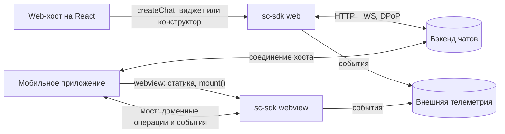
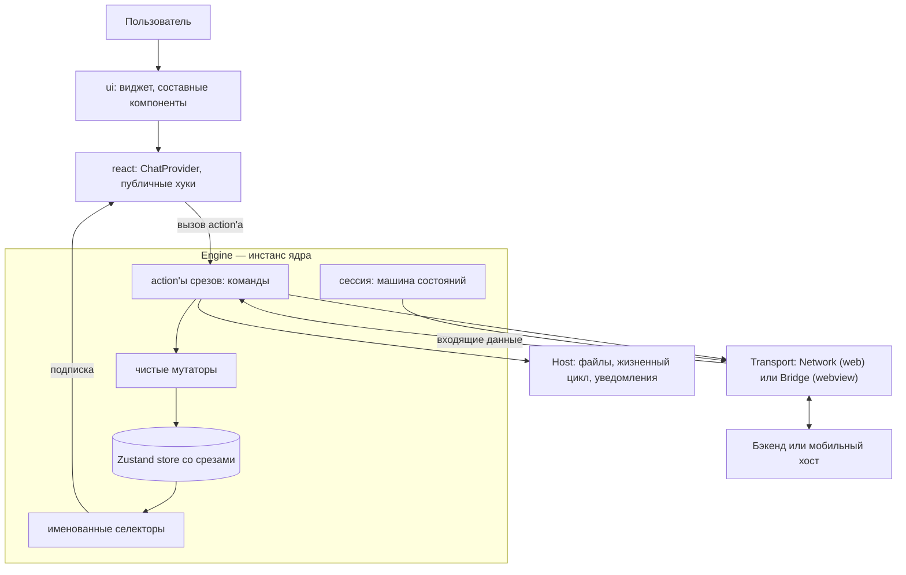
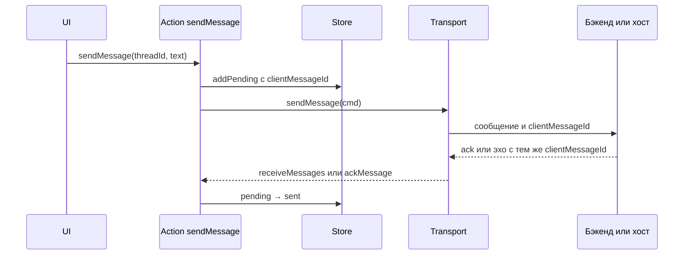
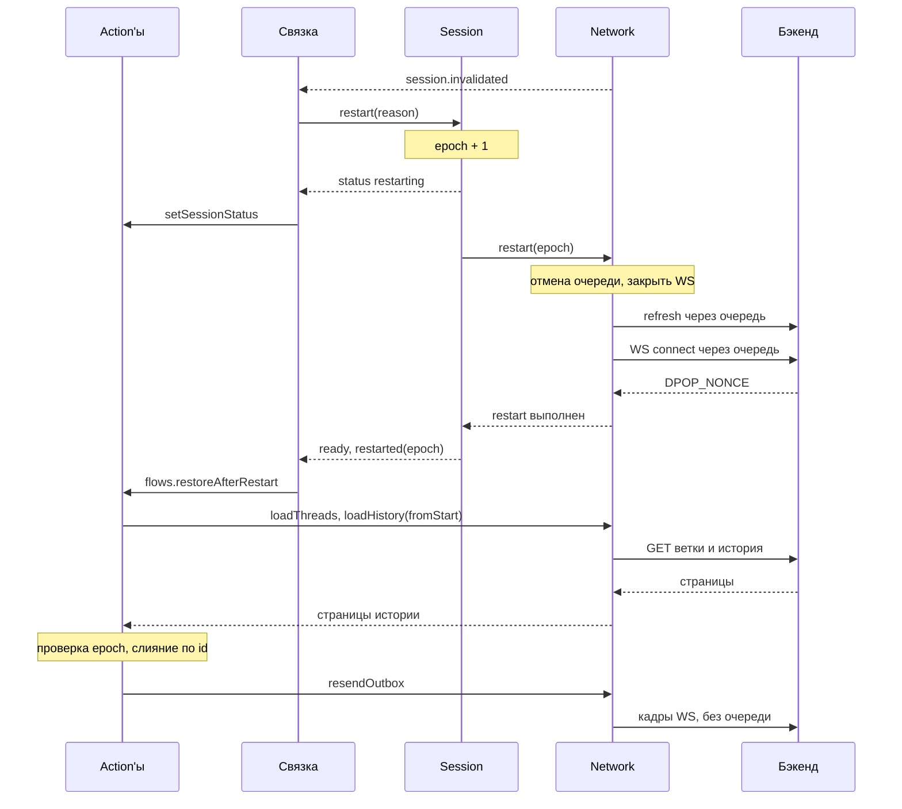
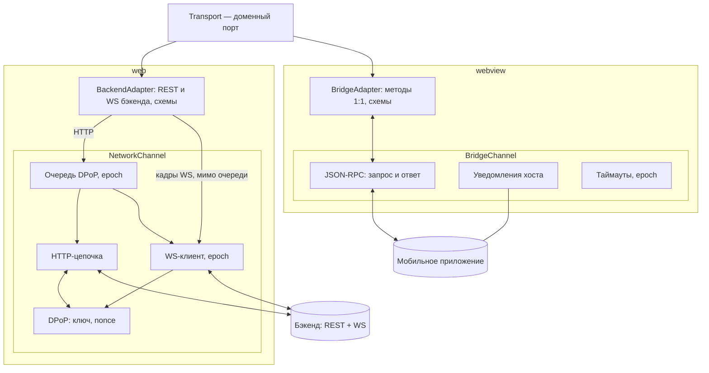

# sc-sdk: архитектура

> Рабочий документ. Переписан 01.10.2026 по итогам обсуждений 30.09–01.10.
> Пометки: **[решено]** — подтверждено командой; **[предложение]** — рекомендация, ждёт ADR; **[вопрос N]** — зависит от ответа из раздела 18.
> Прежняя версия с промежуточными вариантами — FINDINGS.prev.md. Отклонённые варианты с причинами — раздел 16.

## 1. Контекст и ограничения

- sc-sdk — платформа чатов, встраиваемая в продукты разных поверхностей.
- Поставка **[решено]**: готовый виджет и конструктор (хуки и компоненты) — оба варианта.
- Два режима **[решено]**:
  - **web** — React-библиотека, React в `peerDependencies`, хосты только на React. SDK сам работает с бэкендом по HTTP + WS с DPoP;
  - **webview** — статика внутри мобильного приложения, React в бандле, `mount()`. Единственный рабочий режим — relay: хост держит соединение, SDK запрашивает у него доменные операции через мост и в сеть не ходит.
- Ограничения **[решено]**:
  - малый бандл — не подходят RTK + saga, RxJS, MobX;
  - запрещён любой persist, включая IndexedDB;
  - на команды хостов влиять нельзя: их много, координировать сложно;
  - SDK в webview лежит статикой в приложении и выпускается вместе с ним;
  - телеметрия внешняя;
  - SDD — spec-driven development.
- Стек **[решено]**: React 18, Zustand (последняя, v5), styled-components, TypeScript, ESLint, Vitest, Playwright.
- Браузеры: Chromium, Яндекс Браузер; в webview — WKWebView (WebKit) и Android System WebView.
- Команда: архитектор, тимлид, 2 middle. Всё, что требует постоянного сопровождения, вводим, только если окупается сразу.

## 2. Ключевые решения

1. Ядро — **Engine**: инстанс с собственным Zustand-стором, сессией и сервисами. Стор — часть движка, наружу не виден напрямую. **[предложение]**
2. Состояние — **один Zustand-стор со срезами**, action'ы — это команды, изменения — чистые мутаторы, чтение — стандартные селекторы. Без событийного ядра и собственного фасада чтения. **[решено предварительно]**
3. **Transport — порт уровня домена** с двумя реализациями, каждая — адаптер поверх канала: `BackendAdapter` + `NetworkChannel` (web) и `BridgeAdapter` + `BridgeChannel` (webview, relay, JSON-RPC 2.0). Транспорт не имеет доступа к стору. Полный контракт — `contracts/transport.md`. **[решено]**
4. **Контракт моста = контракт Transport** — центральная спецификация для SDD; её реализуют SDK (web) и все команды хостов (webview). **[предложение]**
5. **DPoP только в web**, внутри `NetworkChannel`: последовательная очередь, nonce из HTTP и WS, два уровня восстановления. Стратегий авторизации как абстракции нет. **[решено]**
6. **Публичный API** — виджет, составные компоненты и именованные хуки. Форма стора в публичный API не входит. **[предложение]**
7. **Конфиг**: значения по умолчанию → удалённый → хост; хост может переписать что угодно. **[решено]**
8. **Код**: чистые функции для логики, тонкие сервисы для ввода-вывода, хуки — только клей. **[предложение]**
9. **События — только у сервисов** (транспорт, сессия, хост), эмиттер на инстанс. Стор и action'ы событий не эмитят. Связка в `core/wiring` маршрутизирует факты: независимые реакции — подписки, последовательности с порядком и условиями — сценарии в `core/flows`. **[решено]**

## 3. Схемы

### 3.1. Контекст



### 3.2. Модули



Внутри границы Engine лежит всё, чем движок владеет. Снаружи — адаптеры через порты (Transport, Host) и React-слой, который ходит только через хуки.

### 3.3. Отправка сообщения



### 3.4. Рестарт сессии (web)



Сессия управляет только соединением и сообщает факты. Данные восстанавливает сценарий `restoreAfterRestart` через action'ы и порт Transport. В webview фазу «restart(epoch) → restart выполнен» целиком делает хост и присылает `session.restarted`.

## 4. Модули и слои

```
src/
├─ core/                                чистый TS, без React и DOM
│  ├─ create-engine.ts                  Factory: стор + сервисы из переданных портов
│  ├─ ports/                            transport, host, logger, telemetry (+ noop-реализации)
│  ├─ session/                          машина состояний соединения, эмиттер status.changed / restarted
│  ├─ wiring/                           связка: факты сервисов → action'ы, реакции, сценарии
│  ├─ flows/                            сценарии с порядком: restoreAfterRestart, resumeFromBackground
│  ├─ store/                            createChatStore, named(), devtools — единственное место с zustand
│  ├─ domain/
│  │  ├─ messages/                      slice (action'ы), mutators, selectors, outbox, status
│  │  ├─ feed/                          buildFeed — проекция ленты, селекторы
│  │  ├─ threads/ files/ banner/ config/ ui/
│  ├─ time/day-ticker.ts                смена суток
│  └─ lib/                              emitter, serial-queue, request-reply, single-flight, memoize-last
├─ transports/
│  ├─ network/
│  │  ├─ backend-adapter/               web: протокол бэкенда (REST + WS), схемы, мапперы
│  │  └─ channel/                       очередь DPoP, HTTP-цепочка, WS-клиент, DPoP, epoch
│  ├─ bridge/
│  │  ├─ bridge-adapter/                webview: методы порта 1:1, схемы, capabilities
│  │  └─ channel/                       JSON-RPC 2.0 поверх моста, таймауты, epoch
│  └─ mock/                             тесты, Storybook, Playwright
├─ hosts/
│  ├─ web/                              колбэки из опций, <input type="file">
│  └─ native-bridge/                    методы хоста через мост, capabilities, диагностика
├─ react/                               ChatProvider, useChat, хуки по доменам, публичные хуки
├─ ui/                                  виджет, составные компоненты, рендереры сообщений
├─ entries/                             web.ts (библиотека), webview.ts (статика + mount) — Composition Root
└─ devtools/                            отладочные подключения, не в prod
test/
├─ contracts/                           контрактные наборы для Transport и Host
└─ builders/                            Test Data Builder
```

Направление зависимостей: `entries → ui → react → core ← transports, hosts`. core объявляет порты, транспорты и хосты их реализуют, entries собирают всё вместе. Границы проверяются одним инструментом — eslint-plugin-boundaries или dependency-cruiser **[предложение]**.

Владение и внедрение:
- **часть движка** (создаёт и уничтожает сам, больше никто не пользуется): стор, сессия, очереди, мутаторы и селекторы;
- **зависимость движка** (внедряется через порт, реализация меняется): transport, host, logger, telemetry.

## 5. Транспорт

### 5.1. Устройство: доменный порт, адаптер и канал **[решено]**



- **Порт** — один для обоих режимов, говорит на языке домена: в нём нет HTTP, WS, DPoP и моста. Движок видит только его.
- **Адаптер** — домен ↔ протокол: какие запросы делать, как разбирать ответы и кадры, как переводить ошибки в коды. Не знает, как данные доставляются.
- **Канал** — доставка: соединение, очередь, повторы, таймауты, epoch. Не знает доменных типов.
- **Пары:** `BackendAdapter` поверх `NetworkChannel` (web — SDK сам говорит на протоколе бэкенда) и `BridgeAdapter` поверх `BridgeChannel` (webview — SDK говорит на протоколе моста).
- **Транспорт не имеет доступа к стору** ни на чтение, ни на запись; импорт `core/store` и срезов ему запрещён правилом границ. Влияет только через результаты вызовов, события и ошибки с кодами. Нужные данные приложения он получает от вызывающего: при создании — параметрами фабрики, в работе — аргументами методов.
- **Экземпляры:** транспорт создаётся в Composition Root на каждый инстанс движка. Два чата на странице — два транспорта, два соединения, два ключа.

```ts
// entries/web.ts
const transport = createBackendAdapter(createNetworkChannel({ endpointsUrl, logger }), endpoints);

// entries/webview.ts
const transport = createBridgeAdapter(createBridgeChannel(window.nativeBridge, { timeoutMs: 15_000 }));
```

Общий интерфейс каналов не вводим: семантика разная (HTTP и поток WS-кадров против RPC-вызова). Абстракция над `RpcChannel` появится, если будет вторая реализация — например, `postMessage` для встраивания через iframe.

Полный контракт порта — `contracts/transport.md`.

### 5.2. Порт (кратко)

```ts
interface TransportLifecycle { start(ctx: Ctx): Promise<void>; restart(ctx: Ctx): Promise<void>; dispose(): void }
interface ThreadsPort   { loadThreads(): Promise<Thread[]> }
interface HistoryPort   { loadHistory(threadId: ThreadId, opts?: { fromStart?: boolean }): Promise<HistoryPage> }
interface MessagingPort { sendMessage(cmd: SendMessageCmd): Promise<Ack> }
interface FilesPort     { uploadFile(file: FileRef, threadId: ThreadId, opts: { uploadId: UploadId; signal?: AbortSignal }): Promise<UploadedFile> }
interface TransportEvents { on<K extends keyof TransportEventMap>(type: K, fn: (e: TransportEventMap[K]) => void): () => void }

type Transport = TransportLifecycle & ThreadsPort & HistoryPort & MessagingPort & FilesPort & TransportEvents & {
  readonly capabilities: TransportCapabilities;   // необязательные операции объявляются явно
};
```

- Потребители получают узкие интерфейсы: сессия — `TransportLifecycle`, срез сообщений — `MessagingPort` и `HistoryPort`, срез файлов — `FilesPort`.
- События: `message.received`, `message.acked`, `thread.created`, `file.uploadProgress`, `file.uploadConfirmed`, `connection.changed`, `session.invalidated` (web: «перезапусти меня»), `session.restarted` (webview: хост уже перезапустил). Каждое несёт epoch.
- Ошибки — `TransportError` с кодом из закрытого списка и признаком `retryable`.

### 5.3. Web: BackendAdapter + NetworkChannel

`BackendAdapter`:
- эндпоинты, схемы valibot, перевод ответов и кадров WS в доменные типы и события;
- стартовая последовательность протокола: адреса эндпоинтов → ключ и токены (раздел 7) → список веток по REST → подключение WS → первая страница истории активной ветки;
- ветки — по REST, новые ветки — кадром WS; пагинация своя у каждой ветки, флаг `hasNext` **[решено]**;
- склейка истории и живого потока: открыть WS и буферизовать → загрузить историю → слить с дедупликацией по id;
- `sendMessage` — кадр WS через канал мимо очереди, ожидание ack по `clientMessageId`;
- `update_token_error` → событие `session.invalidated`;
- сортировка без seq: серверное время сообщения, при равенстве — id **[вопрос 5]**.

`NetworkChannel`:
- единая очередь DPoP для HTTP-запросов и подключений WS (5.4);
- HTTP-цепочка: токен → подпись proof с текущим nonce → запрос; для загрузок — `XMLHttpRequest`, потому что `fetch` не сообщает прогресс отправки;
- WS-клиент: подключение через очередь с ожиданием `DPOP_NONCE`, переподключение с теми же учётными данными (`connection.changed`), отправка кадров мимо очереди;
- DPoP: ключ, токены, текущий nonce — единственное место с секретами (раздел 7);
- epoch: HTTP-запрос помнит поколение, в котором встал в очередь; каждый сокет создаётся с текущим поколением; ответы и кадры старого поколения отбрасываются;
- запрет прямых `fetch`, `XMLHttpRequest` и `new WebSocket` вне канала правилом линтера: запрос в обход очереди рвёт цепочку.

### 5.4. Единая очередь DPoP (web) **[решено]**

- Через одну последовательную очередь идут все операции, которые расходуют или обновляют nonce: HTTP-запросы и подключения WS, включая переподключение. `DPOP_NONCE` по WS может прийти во время HTTP-запроса и сделать его значение недействительным.
- Задача «подключить WS» завершается, только когда пришёл кадр `DPOP_NONCE` (или по таймауту). `DPOP_NONCE` приходит только после подключения, поэтому очередь полностью закрывает гонку за nonce.
- Proof для кадров по открытому WS не нужен → отправка сообщений идёт мимо очереди.
- Приоритеты ожидающих задач: рестарт → подключение WS → refresh токена → ветки и история → загрузка файлов. Выполняющаяся задача не прерывается; рестарт сначала отменяет очередь с кодом `aborted_by_restart`.
- Устаревший nonce: `token_error` в REST, `update_token_error` в WS. При единой очереди это ошибка SDK — логируется с номером звена. Обработка: `token_error` → один refresh → повтор; повторный `token_error` или `update_token_error` → рестарт **[вопрос 37]**.
- Цена: долгая загрузка файла задерживает переподключение WS, а значит и входящие. Варианты — принять и показывать статус или отменять загрузку при обрыве WS (через `signal`) и повторять после; решить на вертикальном срезе.
- Длительности (ожидание в очереди, рестарт, загрузки) отмечаются User Timing (`performance.mark` / `measure`) и видны во вкладке Performance.

### 5.5. Webview: BridgeAdapter + BridgeChannel (relay)

- Единственный рабочий режим webview — relay: хост держит соединение, SDK в сеть не ходит **[решено]**.
- `BridgeAdapter` — методы порта один к одному в методы моста, проверка ответов и уведомлений схемами, capabilities при старте. Необязательная операция без поддержки скрыта, а не падает.
- `BridgeChannel` — JSON-RPC 2.0 поверх моста: запрос и ответ по `id`, уведомления хоста без `id`, таймаут на каждый запрос, epoch.
- Переподключения, токены, nonce и рестарты — забота хоста. SDK видит `connection.changed` и `session.restarted` **[вопрос 15]**.
- Webview-сборка не содержит протокола бэкенда, DPoP и сетевого кода.

### 5.6. Загрузка файлов

Порт один, реализации разные.

Web:
1. Выбор через `<input type="file">` → `Blob` хранится в сервисе files, в сторе — метаданные.
2. `BackendAdapter.uploadFile({ kind: 'blob', ... })` → multipart через очередь DPoP с низшим приоритетом, прогресс через `XMLHttpRequest`.
3. Ответ даёт `fileId`; затем кадр `UPLOAD_FILE_API_REQUEST` → `file.uploadConfirmed` → колбэк хосту из опций.

Webview **[допущение, вопрос 14]**:
1. Выбор через мост → в SDK приходит ссылка `{ kind: 'host', hostFileId, name, size }`, байты в webview не попадают.
2. `BridgeAdapter.uploadFile` → метод моста `transport.uploadFile({ hostFileId, threadId, uploadId })`; хост читает и грузит файл сам.
3. Прогресс и подтверждение — уведомлениями хоста.

Общее:
- `uploadId` задаёт SDK — ключ для прогресса в сторе, отмены и связи с черновиком;
- отмена: в web `signal` снимает задачу с очереди или прерывает запрос, в webview — вызов моста `transport.cancelUpload`;
- `capabilities.maxFileSizeBytes` проверяется до загрузки;
- срез files в сторе от режима не зависит: ожидание, прогресс, ошибка, отмена, `fileId`.

### 5.7. Контракт моста **[предложение]**

- Основа — **JSON-RPC 2.0**:
  - вызов — `{ jsonrpc: '2.0', id, method: 'transport.loadHistory', params }`, ответ — `result` или `error`;
  - события хоста — уведомления без `id`: `{ method: 'transport.event', params: { type, data } }`;
  - ошибки — коды JSON-RPC с `data.code` из `TransportErrorCode`;
  - возможности — `transport.capabilities` при старте; нет ответа за таймаут → минимальный набор.
- Методы повторяют порт Transport один к одному, плюс методы порта Host и запрос опций инициализации.
- Epoch SDK передаёт хосту при `start` и `restart`, хост возвращает его в уведомлениях.
- Помимо формы, контракт фиксирует поведенческие гарантии из `contracts/transport.md`.
- Защита от разнобоя у хостов: общий контрактный набор тестов для обоих адаптеров, диагностический режим SDK для команд хостов, эталонные реализации для iOS и Android, минимальная поверхность моста.
- Следствия статического размещения SDK: согласование версий протокола в рантайме не нужно, хватает capabilities; исправления доходят до пользователей с релизами приложений; версию SDK стоит передавать хосту и бэкенду.
- Описание контракта — JSON Schema на каждое сообщение плюс поведенческие гарантии; AsyncAPI — если мобильные команды готовы. Кто владеет контрактом — **[вопрос 13]**.

## 6. Сессия

Машина состояний, общая для обоих режимов **[предложение]**:

```ts
const sessionTransitions = {
  idle:         ['starting'],
  starting:     ['ready', 'failed'],
  ready:        ['reconnecting', 'restarting', 'disposed'],
  reconnecting: ['ready', 'restarting', 'failed', 'disposed'],
  restarting:   ['ready', 'failed', 'disposed'],
  failed:       ['starting', 'disposed'],
  disposed:     [],
} as const satisfies Record<SessionState, readonly SessionState[]>;
```

Два уровня восстановления **[решено по ответам бэкенда]**:
- **`reconnecting`** — переподключение WS с теми же учётными данными, цепочка и пагинация сохраняются. Делает сам Network и сообщает `connection.changed`;
- **`restarting`** — полный рестарт после `update_token_error` (web, через `session.invalidated`), по `chat.restart()` от хоста или после исчерпания попыток переподключения. В webview хост перезапускает сам и присылает `session.restarted`.

Ответственность **[решено]**:
- **Сессия — только жизненный цикл соединения.** Решает, что нужен рестарт, поднимает epoch, вызывает `transport.restart`, повторяет с backoff. В стор не пишет, про ветки, историю и outbox не знает.
- Наружу сессия сообщает факты через свой эмиттер: `status.changed` и `restarted({ epoch })`. Связка превращает их в action `setSessionStatus` и сценарий `flows.restoreAfterRestart`.
- **Данные восстанавливает сценарий**: ветки → история открытых веток с первой страницы (слияние по id) → outbox с теми же `clientMessageId`. После каждого `await` проверяется epoch.
- Статус сессии означает «соединение готово». Загрузка истории видна по срезу `history` каждой ветки. Общий индикатор «чат готов», если нужен, — селектор по обоим.

Корректность рестарта:
- **epoch**: транспорт помечает входящее текущим epoch и отбрасывает запоздавшее от старой сессии, сценарии проверяют epoch после ожиданий;
- **отмена очереди с кодом** `aborted_by_restart`: сообщения не становятся failed, остаются в outbox;
- **single-flight** на уровне сессии и транспорта: одновременные `update_token_error` и `chat.restart()` дают один рестарт.

Как переходы запускаются: в web — ошибками сети и WS; в webview — сигналами хоста. Повторы — с backoff и лимитом попыток, после лимита — `failed`; истёкший refresh-токен — сразу `failed` с причиной `auth_required`.

## 7. Авторизация (только web)

**[решено]**
- SDK генерирует пару ECDSA P-256 (`extractable: false`) и считает thumbprint по RFC 7638. Отдельного эндпоинта регистрации ключа нет.
- Persist запрещён → ключ живёт только в памяти, при каждом запуске новый.
- Значение цепочки одноразовое, источники — ответы HTTP и `DPOP_NONCE` по WS.

**[предложение]**
- Привязка, вероятно, стандартная: каждый proof несёт публичный ключ в заголовке, сервер привязывает токен к thumbprint при выдаче. Кто и каким запросом получает стартовые токены — **[вопрос 1]**.
- Refresh — single-flight: N параллельных 401 → один refresh. Ротация refresh-токенов — **[вопрос 11]**.
- Порядок интерсепторов HTTP (снаружи внутрь): логирование → очередь → восстановление при ошибке цепочки → refresh при 401 → access-токен → DPoP-подпись → fetch. DPoP после токена, потому что proof содержит хэш токена; refresh снаружи обоих, потому что после обновления запрос переподписывается.
- `crypto.subtle` доступен только в secure context — проверить на поддерживаемых браузерах.
- В логи пишется только порядковый номер звена цепочки (`chain#17 → GET history`), не значение.

Время жизни токенов **[предложение]**:
- Истечение access-токена ломает и HTTP, и WS одновременно, поэтому обновлять его нужно заранее, а не по ошибке.
- Срок считается от момента получения токена по монотонным часам (`performance.now()` + `expires_in`), а не сравнением `exp` с часами устройства: часы устройства могут врать.
- Плановое обновление — задача очереди с высоким приоритетом за запас до истечения (например, 10–20% срока, не меньше минуты).
- После обновления токен доносится до открытого WS: кадром обновления токена, если протокол его поддерживает, иначе переподключением WS через очередь **[вопрос 38]**.
- Таймеры засыпают в фоне. При возврате на экран сначала проверить срок и при необходимости обновить токен, потом переподключать WS. Порядок задаёт очередь: refresh стоит в ней раньше подключения WS.
- Реактивный путь остаётся страховкой: `token_error` → один refresh → повтор; повторный `token_error` или `update_token_error` → рестарт.
- Истёк refresh-токен — SDK сам восстановиться не может: `session.invalidated` с причиной `auth_required`, и хост получает колбэк за новыми токенами **[вопрос 39]**.

Открыто: как передаётся proof при подключении WS **[вопрос 3]**, нужна ли новая пара ключей при полном рестарте **[вопрос 4]**.

## 8. Состояние

### 8.1. Стор **[решено предварительно]**

- Один Zustand-стор со срезами на инстанс движка: `createStore` из `zustand/vanilla` + React-контекст. Никаких `create()` на уровне модуля.
- **Action'ы = команды.** Action вызывает `set` с чистым мутатором и при необходимости порт. Логики между ними нет.
- **Мутаторы** — чистые функции `(state, args) => state`, лежат в домене. Аргументы сериализуемы (без функций и Blob).
- Реакции нескольких доменов на один факт — явной композицией мутаторов: `receiveMessage` = `appendMessage` + `touchThread`.
- Пачки (страница истории, сообщения после переподключения) применяются одним `set`.

```ts
// core/domain/messages/slice.ts
type SliceCreator<T> = StateCreator<ChatStore, [['zustand/devtools', never]], [], T>;

export const createMessagesSlice = (deps: StoreDeps): SliceCreator<MessagesSlice> => (set) => {
  const act = named(set, 'messages');
  return {
    messages: initialMessages,

    sendMessage: (threadId, text) => {
      const clientId = deps.ids.next();
      act('send', (s) => addPending(s, { threadId, clientId, text, at: Date.now() }), { threadId, clientId });
      deps.transport.sendMessage({ threadId, clientId, text });
    },

    receiveMessages: (messages) =>
      act('receive', (s) => messages.reduce(receiveMessage, s), { count: messages.length }),
  };
};

// core/store/named.ts
export const named = (set: DevtoolsSet<ChatStore>, domain: string) =>
  (action: string, fn: (s: ChatStore) => Partial<ChatStore>, payload?: object) =>
    set(fn, false, { type: `${domain}/${action}`, ...payload });
```

```ts
// core/store/create-chat-store.ts
export const createChatStore = (deps: StoreDeps, instanceId: string) =>
  createStore<ChatStore>()(
    devtools(
      (...a) => ({
        ...createMessagesSlice(deps)(...a),
        ...createThreadsSlice(deps)(...a),
        ...createSessionSlice(deps)(...a),
      }),
      { name: `sc-sdk#${instanceId}`, enabled: import.meta.env.DEV, anonymousActionType: 'UNNAMED' },
    ),
  );
```

### 8.2. Правила записи

- `setState` и прямые мутации вне `core` запрещены линтером. Импорт `zustand` разрешён только в `core/store`.
- Каждый `set` — с именем `домен/действие`. В полезной нагрузке для devtools — id и счётчики, без текстов сообщений и токенов.
- Сервисы (сессия, транспорт) пишут в стор только через action'ы.
- **Подписки на изменения стора — только для вывода наружу** (колбэк хосту о непрочитанном, телеметрия). Вызывать action'ы из подписки нельзя: это и есть лавина взаимных подписок из README.
- Реакция «изменилось X — сделай Y» внутри SDK пишется явно в action'е, который меняет X (`selectThread` сам вызывает `loadHistory`).

### 8.3. Что в сторе и что вне

В сторе (срезы):
- `session` — публичный статус и код ошибки;
- `config` — итоговый конфиг и возможности хоста;
- `threads`, `banner`;
- `messages` — порядок, метаданные, тексты, outbox, статусы;
- `history` — `hasNext` и загрузка по веткам;
- `files` — метаданные и прогресс;
- `clock` — `dayKey`;
- `ui` — развёрнутые дни, активная ветка, черновики по веткам **[решено: черновики только в памяти Zustand]**.

Вне стора:
- секреты: ключ DPoP, токены, значение цепочки, адреса эндпоинтов — внутри `NetworkChannel` и сессии;
- опции с функциями и адаптеры — в замыкании движка;
- очереди: HTTP, ожидающие ответы моста;
- Blob выбранных файлов;
- локальное состояние компонента (фокус, меню, текст во время набора) — `useState`.

Границы данных:
- секреты — ни в стор, ни в логи, ни в телеметрию;
- пользовательский контент — в стор и UI, но не в телеметрию и логи;
- на диск — ничего;
- ответы бэкенда и моста разбираются терпимо, опции хоста — строго.

### 8.4. События, связка и сценарии **[решено]**

- **События эмитят только сервисы**: транспорт (`message.received`, `message.acked`, `thread.created`, `file.uploadConfirmed`, `connection.changed`, `session.invalidated`, `session.restarted`), сессия (`status.changed`, `restarted`), хост. Это факты извне или о жизненном цикле.
- **Стор и action'ы не эмитят.** Изменения стора доходят до UI через селекторы; наружу — только `store.subscribe` с выводом (колбэк хосту), без вызова action'ов.
- **Эмиттер** — свой, типизированный, около 20 строк, на каждый инстанс сервиса; ошибки слушателей изолируются и логируются; `dispose` очищает подписки.
- **Связка `core/wiring`** — одна связь одна строка, без условий, циклов и состояния (проверяется `no-restricted-syntax` в `core/wiring/**`). Разбита по источникам: `transport.ts`, `session.ts`, `host.ts`. Сервисы не подписываются друг на друга напрямую.
- **Независимые реакции** на факт (стор, хост, телеметрия) — отдельные подписки в связке. Порядок между ними не важен.
- **Последовательности с порядком и условиями** (рестарт, старт, возврат из фона) — сценарии в `core/flows` с явными шагами и проверкой epoch.
- Реакции, которые должны быть атомарны со стором (сообщение и обновление ветки), — внутри одного action'а композицией мутаторов, а не отдельными подписками.
- Побочные эффекты из действий пользователя (телеметрия отправки) action вызывает через порт напрямую; событие стора для этого не нужно.

```ts
// core/wiring/transport.ts
export const wireTransport = ({ transport, session, actions, host, telemetry }: WiringCtx) => [
  transport.on('message.received', ({ message }) => actions.receiveMessages([message])),
  transport.on('message.received', ({ message }) => host.notifyIncoming?.(toHostMessage(message))),
  transport.on('message.received', ({ message }) => telemetry.track('message.received', { threadId: message.threadId })),
  transport.on('session.invalidated', ({ reason }) => session.restart(reason)),
];

// core/flows/restore-after-restart.ts
export const restoreAfterRestart = (d: { actions: RestoreActions; epoch: EpochRef }) => async (epoch: number) => {
  const stale = () => d.epoch.current() !== epoch;
  await d.actions.reloadThreads();      if (stale()) return;
  await d.actions.reloadOpenThreads();  if (stale()) return;
  d.actions.resendOutbox();
};
```

Признаки, что связка превращается в «божественный объект»: условия или переменные в ней, импорт мутаторов и селекторов, несколько строк подряд на одно событие (это скрытый сценарий), файл не помещается на экран. Альтернатива при росте — реакции, объявленные рядом с доменами (`domain/*/reactions.ts`), с регистрацией в центре.

### 8.5. Статусы сообщений

- Сейчас: pending → sent | failed. Доставки и прочтения нет **[вопрос 12]**.
- Повторная отправка безопасна благодаря дедупликации по `clientMessageId` **[решено: сервер дедуплицирует]**.
- Отображение failed и политика повторов — **[вопрос 23]**.

### 8.6. Перерисовки

Один стор не даёт лишних перерисовок: после `set` прогоняются селекторы подписчиков, а компонент перерисовывается, только если результат изменился (`Object.is`). Правила:
- селектор возвращает примитив, ссылку из стора или мемоизированный результат;
- несколько полей — `useShallow`; производные данные — именованный мемоизированный селектор;
- мутаторы сохраняют ссылки на неизменённые части состояния;
- строки ленты — `memo` с примитивными пропсами;
- высокочастотные обновления (прогресс загрузки) троттлятся до записи в стор. Если не поможет — отдельный маленький стор для них, но только после профилирования.

Проверка: React DevTools Profiler на сценарии «пришло 50 сообщений пачкой» и счётчик вызовов селекторов в dev.

## 9. Чтение и публичный API

### 9.1. Внутри SDK — стандартный Zustand **[решено]**

```ts
// react/use-chat.ts
export const useChat = <T>(selector: (s: ChatStore) => T) => useStore(useContext(ChatContext), selector);

// хуки по доменам — читаемость и более узкие типы
export const useMessages = <T>(sel: (m: MessagesState) => T) => useChat((s) => sel(s.messages));
export const useThreads  = <T>(sel: (t: ThreadsState) => T)  => useChat((s) => sel(s.threads));
```

- Селекторы именованные и лежат рядом со срезами, в `selectors.ts`.
- Анонимные селекторы в компонентах — только для простых выборок (`(s) => s.sendMessage`).
- Собственная абстракция над подпиской не нужна: стор и UI живут в одном пакете и меняются вместе.

### 9.2. Для хостов **[предложение]**

- **Виджет** — `<Chat />` для web и `mount(el)` для webview.
- **Конструктор** — составные компоненты (`<Chat.Root>`, `<Chat.Thread>`, `<Chat.Composer>`), виджет — их сборка по умолчанию.
- **Хуки** — именованные однострочники поверх `useChat`: `useFeedRows`, `useSendMessage`, `useSessionStatus`. Хосты не получают `useChat` и `ChatState`, поэтому рефакторинг стора не ломает semver.
- Публичная поверхность из-за конструктора растёт: под semver попадают компоненты и их пропсы. Тем важнее api-extractor и отчёт публичного API в репозитории.
- Уведомления хосту о фактах (например, `UPLOAD_FILE_API_REQUEST`) — методы порта Host, которые вызывает action: в web — колбэк из опций, в webview — метод моста **[вопрос 16]**.

## 10. Лента

- Группировка по дням — проекция, а не action: `buildFeed(order, meta, view): FeedRow[]`, мемоизированный селектор.

```ts
type FeedRow =
  | { kind: 'day'; key: `day:${string}`; dayKey: string }
  | { kind: 'unread'; key: 'unread' }
  | { kind: 'message'; key: string; id: string; position: 'single' | 'first' | 'middle' | 'last' };
```

- Плоский список под виртуализацию, стабильные ключи (`day:2026-09-29`, а не «Вчера»), в строке только id.
- Группировка по календарной дате не зависит от текущего времени: в полночь меняются только подписи, на часы подписан только разделитель.
- Время: тикер до полуночи + перепроверка при возврате на экран (`visibilitychange`, `pageshow`, сигнал хоста). Серверного времени нет, используем время устройства.
- Относительное время («5 минут назад») — не через стор, а общий тикер для видимых меток.
- Якорение скролла при подгрузке истории вверх: react-virtuoso умеет из коробки, TanStack Virtual — вручную, но легче.
- Разделители или сворачивание прошедших дней, часовой пояс — **[вопрос 22]**.

## 11. Конфиг

Четыре вида:
1. **Константы сборки** (версия SDK, web или webview, dev или prod) — подставляет бандлер.
2. **Опции инициализации от хоста** — разбираются строго в `createChat`, неизменяемы, живут в замыкании движка. В webview приходят только через мост **[решено]**.
3. **Удалённый конфиг** (настройки поверхности, feature flags) — разбирается терпимо, итог в срезе `config`.
4. **Состояние сессии** (токены, эндпоинты, цепочка) — не конфиг, в стор не попадает.

Правила:
- Приоритет **[решено]**: значения по умолчанию → удалённый конфиг → конфиг хоста. Хост может переписать что угодно, включая включение выключенного сервером. При расхождении SDK логирует предупреждение, чтобы было видно, откуда ошибки.
- Доступность функции = итоговый флаг ∧ возможность хоста — одна чистая функция `isAvailable`, а не условия по компонентам.
- `ChatOptions` — входной, частичный, публичный, держать маленьким. `ResolvedConfig` — внутренний и полный.
- На лету меняются только поля из белого списка (`chat.update({ theme, locale })`), остальное — пересоздание инстанса.

Старт webview-сборки: `mount()` → ожидание моста → запрос опций с таймаутом → `createChat` → старт сессии. Нет ответа моста — экран ошибки, а не пустой виджет **[вопрос 21]**.

Отвергнуто: ConfigProvider в React-контексте, глобальный `config.ts`, эндпоинты из env при сборке (раздел 16).

## 12. Код: чистые функции и сервисы **[предложение]**

- **Чистые функции** — бо́льшая часть логики: мутаторы, селекторы, `buildFeed`, `resolveConfig`, `isAvailable`, парсеры и мапперы, правила outbox, таблицы переходов. Время и id получают аргументами.
- **Сервисы** — только там, где есть состояние, ввод-вывод или жизненный цикл: сессия, транспорты, очередь, хост-адаптеры, тикер. Сервис тонкий; доменное `if` в нём — повод вынести функцию.
- Сервис — объект на инстанс, создаётся в Composition Root, зависимости получает параметрами. Не синглтон и не DI-контейнер.
- Фабрики (`createSession(deps)`) предпочтительнее классов: action'ы и методы уходят в компоненты, и у методов класса теряется `this` **[вопрос 35]**.
- **Хуки — только клей:** подписка на селектор или возврат action'а. Без `fetch`, доменных условий и `useEffect` с бизнес-логикой; `useEffect` — только для DOM.
- **Тесты:** чистые функции — таблицами; сервисы — с MockTransport, фейковым хостом и fake timers; хуки почти не тестируются; UI — компонентные тесты и Playwright (включая WebKit).

## 13. Отладка

- **Redux DevTools** через devtools middleware Zustand: лента action'ов с именами `домен/действие` и полезной нагрузкой. Отдельная лента на каждый инстанс, только в dev.
- **События сервисов** (транспорт, сессия) — отдельное соединение с расширением (`sc-sdk#id events`) из dev-точки входа: связка подписывает его на все эмиттеры через `onAny`, в ленту уходят тип, epoch, id и счётчики без текстов. Если сопоставлять две ленты станет неудобно — общий мост, где события и action'ы идут в одну ленту.
- **Длительности** (ожидание в очереди DPoP, рестарт, загрузки) — User Timing во вкладке Performance.
- **Logger** с пространствами имён `sc:session`, `sc:transport`, `sc:bridge`, уровнями и маскированием.
- **Цепочка «причина → следствие»**: связка `clientMessageId` → id запроса в очереди → correlation id моста, видна в логах и devtools.
- **Инварианты в dev**: после каждого action'а — `assertInvariants(state)`: нет дублей `clientMessageId`, у pending есть ветка, переход сессии допустим.
- **Webview**: Safari Web Inspector (`isInspectable` в debug-сборке хоста) и `chrome://inspect` (`setWebContentsDebuggingEnabled`). Флаги включают команды хостов. Своя отладочная панель по опции хоста в не-prod сборках, совмещённая с диагностикой моста.
- **Журнал для воспроизведения** — позже, если понадобится: кольцевой буфер «имя action'а + аргументы» в памяти, выгрузка по явному действию, маскирование текстов. Держать в prod — решение безопасности **[вопрос 30]**.

## 14. Контракты и DX

### 14.1. Контракты по цене изменения

- Дорогие: контракт моста (множество несогласованных команд), протокол бэкенда, схема конфига, публичный API SDK (виджет, компоненты, хуки).
- Дешёвые: внутренние порты, срезы, мутаторы, селекторы.
- Строгость и версионирование — там, где дорого. Внутри — TS-типы и компилятор.

### 14.2. Внешние контракты

- Спецификации API бэкенда нет **[решено]** → пишем сами: схемы valibot в транспортах — источник правды, типы выводятся из схем. Golden fixtures — записанный реальный трафик, из них же MSW-хендлеры.
- Контракт моста — JSON-RPC 2.0, схемы операций и событий + поведенческие гарантии (5.7, `contracts/transport.md`). Эталонные JSON-сообщения общие для нас и мобильных команд.
- Tolerant reader: неизвестные поля и события логируем и пропускаем. Внутри мажорной версии — только добавление.
- Публичный API: api-extractor с отчётом `.api.md` в репозитории, semver, политика deprecation.

### 14.3. DX расширения

- **Компилятор как чеклист**: union типов сообщений + карта рендереров через `satisfies` — забытый тип не компилируется.
- **Контрактные наборы тестов** для Transport и Host — исполняемая документация портов; автор реализации пишет только харнесс.
- **MockTransport со сценариями и Test Data Builder** (`aMessage().fromBot().build()`) — общие для Vitest, Storybook и Playwright.
- **Колокация по домену**: slice, мутаторы, селекторы — в одной папке.
- **Шаблон и README** в каждой точке расширения. Генераторов кода не нужно.
- Первый вертикальный срез делается в паре, дальше middle ведут реализации по контрактным тестам.

## 15. Инфраструктура и сборка

- **Две сборки из общего кода:**
  - web — библиотека, React в `peerDependencies` (диапазон — **[вопрос 33]**), NetworkChannel;
  - webview — статика с React внутри, `mount()`, BridgeAdapter. Протокола бэкенда, DPoP и сетевого кода в ней нет.
- Бюджет бандла — числом для каждой сборки, size-limit в CI **[вопрос 32]**.
- Слои по направлению зависимостей вместо FSD, один инструмент контроля границ.
- **Самописные утилиты** (покрыть тестами в первую очередь): emitter, serial-queue, request-reply, single-flight, backoff, memoize-last.
- **Стили — styled-components.** Издержки для встраиваемого SDK:
  - рантайм и вес;
  - inline-стили и CSP хоста **[вопрос 29]**;
  - риск двух экземпляров библиотеки у хоста.

  Сейчас не меняем: стили живут только в `ui`, решение обратимо. На время — `StyleSheetManager` с `namespace`, тема через CSS-переменные. Кандидат на замену — Linaria **[вопрос 34]**.
- SSR у web-хостов — **[вопрос 27]**: если есть, нужны `'use client'` на точке входа и `createChat` без побочных эффектов.

## 16. Рассмотрено и отклонено

- **Событийное ядро** (команда → событие → `applyEvent` → стор). Даёт журнал с точным воспроизведением, пакетирование и проверку полноты, но для команды из четырёх человек избыточно. Вернуться, если понадобится воспроизводить баги из webview по журналу или станет много реакций «один факт → несколько доменов». Переход механический: мутаторы становятся ветками `apply`.
- **Собственный фасад чтения** (`engine.read`, `useQuery`, `defineQuery`). Убирал форму стора из UI, но дублировал подписку Zustand. Стор и UI меняются вместе, поэтому внутри SDK это лишнее; граница нужна только для хостов, и её дают именованные хуки.
- **Название CQRS.** Отдельных моделей для записи и чтения нет; верное описание — action'ы и селекторы одного стора.
- **reselect** — пока не нужен; селекторы мемоизируем вручную. Вернуться, если понадобится общий кэш по аргументам.
- **Несколько сторов по доменам** — нет атомарности обновлений между доменами, межсрезовые селекторы превращаются в комбинации хуков.
- **Стратегии авторизации (`AuthStrategy`) и `TokenSource`** — после ответа про relay DPoP остался единственной схемой, и только в web.
- **Мост как канал только для токенов и файлов**, а данные SDK получает сам — режим не используется, единственный рабочий режим webview — relay.
- **Relay на уровне сырых HTTP-запросов и WS-кадров** — мост работает на уровне доменных операций.
- **Источники данных как React-провайдеры** (`<BridgeProvider>`) — StrictMode даёт двойные подключения, порядок слияния неявен, без React не тестируется.
- **RTK, Redux-saga, RxJS, MobX** — вес бандла. RTK без саг стоит перепроверить, если появятся признаки «самописного Redux»: хелперы в духе `createSlice`, middleware вокруг записи, публичный `dispatch`.
- **FSD** — рассчитан на приложения, для SDK лучше слои по направлению зависимостей.
- **DI-контейнер** (inversify, tsyringe) — декораторы, reflect-metadata, вес, непрозрачность.
- **Дублирующие проверки архитектуры** (ArchUnitTS вместе с правилами ESLint) — один инструмент границ.
- **xstate** — хватает таблиц переходов.
- **ConfigProvider в React-контексте, глобальный `config.ts`, эндпоинты из env** — ломают ядро без React, несколько инстансов и единый бандл для разных поверхностей.
- **Общая шина событий на всё приложение** — отклонена: события есть только у сервисов, у каждого свой эмиттер, связи — в `core/wiring`.
- **Действия хоста через «стратегию» в сессии и запись сессии в стор** — отклонено по SRP: сессия только сообщает факты.
- **Хореография для всего** (сценарий складывается из подписок) — порядок становится неявным, рестарт труднее менять. Последовательности — оркестрацией во `flows`.

## 17. Журнал ответов

30.09.2026:
- DPoP: значение одноразовое, параллельные запросы невозможны; при обрыве — ошибка и повторная инициализация.
- Ключевую пару генерирует SDK.
- seq и курсора нет, пагинация через `hasNext`.
- Сервер дедуплицирует по `clientMessageId`.
- Спецификации API нет. Серверного времени нет.
- По WS приходят только новые сообщения, правок и удалений нет.
- Есть лимиты на файлы и rate limit.
- SDK в приложении лежит статикой; на хосты влиять нельзя.
- Zustand последний; браузеры Chromium и Яндекс; стили — styled-components; команда — архитектор, тимлид, 2 middle.
- SDD — spec-driven development; телеметрия внешняя; любой persist запрещён; React — peer для web, в статике для webview.

01.10.2026:
- Поставка: виджет и конструктор; web-хосты только на React; несколько лент возможны, но не используются.
- Конфиг хоста может переписать удалённый, включая включение выключенного.
- Черновики — только в памяти Zustand.
- Ключ: ECDSA P-256, thumbprint по RFC 7638, эндпоинта регистрации нет.
- WS: подключение обновляет nonce (`DPOP_NONCE` сразу после подключения); переподключение с теми же учётными данными; при `update_token_error` — полный рестарт.
- Загрузка файлов — в той же цепочке.
- `DPOP_NONCE` по WS может прийти во время HTTP-запроса и сделать его значение недействительным → очередь единая для HTTP и WS.
- `DPOP_NONCE` приходит только после подключения WS. Устаревший nonce: `token_error` в REST, `update_token_error` в WS.
- Proof для отправки кадров по открытому WS не нужен.
- Ветки — по REST, новые — по WS; пагинация своя на ветку.
- Файл грузится по REST, после `UPLOAD_FILE_API_REQUEST` по WS событие передаётся хосту.
- Webview: опции только через мост; relay — единственный рабочий режим: хост держит соединение, SDK запрашивает доменные операции через мост и в сеть не ходит.
- reselect пока не используем; ядро — без событий.

## 18. Открытые вопросы

Бэкенд (web):
1. Кто и каким запросом получает стартовые токены, и как они привязываются к ключу — первым запросом с proof? Где SDK использует thumbprint?
2. Закрыт: `DPOP_NONCE` может прийти во время HTTP-запроса и сделать его значение недействительным → единая очередь.
3. Как передаётся DPoP-proof при подключении WS?
4. При полном рестарте после `update_token_error` нужны новая пара ключей и новые токены?
5. Страницы истории идут от новых к старым? Как начать с первой страницы? Есть ли в сообщении серверное время, монотонен ли id?
6. Одно WS-соединение на все ветки?
7. Rate limit: значения, как проявляется, рвёт ли 429 цепочку?
8. Лимиты файлов: размер, типы, количество.
9. Есть ли счётчики непрочитанного и признак прочтения?
10. Может ли удалённый конфиг меняться во время сессии? Перечитывать ли его после рестарта?
11. Ротируются ли refresh-токены и каким запросом SDK их обновляет?
12. Планируются ли статусы доставки и прочтения, правки и удаления?

Мобильные команды (мост):
13. Кто владеет контрактом моста, где он хранится и как меняется?
14. Как передаётся файл при загрузке: ссылка на выбранный файл и загрузка хостом, или байты через мост?
15. Какие сигналы о соединении хост отдаёт SDK: подключено, переподключение, рестарт?
16. `UPLOAD_FILE_API_REQUEST`: что хост делает с этим событием, его формат; нужно ли оно в web?
17. Какой набор методов моста уже есть у всех поверхностей?
18. Минимальные версии iOS и Android System WebView.
19. Бывают ли хосты, которые грузят SDK в webview по сети, а не статикой?
20. Может ли хост сообщать о сворачивании и возврате приложения?
21. Формат опций инициализации через мост; что делать, если мост не ответил.

Продукт:
22. Группировка: разделители по дням или сворачивание прошедших; часовой пояс устройства или поверхности?
23. Ошибка отправки: кнопка «повторить» или автоповтор, сколько попыток?
24. Сообщение неизвестного формата: скрыть или показать заглушку?
25. Требования к доступности и локализации.
26. Какие типы сообщений ожидаются в ближайший год?
27. Рендерят ли web-хосты на сервере (Next.js и подобное)?
28. Какие методы конструктора и пропсы компонентов нужны хостам в первую очередь?

Безопасность:
29. Разрешены ли у хостов inline-стили в CSP?
30. Можно ли держать журнал действий в памяти в prod-сборке, с маскированием, по флагу хоста?

Команда SDK:
31. Миграция: сохраняем публичный API текущих хостов или новая мажорная версия? Нужен ли период параллельной работы?
32. Бюджет бандла в КБ gzip для web и webview, текущий вес.
33. Какие версии React у web-хостов?
34. styled-components: peer или внутри web-сборки; оставляем или планируем замену?
35. Сервисы — фабрики или классы?

Добавлено:
36. Закрыт: proof для кадров по открытому WS не нужен; `DPOP_NONCE` только после подключения; устаревший nonce → `token_error` в REST, `update_token_error` в WS.
37. Бэкенд: различает ли `token_error` истёкший access-токен и неверный nonce (разные коды или поля)? Какой ответ означает «нужен refresh», а какой — «нужна новая сессия»?
38. Бэкенд: как обновлённый access-токен доходит до открытого WS — есть кадр обновления токена (судя по `update_token_error`, да) или нужно переподключение? Закрывает ли сервер WS при истечении токена? Какое время жизни у access- и refresh-токенов, приходит ли `expires_in`?
39. Бэкенд, web-хосты: что делать, когда истёк refresh-токен — SDK просит у хоста новые стартовые токены через колбэк? Как хост их получает?

## 19. Следующие шаги

1. Разослать вопросы: бэкенду — 1–12, мобильным командам — 13–21, продукту — 22–28, безопасности — 29–30.
2. Довести `contracts/transport.md` до согласованной версии и описать по нему контракт моста на JSON-RPC 2.0 — центральный артефакт SDD. Согласовать владельца (вопрос 13).
3. ADR: Engine со стором внутри; Zustand с action'ами без событийного ядра; два транспорта уровня домена; DPoP только в web; публичный API (виджет, конструктор, хуки); styled-components.
4. Вертикальный срез: отправка сообщения в обоих режимах — NetworkChannel на MSW + mock WS (очередь, nonce из WS, переподключение и рестарт) и BridgeAdapter с фейковым хостом; один контрактный набор тестов для обоих. Проверить перерисовки на пачке из 50 сообщений.
5. Схемы ответов бэкенда (valibot) и golden fixtures из реального трафика.
