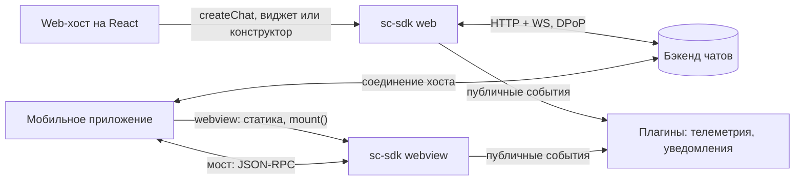
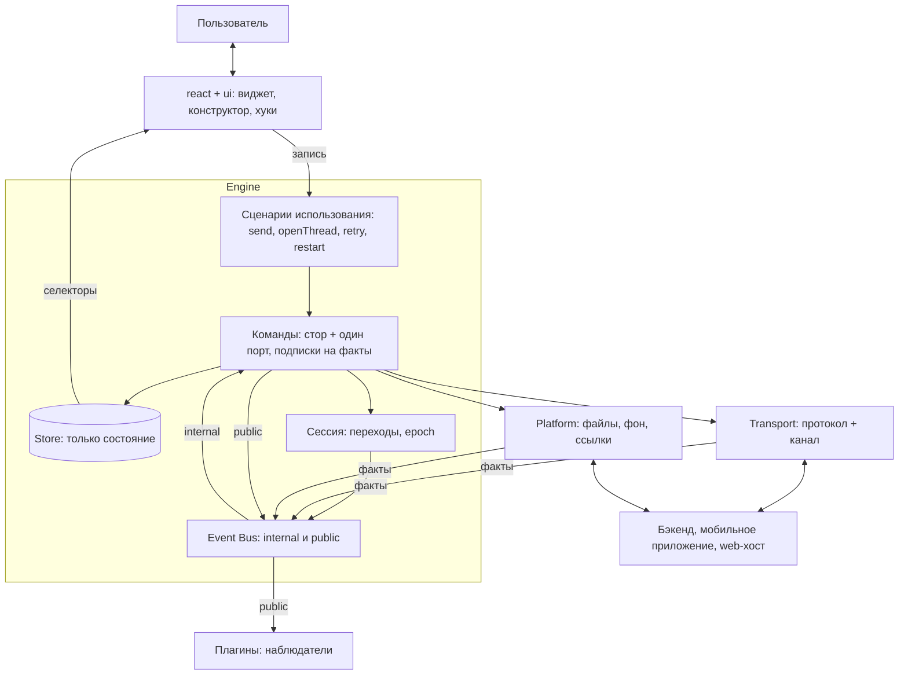
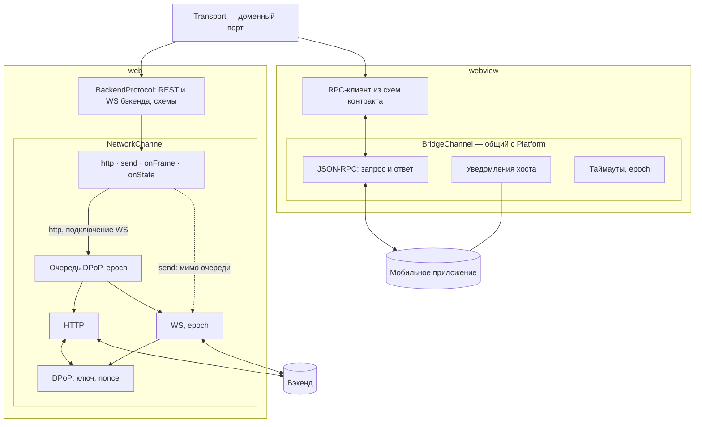
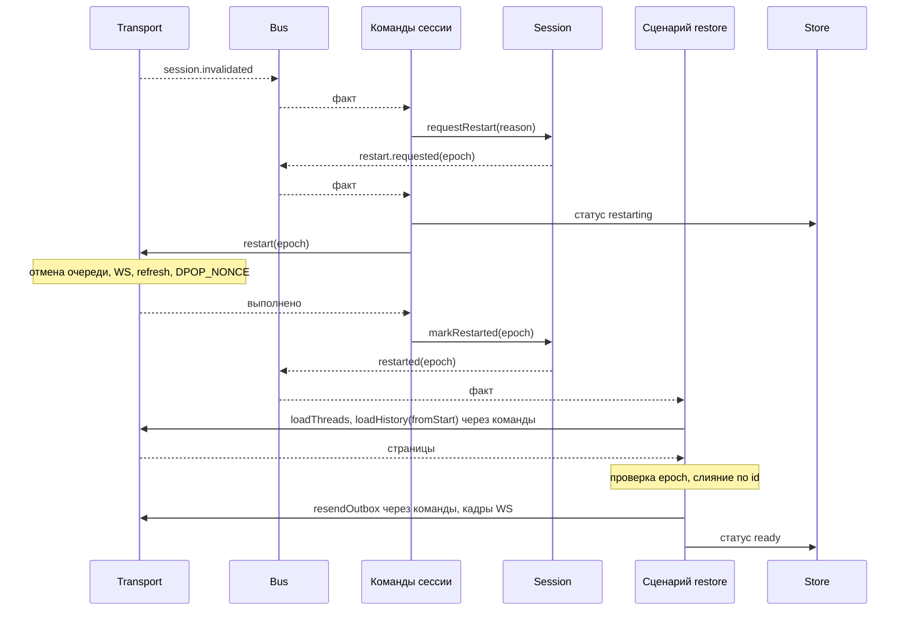

# sc-sdk: архитектура

> Рабочий документ. Версия от 01.10.2026 (вечер) — переписан целиком по итогам обсуждений 30.09–01.10.
> Пометки: **[решено]** — подтверждено командой; **[предложение]** — рекомендация, ждёт ADR или проверки на скелете; **[вопрос N]** — зависит от ответа из раздела 20.
> Прежние версии — `archive/`. Контракт транспорта — `contracts/transport.md`. Отклонённые варианты — раздел 18.

## 1. Контекст и ограничения

- sc-sdk — платформа чатов, встраиваемая в продукты разных поверхностей.
- Поставка **[решено]**: готовый виджет и конструктор (хуки и компоненты).
- Два режима **[решено]**:
  - **web** — React-библиотека, React в `peerDependencies`, хосты только на React. SDK сам работает с бэкендом по HTTP + WS с DPoP;
  - **webview** — статика внутри мобильного приложения, React в бандле, `mount()`. Единственный рабочий режим — relay: хост держит соединение, SDK запрашивает у него доменные операции через мост и в сеть не ходит. Опции инициализации — только через мост.
- Ограничения **[решено]**: малый бандл (не подходят RTK + saga, RxJS, MobX); запрещён любой persist, включая IndexedDB; на команды хостов влиять нельзя; SDK в webview лежит статикой в приложении; телеметрия внешняя; SDD — spec-driven development.
- Стек **[решено]**: React 18, Zustand (v5), styled-components, TypeScript, ESLint, Vitest, Playwright.
- Браузеры: Chromium, Яндекс Браузер; в webview — WKWebView (WebKit) и Android System WebView.
- Команда: архитектор, тимлид, 2 middle. Всё, что требует постоянного сопровождения, вводим, только если окупается сразу.

## 2. Ключевые решения

1. **Engine** — инстанс ядра: сценарии использования, команды, стор, сессия, шина. Всё, чем движок владеет, внутри; внешнее — через порты. **[предложение]**
2. **Запись и чтение.** UI пишет только через сценарии использования, читает стор стандартными селекторами Zustand. **[решено]**
3. **Эффекты только в командах.** Команда — атомарная операция: изменение стора и не больше одного вызова порта. Сценарии использования оркестрируют команды. Стор — только состояние, без портов. **[решено]**
4. **Event Bus на инстанс** с двумя уровнями: `internal` (факты сервисов → команды) и `public` (доменные события → плагины). Сервисы ничего не знают друг о друге и о сторе. **[решено]**
5. **Плагины вне ядра** — телеметрия, уведомления хоста, devtools — только читают публичный уровень шины. **[решено]**
6. **Порты:** `Transport` (данные чата) и `Platform` (возможности окружения). В webview оба работают поверх одного `BridgeChannel`. **[решено]**
7. **Transport:** web — `BackendProtocol` + `NetworkChannel` (DPoP, единая очередь); webview — RPC-клиент из схем контракта + `BridgeChannel` (JSON-RPC 2.0). Транспорт не имеет доступа к стору. **[решено]**
8. **Сессия** — машина состояний без ввода-вывода, epoch и single-flight. Ввод-вывод рестарта — в командах сессии. **[решено]**
9. **Структура файлов** — FSD без страниц: `app`, `widgets`, `features`, `entities`, `shared`; UI-кит в `shared/ui-kit`. **[решено]**
10. **Конфиг:** значения по умолчанию → удалённый → хост; хост может переписать что угодно. **[решено]**
11. **Проверка гипотез** — ходячий скелет с фейковым бэкендом в памяти (раздел 17). **[решено]**

## 3. Схемы

### 3.1. Контекст



### 3.2. Общая схема



Правила, которые видны на схеме:
- UI знает только сценарии использования и селекторы.
- Эффекты — изменения стора и вызовы портов — есть только в командах.
- Сервисы (сессия, Transport, Platform) принимают вызовы и публикуют факты в шину; друг о друге и о сторе не знают.
- Плагины видят только публичный уровень шины и ничего не пишут.
- Токены web-хост передаёт каналу транспорта в Composition Root, мимо движка.

### 3.3. Транспорт



### 3.4. Рестарт сессии (web)



В webview фазу «restart(epoch) → выполнено» целиком делает хост и присылает `session.restarted`; команды сессии превращают его в `markRestarted`, дальше всё одинаково.

## 4. Файловая структура: FSD без страниц **[решено]**

```
sc-sdk/
├─ contracts/                       документы контрактов (SDD) для людей: transport.md, platform.md, public-api.md
├─ adr/
├─ archive/                         прежние версии этого документа
├─ src/
│  ├─ app/
│  │  ├─ engine/                    createEngine, сборка стора из срезов, Event Bus, машина сессии, контракт плагинов
│  │  ├─ entries/                   web.ts, webview.ts, dev.ts — Composition Root
│  │  ├─ plugins/                   host-notifications, telemetry, devtools
│  │  └─ providers/                 ChatProvider
│  ├─ widgets/                      составные компоненты конструктора и виджет
│  │  ├─ feed/  composer/  thread-list/
│  │  └─ chat/                      виджет — сборка по умолчанию
│  ├─ features/                     сценарии использования: model (сценарий) + хук + ui
│  │  ├─ send-message/  attach-file/  open-thread/  load-older/  retry-message/
│  │  └─ restore-session/           внутренний сценарий, без UI
│  ├─ entities/                     состояние, селекторы, команды и UI сущности
│  │  ├─ message/                   model/ (срез, мутаторы, селекторы, команды), ui/ (пузырь, рендереры типов)
│  │  ├─ thread/  file/  banner/  config/
│  │  └─ session/                   публичный статус и команды сессии
│  └─ shared/
│     ├─ api/
│     │  ├─ transport/              port.ts, network/ (protocol, channel, dpop), bridge/ (rpc-transport), mock/
│     │  ├─ platform/               port.ts, web/, bridge/
│     │  └─ bridge-channel/         JSON-RPC поверх моста — общий для transport и platform
│     ├─ contracts/                 схемы valibot: transport, platform, bridge — источник типов и проверок
│     ├─ lib/                       emitter, backoff, single-flight, memoize-last, ids
│     └─ ui-kit/                    примитивы, тема — не знают о чате
├─ dev/fake-backend/                фейковый бэкенд в памяти (раздел 17)
└─ tests/                           contracts/, scenarios/, builders/, e2e/
```

Правила:
- Слои импортируют только вниз: `app` → `widgets` → `features` → `entities` → `shared`.
- Между слайсами одного слоя — только через `index.ts`; связки сущностей (входящее сообщение меняет и `message`, и `thread`) — через `@x` (FSD 2.1).
- Сегменты слайса: `ui`, `model`, `api`, `lib`.
- `zustand` разрешён только в `app/engine` и `entities/*/model`.
- Прямые `fetch`, `XMLHttpRequest`, `WebSocket` — только в `shared/api/transport/network/channel`.
- Транспорт и платформа видят только свои порты и `shared/contracts`.
- Проверка — Steiger и `eslint-plugin-boundaries`. Юнит-тесты лежат рядом с кодом, в `tests/` — то, что проверяет несколько модулей.
- Публичный экспорт для хостов собирается явным списком в `app/entries`.

Если `@x` окажется неудобным на скелете — запасной вариант: раскладка по доменам (`messages/state.ts`, `commands.ts`, `use-cases.ts`, `hooks.ts`, `ui/`) с теми же правилами по ролям файлов.

## 5. Транспорт

### 5.1. Устройство **[решено]**

- **Порт** — один для обоих режимов, на языке домена: без HTTP, WS, DPoP и моста. Потребители получают узкие интерфейсы: `TransportLifecycle`, `ThreadsPort`, `HistoryPort`, `MessagingPort`, `FilesPort`, `TransportEvents`.
- **Web: `BackendProtocol` + `NetworkChannel`.** Протокол — что делать (эндпоинты, схемы, кадры → события, стартовая последовательность, ожидание ack, перевод ошибок). Канал — как доставить (очередь DPoP, HTTP, WS, epoch, переподключение).
- **Webview: RPC-клиент + `BridgeChannel`.** Клиент собирается из схем `shared/contracts/transport.schema.ts`: метод порта → `transport.<метод>` → проверка результата. Вручную — только отличия webview: `FileRef` с `hostFileId`, передача epoch, capabilities.
- **Транспорт не имеет доступа к стору.** Влияет только через результаты вызовов, факты в шине и ошибки с кодами. Данные приложения получает параметрами фабрики или аргументами методов.
- **Экземпляр на инстанс движка**, создаётся в Composition Root.

Полный контракт — `contracts/transport.md`.

### 5.2. API канала (web)

```ts
export interface NetworkChannel {
  /** Через очередь DPoP: строго по одному, расходует nonce. */
  http<T>(req: HttpRequest, opts: { priority: Priority }): Promise<T>;
  /** Мимо очереди: кадр по открытому сокету, nonce не трогает. Нет соединения → TransportError('not_connected'). */
  send(frame: WsFrame): void;
  onFrame(fn: (f: WsFrame) => void): () => void;
  onState(fn: (s: WsState) => void): () => void;
  /** Подключение WS — внутренняя задача очереди, завершается после DPOP_NONCE. */
  start(ctx: Ctx): Promise<void>;
  /** Отмена очереди, закрытие сокета, новое подключение через очередь. */
  restart(ctx: Ctx): Promise<void>;
  close(): void;
}
```

Путь каждого метода фиксирован, вызывающий его не выбирает. Правило маршрутизации — «трогает ли операция nonce» — записано комментарием рядом с кодом канала.

### 5.3. Единая очередь DPoP **[решено]**

- Через очередь: HTTP-запросы и подключения WS (включая переподключение). `DPOP_NONCE` приходит только после подключения и может сделать недействительным значение HTTP-запроса в полёте — поэтому очередь одна.
- Мимо очереди: кадры по открытому WS — proof для них не нужен. Сообщение пользователя не ждёт загрузок и истории; без соединения оно ждёт в outbox, а не в очереди.
- Приоритеты ожидающих задач: рестарт → подключение WS → refresh токена → ветки и история → загрузка файлов. Выполняющаяся задача не прерывается.
- Устаревший nonce: `token_error` в REST, `update_token_error` в WS — при единой очереди это ошибка SDK, логируется с номером звена. `token_error` → один refresh → повтор; повторный `token_error` или `update_token_error` → `session.invalidated` **[вопрос 37]**.
- Цена: долгая загрузка задерживает переподключение WS и входящие. Принять или отменять загрузку при обрыве — решаем на скелете.
- Длительности — User Timing во вкладке Performance.

### 5.4. Загрузка файлов

- Web: `<input type="file">` → `Blob` в сервисе файлов → multipart через очередь с низшим приоритетом, прогресс через `XMLHttpRequest` → `fileId` → кадр `UPLOAD_FILE_API_REQUEST` → `file.uploadConfirmed`.
- Webview **[допущение, вопрос 14]**: файл выбирает хост, в SDK приходит `{ kind: 'host', hostFileId, … }`, загрузку делает хост, прогресс и подтверждение — уведомлениями.
- Общее: `uploadId` задаёт SDK; отмена через `signal`; `capabilities.maxFileSizeBytes` проверяется до загрузки; срез файлов в сторе от режима не зависит.

### 5.5. Контракт моста **[предложение]**

- JSON-RPC 2.0: вызовы `transport.*` и `platform.*`, уведомления `transport.event` и `platform.event`, ошибки с `data.code` из `TransportErrorCode`, `transport.capabilities` при старте.
- Epoch SDK передаёт хосту при `start` и `restart`, хост возвращает его в уведомлениях.
- Схемы `shared/contracts/*.schema.ts` — источник для типов, проверки ответов, диагностического режима и JSON Schema для мобильных команд.
- Защита от разнобоя у хостов: общий контрактный набор тестов, диагностический режим SDK, эталонные реализации для iOS и Android, минимальная поверхность моста.
- SDK статикой в приложении → согласование версий в рантайме не нужно, хватает capabilities; версию SDK передавать хосту и бэкенду. Кто владеет контрактом — **[вопрос 13]**.

## 6. Platform **[решено]**

Порт описывает не «что умеет хост», а «чем отличается окружение»:

```ts
export interface Platform {
  readonly capabilities: { customFilePicker: boolean; haptics: boolean };
  pickFiles(opts: PickOptions): Promise<FileRef[]>;
  openLink(url: string): void;
  openFile?(file: FileAttachment): void;
  on<K extends keyof PlatformEventMap>(type: K, fn: (e: PlatformEventMap[K]) => void): () => void;   // app.resumed, app.paused, network.changed
}
```

- **Web** — браузер: `<input type="file">`, `visibilitychange` и `pageshow`, `online` и `offline`, `window.open`. Необязательные переопределения из опций хоста: свой выбор файлов, перехват ссылок, просмотр вложений **[вопрос 40]**.
- **Webview** — методы `platform.*` на общем `BridgeChannel`.
- Выбор файла — вызов с ответом, а не факт. Фактами в шину Platform публикует только жизненный цикл приложения и сеть.
- Что не относится к Platform: токены (зависимость канала транспорта), опции инициализации (аргумент `createChat`), уведомления хосту (плагин на публичных событиях).

## 7. Сессия **[решено]**

### 7.1. Зачем машина состояний

У сессии много источников событий в любом порядке: обрыв WS, `update_token_error`, `session.restarted` от хоста, `chat.restart()`, возврат из фона, истёкший refresh-токен, `dispose`. Флаги допускают невозможные сочетания и гонки (переподключение поверх рестарта, оживление после `dispose`, «готово» после `failed`). Таблица переходов решает их по построению: всё, чего нет в таблице, отбрасывается и логируется.

```ts
const transitions = {
  idle:         ['starting', 'disposed'],
  starting:     ['ready', 'failed', 'disposed'],
  ready:        ['reconnecting', 'restarting', 'disposed'],
  reconnecting: ['ready', 'restarting', 'failed', 'disposed'],
  restarting:   ['ready', 'failed', 'disposed'],
  failed:       ['starting', 'disposed'],
  disposed:     [],
} as const satisfies Record<SessionState, readonly SessionState[]>;
```

Дополнительно: один источник правды для статуса в UI; тесты таблицей без моков; таблица — готовая диаграмма. xstate не нужен. Та же техника — для статуса сообщения (`pending → sent | failed`, `failed → pending`). Больше машин состояний не вводим.

### 7.2. Устройство

- **Сессия без ввода-вывода:** переходы, epoch, single-flight. Методы `requestRestart`, `markRestarted`, `markFailed`; факты `restart.requested`, `restarted`, `status.changed` — в шину.
- **Ввод-вывод — в командах сессии:** по `restart.requested` вызывают `transport.restart(epoch)` с backoff, затем `markRestarted` или `markFailed`; по `session.invalidated` от транспорта — `requestRestart`; статус — в срез `session` стора.
- **Восстановление данных** — сценарий `features/restore-session` по факту `restarted`: ветки → история открытых веток с первой страницы (слияние по id) → outbox с теми же `clientMessageId`; после каждого ожидания проверка epoch.
- Два уровня восстановления: `reconnecting` (WS с теми же учётными данными, делает канал) и `restarting` (полный рестарт). В webview рестарт делает хост и присылает `session.restarted`.
- При рестарте клиентский стор не очищается. Статус сессии означает «соединение готово», загрузка истории видна по срезу `history`.

### 7.3. Epoch

Номер поколения сессии, растёт при каждом `start` и `restart`.
- Канал помечает им всё входящее: HTTP-запрос помнит поколение очереди, сокет — своё поколение, в webview epoch передаётся хосту и возвращается в уведомлениях. Старое отбрасывается, вызов отклоняется с `aborted_by_restart`.
- Сценарии проверяют epoch после каждого ожидания.
- Отмена (`AbortController`) останавливает то, что ещё можно остановить; epoch отбрасывает то, что не успели.
- В стор не попадает.

## 8. Авторизация (только web)

**[решено]**
- SDK генерирует пару ECDSA P-256 (`extractable: false`) и считает thumbprint по RFC 7638; эндпоинта регистрации ключа нет.
- Persist запрещён → ключ только в памяти, при каждом запуске новый.
- Значение цепочки одноразовое; источники — ответы HTTP и `DPOP_NONCE` по WS после подключения; proof для кадров по открытому WS не нужен.

**[предложение]**
- Привязка, вероятно, стандартная: proof несёт публичный ключ, сервер привязывает токен к thumbprint при выдаче. Кто получает стартовые токены — **[вопрос 1]**.
- Токены — зависимость канала: стартовые и новые при `auth_required` приходят из опций web-хоста в Composition Root, движок о них не знает.
- Плановое обновление access-токена: срок по монотонным часам (`performance.now()` + `expires_in`), задача очереди с высоким приоритетом за запас до истечения; донести до WS кадром обновления или переподключением **[вопрос 38]**. При возврате из фона — сначала проверить срок.
- Refresh — single-flight. Истёк refresh-токен → `failed` с причиной `auth_required` и колбэк хосту **[вопрос 39]**.
- Порядок в HTTP-цепочке: логирование → очередь → refresh при 401 → access-токен → DPoP-подпись → запрос.
- В логи — только номер звена цепочки, не значение.

## 9. Ядро: стор, команды, сценарии, шина, плагины

### 9.1. Стор **[решено]**

- Один Zustand-стор со срезами на инстанс (`createStore` из `zustand/vanilla` + контекст). Никаких `create()` на уровне модуля.
- **Только состояние:** action'ы — синхронные `set(чистый мутатор)` с именем `домен/действие` для devtools. Ни портов, ни зависимостей в срезах.
- Мутаторы — чистые функции; аргументы сериализуемы; реакции нескольких сущностей на один факт — композицией мутаторов в одном `set` (атомарно).
- `setState` и мутации вне `app/engine` и `entities/*/model` запрещены линтером.
- Срезы: `session` (публичный статус), `config`, `threads`, `banner`, `messages` (порядок, метаданные, тексты, outbox, статусы), `history`, `files`, `clock`, `ui` (развёрнутые дни, активная ветка, черновики — только в памяти **[решено]**).
- Вне стора: секреты (канал), очереди (сервисы), Blob файлов, производные данные (селекторы), локальное состояние компонентов (`useState`).
- Подписки на стор — только для вывода наружу (в плагинах), без вызова action'ов.

### 9.2. Команды и сценарии использования **[решено]**

- **Сценарии использования** (`features/*/model`) — то, что UI и хост могут попросить: `sendMessage(text, files)`, `openThread`, `loadOlder`, `retry`, `restart`. Внутренние сценарии (`restore-session`) запускаются фактами. Оркестрируют команды, порты не вызывают.
- **Команды** (`entities/*/model`) — атомарные операции: изменение стора и не больше одного вызова порта. Каждый модуль команд объявляет подписки на факты шины в `subscribe()`. Входящие данные — тоже команды (`receiveMessages`).
- UI знает только сценарии использования, даже тривиальные.

```ts
// features/send-message/model.ts
export const sendMessage = (c: Commands) => async (threadId: ThreadId, text: string, files: FileRef[] = []) => {
  const draftId = c.messages.createDraft({ threadId, text });
  const fileIds = await Promise.all(files.map((f) => c.files.upload(f, threadId, { draftId })));
  c.messages.send({ draftId, fileIds });
};

// entities/message/model/commands.ts
export function createMessageCommands(d: MessageDeps) {
  const commands = {
    send: ({ draftId, fileIds }) => {
      const p = d.store.promoteDraftToPending(draftId, fileIds, d.ids.next());
      d.messaging.sendMessage(toCmd(p));
    },
    receiveMessages: (messages: Message[]) => {
      d.store.receiveMessages(messages);
      d.bus.public.emit('message.received', toPublic(messages));
    },
  };
  const subscribe = () => [
    d.bus.internal.on('transport.message.received', ({ message }) => commands.receiveMessages([message])),
    d.bus.internal.on('transport.message.acked', ({ ack }) => d.store.ackMessage(ack)),
  ];
  return { commands, subscribe };
}
```

### 9.3. Event Bus **[решено]**

```ts
export const createBus = () => ({
  internal: createEmitter<InternalEventMap>(),   // факты транспорта, платформы, сессии
  public: createEmitter<PublicEventMap>(),       // доменные события для плагинов, под semver
});
```

Правила:
1. В шине только факты, никаких команд.
2. На `internal` подписываются только модули команд и сценарии использования, и только при сборке. Сервисы на шину не подписываются.
3. В `public` публикуют только команды и сценарии; плагины видят только `public`.
4. Обработчик факта не публикует новый внутренний факт — последовательности только в сценариях.
5. Эмиттер на инстанс; ошибки слушателей изолируются и логируются; `dispose` очищает подписки.
6. Имена: `источник.сущность.прошедшее_время`; в событиях нет текстов сообщений и токенов.

### 9.4. Плагины **[решено]**

```ts
export interface EnginePlugin {
  name: string;
  setup(ctx: { events: { on: PublicBus['on'] }; select<T>(sel: (s: ChatState) => T): T; logger: Logger }): () => void;
}
```

- Встроенные: `host-notifications` (web — колбэки из опций; webview — через мост, подключается по умолчанию), `telemetry`, `devtools`.
- Плагины только читают; не зависят друг от друга и от порядка; ошибки изолированы.

### 9.5. Перерисовки

- Селектор возвращает примитив, ссылку из стора или мемоизированный результат; несколько полей — `useShallow`; производные — именованный мемоизированный селектор (reselect пока не используем).
- Мутаторы сохраняют ссылки на неизменённые части; строки ленты — `memo` с примитивными пропсами; частые обновления (прогресс) троттлятся.
- Проверка — пачка из 50 сообщений в скелете.

## 10. Чтение и публичный API

- Внутри SDK — стандартный Zustand: `useChat(selector)` через контекст, именованные селекторы рядом со срезами, хуки по сущностям. Собственной абстракции над подпиской нет.
- Для хостов **[предложение]**: виджет (`<Chat />`, `mount(el)`), составные компоненты (`widgets/*`), именованные хуки (чтение — селекторами, запись — сценариями). `useChat` и `ChatState` наружу не уходят. Экспорт — явным списком в `app/entries`, отчёт api-extractor в репозитории.
- Публичные события для хостов — через плагин уведомлений.

## 11. Лента

- Группировка по дням — проекция `buildFeed(order, meta, view): FeedRow[]`, мемоизированный селектор; плоский список под виртуализацию, стабильные ключи, в строке только id.
- В полночь меняются только подписи разделителей; на часы подписан только разделитель. Тикер до полуночи + перепроверка по `app.resumed`.
- Серверного времени нет — время устройства. Относительное время — общий тикер для видимых меток.
- Якорение скролла при подгрузке вверх; выбор виртуализатора — на скелете.
- Разделители или сворачивание, часовой пояс — **[вопрос 22]**.

## 12. Конфиг

1. Константы сборки — подставляет бандлер.
2. Опции инициализации — разбираются строго в `createChat`, неизменяемы; в webview — только через мост.
3. Удалённый конфиг — разбирается терпимо, итог в срезе `config`.
4. Состояние сессии — не конфиг.

- Приоритет **[решено]**: значения по умолчанию → удалённый → хост; хост может включить выключенное сервером, SDK логирует расхождение.
- Доступность = флаг ∧ возможность платформы — одна чистая функция.
- На лету — только белый список (`chat.update({ theme, locale })`).
- Старт webview: `mount()` → ожидание моста → `init.getOptions` с таймаутом → `createChat`; нет ответа — экран ошибки.

## 13. Код **[решено]**

- Чистые функции — мутаторы, селекторы, `buildFeed`, `resolveConfig`, мапперы, таблицы переходов. Время и id — аргументами.
- Эффекты — только команды; сервисы (каналы, сессия, платформа) — тонкие объекты на инстанс, зависимости — параметрами, фабрики вместо классов **[вопрос 35]**.
- Хуки — только клей; `useEffect` — только для DOM.
- Тесты: чистые функции — таблицами; команды и сценарии — с фейковым бэкендом; хуки почти не тестируются; UI — компонентные тесты и Playwright с WebKit.

## 14. Отладка

- Redux DevTools: лента action'ов стора (middleware Zustand, `домен/действие`) и отдельная лента шины (плагин `devtools` подписан на `internal` и `public` через `onAny`). Только dev.
- User Timing во вкладке Performance — очередь DPoP, рестарт, загрузки.
- Logger с пространствами имён и маскированием.
- Инварианты в dev после каждого action'а: нет дублей `clientMessageId`, переходы сессии по таблице.
- Webview: Safari Web Inspector и `chrome://inspect` (флаги в debug-сборках хостов); своя отладочная панель как плагин, совмещённая с диагностикой моста.
- Журнал для воспроизведения — позже, в памяти, с маскированием **[вопрос 30]**.

## 15. Контракты и DX

- Дорогие контракты: мост (несогласованные команды), протокол бэкенда, конфиг, публичный API (виджет, компоненты, хуки, публичные события).
- Схемы valibot в `shared/contracts` — источник правды; golden fixtures из реального трафика; tolerant reader; api-extractor и semver для публичного API.
- Общие контрактные наборы тестов для транспорта и платформы; MockTransport и Test Data Builder; шаблон и README для новой сущности.
- Компилятор как чеклист: union типов сообщений + карта рендереров через `satisfies`.

## 16. Сборка и инфраструктура

- Две сборки: web (библиотека, React peer **[вопрос 33]**) и webview (статика с React, без сети и DPoP).
- Бюджет бандла — числом, size-limit в CI **[вопрос 32]**.
- Самописное: emitter, backoff, single-flight, memoize-last; очередь DPoP — в канале, request-reply — в `BridgeChannel`.
- Стили — styled-components, только в UI; `StyleSheetManager` с `namespace`, тема через CSS-переменные; кандидат на замену — Linaria **[вопрос 34]**.
- SSR у web-хостов — **[вопрос 27]**.

## 17. Проверка гипотез: ходячий скелет **[решено]**

### 17.1. Гипотезы

1. FSD без страниц и правила границ работают, включая `@x`.
2. Стор без портов, команды и сценарии не дают лишнего шаблонного кода.
3. Один стор не вызывает лишних перерисовок.
4. Единая очередь DPoP исключает гонки за nonce.
5. Машина сессии и epoch переживают обрывы и рестарты.
6. Network и RPC-транспорт взаимозаменяемы.
7. Отладка отвечает на вопрос «почему не ушло сообщение».

### 17.2. Объём

Входит: одна ветка, текстовые сообщения; отправка, приём, история; статусы и повтор; рестарт и переподключение; оба режима; простая лента с базовой виртуализацией; `shared/ui-kit` с двумя-тремя примитивами.
Не входит: файлы (вторая итерация), несколько веток, баннер, конфиг, реальный бэкенд, стили.

### 17.3. Фейковый бэкенд в памяти

```
dev/fake-backend/
├─ model.ts         состояние и правила протокола: одноразовый nonce, DPOP_NONCE после подключения,
│                   пагинация с состоянием, дедупликация по clientMessageId, update_token_error
├─ chaos.ts         dropWs(), tokenError(), delay(ms), burst(n), restartFromHost()
├─ adapters/
│  ├─ msw-http.ts   REST поверх модели
│  ├─ ws.ts         WS поверх модели (перехват WebSocket в MSW 2.x или mock-socket)
│  └─ fake-host.ts  мост на JSON-RPC поверх модели — для webview
└─ fixtures/
```

- Одна модель, три адаптера: один сценарий прогоняется в обоих режимах.
- Моделируется только то, что зафиксировано в `contracts/transport.md` и журнале ответов.
- Против расхождения с реальностью: golden fixtures из реального трафика и периодический прогон контрактных тестов против стенда.
- Позже модель можно обернуть в Node-сервер для мобильных команд без переписывания.
- Демо-страница на Vite: переключатель режима и кнопки хаоса.

### 17.4. Критерии

1. Контрактные тесты проходят для обоих транспортов и Mock.
2. Случайное чередование истории, переподключений и рестартов (сотни прогонов) — ни одного `token_error`.
3. Сообщение, отправленное во время рестарта, доставлено ровно один раз; страница прошлого epoch не попадает в стор; после `dispose` во время рестарта — тишина.
4. Пачка из 50 сообщений перерисовывает только ленту и новые строки.
5. Steiger и boundaries проходят; намеренно неверный импорт падает.
6. Фича «повторить отправку» — не больше четырёх файлов.
7. Middle добавляет сущность `banner` по шаблону — замеряем время и вопросы.
8. В DevTools видна цепочка «обрыв → рестарт → переотправка → ack».
9. size-limit фиксирует вес сборок; в webview нет DPoP и сети.

Время — одна-две недели, архитектор и middle в паре; второй middle подключается на пункте 7. Итог — отчёт по каждому критерию и правки в этот документ.

## 18. Рассмотрено и отклонено

- **Событийное ядро** (команда → событие → `applyEvent`) — избыточно; вернуться, если понадобится точное воспроизведение по журналу.
- **Собственный фасад чтения** (`useQuery`, `defineQuery`) — дублировал подписку Zustand.
- **Название CQRS** — отдельных моделей нет.
- **reselect** — пока не нужен.
- **Несколько сторов** — нет атомарности между доменами.
- **Action'ы стора, вызывающие порты** — стор зависел бы от ввода-вывода; эффекты перенесены в команды.
- **Связка (`wiring`) как отдельный слой** — маршрутизация без логики; подписки перенесены в модули команд, а затем в шину. Вариант «команды общаются только через связку» — шина команд с неявным порядком.
- **Хореография для всего** — порядок неявен; последовательности — сценарии.
- **Сессия, вызывающая транспорт, и сессия, пишущая в стор** — нарушение SRP; сессия без ввода-вывода.
- **Публичные события как канал внутренней координации** — плагины видели бы внутреннюю кухню.
- **Общая шина на всё приложение** — шина только на инстанс.
- **Host как порт** — переименован в Platform; уведомления хосту — плагин; токены — зависимость канала.
- **Слияние Platform в Transport** — в web смешало бы DOM с сетью; общий только канал в webview.
- **Отдельный `BridgeAdapter`** — заменён RPC-клиентом из схем; **`BackendAdapter`** переименован в `BackendProtocol`.
- **Группировка API канала (`serial`, `live`)** — путь метода фиксирован, достаточно плоского API.
- **Стратегии авторизации (`AuthStrategy`), `TokenSource`** — DPoP только в web.
- **Мост только для токенов**, **relay на уровне сырых HTTP и WS** — не используются.
- **Hexagonal-раскладка папок** (`domain`, `application`, `adapters/driving|driven`) — сложно сопровождать команде; выбран FSD без страниц.
- **Монорепо с пакетами** (по образцу TanStack и Sentry) — накладные расходы; раскладка позволяет разрезать позже.
- **Источники данных как React-провайдеры**, **RTK, Redux-saga, RxJS, MobX**, **DI-контейнер**, **xstate**, **ConfigProvider, глобальный конфиг, эндпоинты из env**, **заглушки эндпоинтов и отдельный мок-сервер для скелета** — причины в прежних версиях (`archive/`).

## 19. Журнал ответов

30.09.2026:
- DPoP: значение одноразовое, параллельно нельзя; при обрыве — ошибка и повторная инициализация. Ключ генерирует SDK.
- seq и курсора нет, пагинация через `hasNext`. Сервер дедуплицирует по `clientMessageId`.
- Спецификации API нет. Серверного времени нет. По WS только новые сообщения.
- Лимиты на файлы и rate limit есть. SDK в приложении статикой; на хосты влиять нельзя.
- Zustand последний; Chromium и Яндекс Браузер; styled-components; команда из четырёх.
- SDD — spec-driven development; телеметрия внешняя; persist запрещён полностью; React — peer для web, в статике для webview.

01.10.2026:
- Поставка: виджет и конструктор; web-хосты только React; несколько лент возможны, но не используются.
- Конфиг хоста может переписать удалённый. Черновики — в памяти Zustand.
- Ключ: ECDSA P-256, thumbprint RFC 7638, без регистрации.
- WS: подключение обновляет nonce (`DPOP_NONCE`), может сделать недействительным значение HTTP-запроса → единая очередь; `DPOP_NONCE` только после подключения; proof для кадров не нужен; переподключение с теми же учётными данными; `update_token_error` → полный рестарт; устаревший nonce → `token_error` в REST.
- Загрузка файлов — в той же цепочке. Ветки — REST, новые — WS; пагинация на ветку. `UPLOAD_FILE_API_REQUEST` → событие хосту.
- Webview: опции только через мост; relay — единственный рабочий режим, мост на уровне доменных операций.
- Решения: reselect пока не используем; ядро без событийного ядра; FSD без страниц; UI-кит в `shared/ui-kit`; скелет с фейковым бэкендом в памяти.

## 20. Открытые вопросы

Бэкенд (web):
1. Кто и каким запросом получает стартовые токены, как они привязываются к ключу? Где SDK использует thumbprint?
3. Как передаётся DPoP-proof при подключении WS?
4. При полном рестарте нужны новая пара ключей и новые токены?
5. Страницы истории от новых к старым? Как начать с первой? Есть ли серверное время в сообщении, монотонен ли id?
6. Одно WS-соединение на все ветки?
7. Rate limit: значения, проявление, рвёт ли 429 цепочку?
8. Лимиты файлов.
9. Счётчики непрочитанного и признак прочтения?
10. Меняется ли удалённый конфиг во время сессии? Перечитывать ли после рестарта?
11. Ротация refresh-токенов и запрос обновления.
12. Статусы доставки и прочтения, правки и удаления — планируются?
37. Различает ли `token_error` истёкший токен и неверный nonce?
38. Как обновлённый токен доходит до открытого WS; закрывает ли сервер WS при истечении; время жизни токенов, `expires_in`?
39. Что делать при истёкшем refresh-токене — колбэк хосту за новыми стартовыми токенами?

Мобильные команды (мост):
13. Кто владеет контрактом моста и где он хранится?
14. Как передаётся файл при загрузке: ссылка и загрузка хостом или байты через мост?
15. Сигналы о соединении от хоста; может ли SDK попросить рестарт?
16. `UPLOAD_FILE_API_REQUEST`: что хост делает, формат, нужно ли в web?
17. Набор методов моста у всех поверхностей.
18. Минимальные версии iOS и Android WebView.
19. Бывают ли хосты, грузящие SDK по сети?
20. Сигналы сворачивания и возврата приложения.
21. Формат опций инициализации через мост; поведение без ответа.

Продукт и web-хосты:
22. Группировка по дням или сворачивание; часовой пояс.
23. Ошибка отправки: «повторить» или автоповтор, сколько попыток.
24. Неизвестный формат сообщения: скрыть или заглушка.
25. Доступность и локализация.
26. Типы сообщений на год вперёд.
27. SSR у web-хостов.
28. Приоритеты для конструктора: какие компоненты и пропсы нужны первыми.
40. Нужно ли web-хостам перехватывать ссылки, свой выбор файлов, просмотр вложений средствами хоста?

Безопасность:
29. Inline-стили в CSP хостов.
30. Журнал действий в памяти в prod-сборке по флагу хоста.
41. Безопасность отображения сообщений: ссылки, разметка, XSS, вложения неизвестных типов.

Команда SDK:
31. Миграция: сохраняем API текущих хостов или новая мажорная версия?
32. Бюджет бандла для web и webview, текущий вес.
33. Версии React у web-хостов.
34. styled-components: peer или внутри; замена.
35. Фабрики или классы для сервисов.
42. Политика outbox: число повторов, порядок pending относительно подтверждённых, судьба pending при `auth_required`.

## 21. Следующие шаги

1. Скелет (раздел 17): фейковый бэкенд, оба транспорта, сессия, отправка и приём, критерии.
2. Разослать вопросы: бэкенду — 1, 3–12, 37–39; мобильным — 13–21; продукту — 22–28, 40; безопасности — 29, 30, 41.
3. Контракты по образцу `contracts/transport.md`: `contracts/platform.md` и `contracts/public-api.md`; схемы в `shared/contracts`.
4. ADR: Engine и FSD без страниц; команды и сценарии; Event Bus и плагины; транспорт (протокол + канал, RPC-клиент); сессия-FSM; Platform.
5. С тимлидом — стратегия миграции (вопрос 31).
