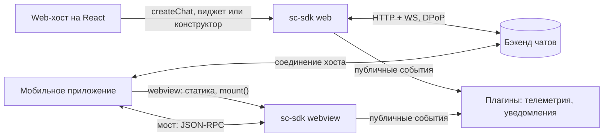
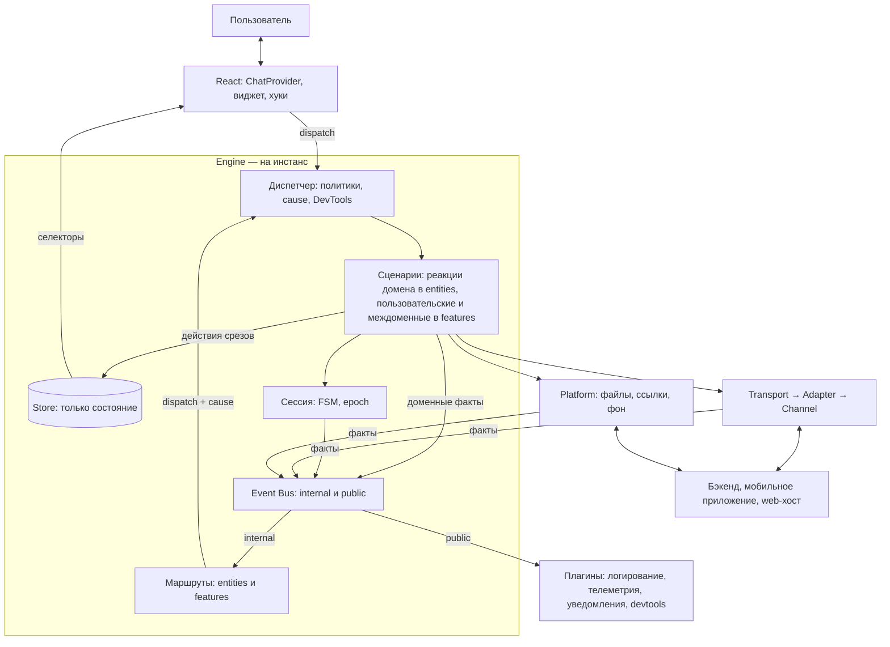
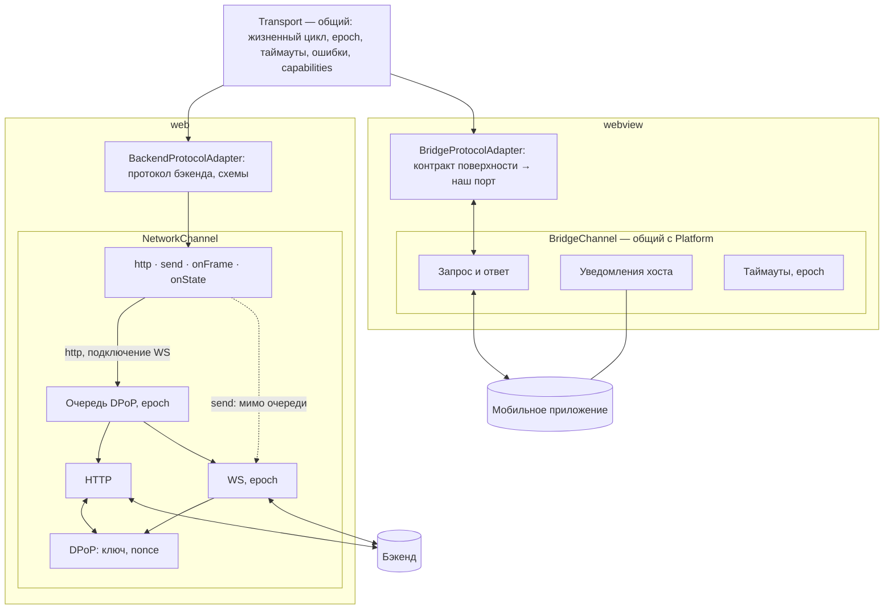
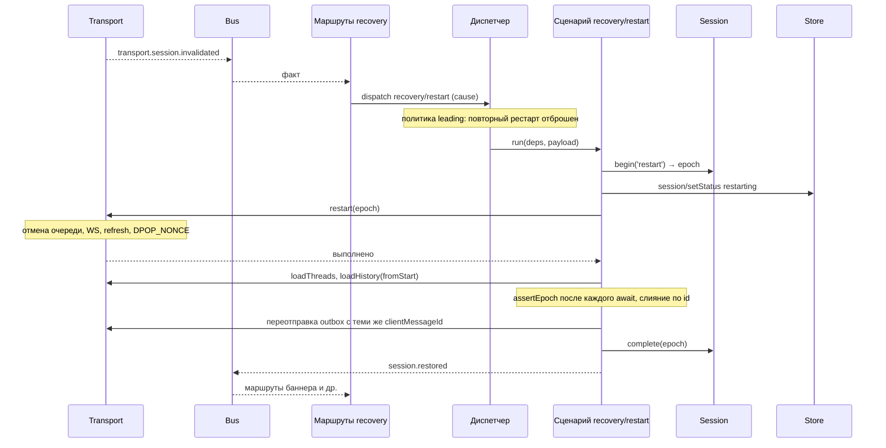

# sc-sdk: архитектура

> Рабочий документ. Версия 4 от 02.10.2026: ядро на диспетчере и сценариях, маршруты по слоям, транспорт в три слоя, контракт моста от поверхности.
> Пометки: **[решено]** — подтверждено командой; **[предложение]** — рекомендация, ждёт ADR или проверки на скелете; **[вопрос N]** — зависит от ответа из раздела 20.
> Прежние версии — `archive/`. Контракт транспорта — `contracts/transport.md`. ТЗ на скелет — `specs/demo-skeleton.md`. Отклонённые варианты — раздел 18.

## 1. Контекст и ограничения

- sc-sdk — платформа чатов, встраиваемая в продукты разных поверхностей.
- Поставка **[решено]**: готовый виджет и конструктор (хуки и компоненты).
- Два режима **[решено]**:
  - **web** — React-библиотека, React в `peerDependencies`, хосты только на React. SDK сам работает с бэкендом по HTTP + WS с DPoP;
  - **webview** — статика внутри мобильного приложения, React в бандле, `mount()`. Единственный рабочий режим — relay: хост держит соединение, SDK запрашивает у него доменные операции через мост и в сеть не ходит. Опции инициализации — только через мост.
- Ограничения **[решено]**: малый бандл (не подходят RTK + saga, RxJS, MobX); запрещён любой persist, включая IndexedDB; на команды хостов влиять нельзя; SDK в webview лежит статикой в приложении; телеметрия внешняя; SDD — spec-driven development.
- Стек **[решено]**: React 18, Zustand (v5), styled-components, TypeScript, ESLint, Vitest, Playwright.
- Браузеры: Chromium, Яндекс Браузер; в webview — WKWebView (WebKit) и Android System WebView.
- Команда: архитектор, тимлид, 2 middle. Всё, что требует постоянного сопровождения, вводим, только если окупается сразу.

## 2. Ключевые решения

1. **Engine** — инстанс ядра: стор, диспетчер, сценарии, сессия, шина, маршруты. Создаётся `createEngine` на каждый инстанс, на уровне модуля ничего не живёт. Внешнее — через порты. **[решено]**
2. **Запись и чтение.** UI и маршруты пишут только через `dispatch(type, payload)`; UI читает стор стандартными селекторами Zustand через хуки. **[решено]**
3. **Сценарий — обычная функция `(deps, payload) => Promise<R>`**; эффекты (вызовы портов) есть только в сценариях. Стор — только состояние: сценарий меняет его исключительно именованными действиями срезов, `setState` ему недоступен по типу. Слоя «команд» нет. **[решено]**
4. **Диспетчер** находит сценарий в реестре и выполняет его через общую обёртку: политика конкурентности, причинная цепочка `cause`, DevTools, User Timing, ошибки. **[решено]**
5. **Реестры типов через declaration merging** (`ChatState`, `ActionMap`, `DomainEventMap` в `shared/engine`): хуки и маршруты на любом слое FSD типизированы без импорта из `app`; рантайм-реестр проверяется `satisfies`. **[решено]**
6. **Event Bus на инстанс:** `internal` — факты сервисов (`transport.*`, `platform.*`, `session.*`) и доменные факты сценариев; `public` — стабильная проекция для плагинов. **[решено]**
7. **Маршруты по слоям:** реакции домена на факты сервисов — в `entities/*/model/routes.ts`, связи между доменами — в `features/*/model/routes.ts`. В маршрутах нет логики и состояния. **[решено]**
8. **Порты:** `Transport` (данные чата) и `Platform` (возможности окружения). В webview оба работают поверх одного `BridgeChannel`. **[решено]**
9. **Transport в три слоя:** общий `Transport` (жизненный цикл, epoch, таймауты, ошибки, capabilities) → адаптер чужого протокола (`BackendProtocolAdapter` / `BridgeProtocolAdapter`) → канал (`NetworkChannel` / `BridgeChannel`). Транспорт не видит стор и не подписывается на шину. **[решено]**
10. **Контракт моста публикует поверхность**; он один и согласованный. Мы держим копию его схем, адаптер-переводчик к нашему порту и consumer-driven набор проверок. **[решено]**
11. **Сессия** — машина состояний без ввода-вывода, epoch и single-flight. Ввод-вывод рестарта — в сценариях `recovery/*`. **[решено]**
12. **Структура файлов** — FSD без страниц: `app`, `widgets`, `features`, `entities`, `shared`; UI-кит в `shared/ui-kit`. **[решено]**
13. **Конфиг:** значения по умолчанию → удалённый → хост; хост может переписать что угодно. **[решено]**
14. **Проверка гипотез** — ходячий скелет с фейковым бэкендом в памяти по ТЗ `specs/demo-skeleton.md` (раздел 17). **[решено]**

## 3. Схемы

### 3.1. Контекст



### 3.2. Общая схема



Правила, которые видны на схеме:
- UI знает только `dispatch` и селекторы.
- Эффекты — только в сценариях; стор меняется только действиями срезов.
- Сервисы (сессия, Transport, Platform) принимают вызовы и публикуют факты; на шину не подписываются, друг о друге и о сторе не знают.
- Подписки на шину — только в маршрутах; маршрут переводит факт в `dispatch` и ничего больше не делает.
- Плагины видят только `public` и ничего не пишут.
- Токены web-хост передаёт каналу транспорта в Composition Root, мимо движка.

### 3.3. Транспорт



### 3.4. Рестарт сессии (web)



В webview фазу «restart(epoch) → выполнено» делает хост и присылает `transport.session.restarted`; маршрут запускает `recovery/hostRestarted`, дальше всё одинаково.

## 4. Файловая структура: FSD без страниц **[решено]**

```
sc-sdk/
├─ contracts/                       документы контрактов (SDD) для людей: transport.md, platform.md, public-api.md
├─ specs/                           ТЗ: demo-skeleton.md
├─ adr/
├─ archive/                         прежние версии документов
├─ src/
│  ├─ app/
│  │  ├─ engine/                    createEngine, сборка стора, реестр сценариев, диспетчер, шина, сессия, подключение маршрутов и плагинов
│  │  ├─ entries/                   web.ts, webview.ts, dev.ts — Composition Root и публичный экспорт
│  │  ├─ plugins/                   logging, telemetry, host-notifications, devtools
│  │  └─ providers/                 ChatProvider
│  ├─ widgets/                      составные компоненты конструктора и виджет
│  │  ├─ feed/  composer/  thread-list/
│  │  └─ chat/                      виджет — сборка по умолчанию
│  ├─ features/                     пользовательские и междоменные сценарии
│  │  ├─ send-message/  open-thread/  load-older/  retry-message/  attach-file/
│  │  ├─ recovery/                  restart, hostRestarted, restore — сценарии и маршруты на факты сессии
│  │  └─ delivery-problem-banner/   пример междоменного поведения: только routes.ts
│  ├─ entities/                     состояние домена и его реакции на факты сервисов
│  │  ├─ message/                   model/ (срез, мутаторы, селекторы, buildFeed, сценарии receive/ack, routes.ts), ui/, @x/
│  │  ├─ thread/  file/  banner/  config/  composer/
│  │  └─ session/                   model/ (публичный статус, реакции на соединение и фон, routes.ts), ui/
│  └─ shared/
│     ├─ engine/                    registry.ts (ChatState, ActionMap), events.ts (InternalEventMap, DomainEventMap, PublicEventMap),
│     │                             deps.ts, routes.ts (defineEntityRoutes, defineFeatureRoutes), context.ts, hooks.ts
│     ├─ api/
│     │  ├─ transport/              port.ts, create-transport.ts, adapter.ts, errors.ts, network/, bridge/, mock/
│     │  ├─ platform/               port.ts, web/, bridge/
│     │  └─ bridge-channel/         транспорт моста — общий для transport и platform
│     ├─ contracts/                 схемы valibot: домен, протокол бэкенда, копия контракта моста
│     ├─ lib/                       emitter, fsm, backoff, single-flight, timers, memoize-last, ids, clock, logger
│     └─ ui-kit/                    примитивы, тема — не знают о чате
├─ dev/fake-backend/                фейковый бэкенд в памяти (раздел 17)
└─ tests/                           contracts/, scenarios/, fuzz/, memory/, e2e/
```

Правила:
- Слои импортируют только вниз: `app` → `widgets` → `features` → `entities` → `shared`.
- Между слайсами одного слоя — только через `index.ts`; связки сущностей — через `@x` (FSD 2.1).
- Сегменты слайса: `ui`, `model`, `api`, `lib`.
- Сценарий живёт в слое по смыслу: реакция одного домена на факты сервисов — в `entities/<домен>/model`; пользовательское действие или работа с несколькими доменами — в `features/<поведение>/model`. Префикс действия — домен (`message/receive`); у междоменных сценариев свой префикс (`recovery/restart`).
- `zustand` разрешён только в `app/engine`, `entities/*/model` и `shared/engine/hooks.ts`.
- Прямые `fetch`, `XMLHttpRequest`, `WebSocket` — только в `shared/api/transport/network/channel.ts`.
- Транспорт и платформа видят только свои порты и `shared/contracts`.
- Изменяемые переменные верхнего уровня модуля и `create()` Zustand на уровне модуля запрещены линтером.
- Проверка — Steiger и `eslint-plugin-boundaries`. Юнит-тесты лежат рядом с кодом, в `tests/` — то, что проверяет несколько модулей.

Если `@x` окажется неудобным на скелете — запасной вариант: раскладка по доменам (`messages/state.ts`, `scenarios.ts`, `routes.ts`, `hooks.ts`, `ui/`) с теми же правилами по ролям файлов.

## 5. Транспорт

### 5.1. Устройство **[решено]**

- **Порт** — один для обоих режимов, на языке домена: без HTTP, WS, DPoP и моста. Сценарии объявляют нужные части в `Pick<Deps, …>`.
- **Три слоя:**
  - `Transport` — одна реализация порта для обоих режимов (`createTransport(adapter)`): `not_started` и `disposed`, идемпотентные `start` и `restart`, таймауты, отмена вызовов старого epoch, отбрасывание старых событий, приведение ошибок к `TransportError`, `capabilities`, публикация фактов `transport.*` в шину. Гарантии контракта проверяются один раз на нём.
  - **Адаптер чужого протокола** — переводит опубликованный кем-то контракт в наш порт: `BackendProtocolAdapter` (протокол бэкенда: эндпоинты, кадры, ack, `token_error` → refresh → `session.invalidated`) и `BridgeProtocolAdapter` (контракт моста поверхности). Интерфейс узкий: `call(op, params, ctx)` и `onEvent`.
  - **Канал** — доставка: `NetworkChannel` (очередь DPoP, HTTP, WS, epoch, переподключение) и `BridgeChannel` (запрос-ответ, уведомления, таймауты).
- **Транспорт не имеет доступа к стору и не подписывается на шину.** Влияет только через результаты вызовов, факты и ошибки с кодами.
- **Экземпляр на инстанс движка**, создаётся в Composition Root.

Полный контракт — `contracts/transport.md`.

### 5.2. API канала (web)

```ts
export interface NetworkChannel {
  /** Через очередь DPoP: строго по одному, расходует nonce. */
  http<T>(req: HttpRequest, opts: { priority: Priority }): Promise<T>;
  /** Мимо очереди: кадр по открытому сокету, nonce не трогает. Нет соединения → TransportError('not_connected'). */
  send(frame: WsFrame): void;
  onFrame(fn: (f: WsFrame) => void): () => void;
  onState(fn: (s: WsState) => void): () => void;
  /** Подключение WS — внутренняя задача очереди, завершается после DPOP_NONCE. */
  start(ctx: Ctx): Promise<void>;
  /** Отмена очереди, закрытие сокета, новое подключение через очередь. */
  restart(ctx: Ctx): Promise<void>;
  close(): void;
}
```

Путь каждого метода фиксирован, вызывающий его не выбирает. Правило маршрутизации — «трогает ли операция nonce» — записано комментарием рядом с кодом канала.

### 5.3. Единая очередь DPoP **[решено]**

- Через очередь: HTTP-запросы и подключения WS (включая переподключение). `DPOP_NONCE` приходит только после подключения и может сделать недействительным значение HTTP-запроса в полёте — поэтому очередь одна.
- Мимо очереди: кадры по открытому WS — proof для них не нужен. Сообщение пользователя не ждёт загрузок и истории; без соединения оно ждёт в outbox, а не в очереди.
- Приоритеты ожидающих задач: рестарт → подключение WS → refresh токена → ветки и история → загрузка файлов. Выполняющаяся задача не прерывается.
- Устаревший nonce: `token_error` в REST, `update_token_error` в WS — при единой очереди это ошибка SDK, логируется с номером звена. `token_error` → один refresh → повтор; повторный `token_error` или `update_token_error` → `session.invalidated` **[вопрос 37]**.
- Цена: долгая загрузка задерживает переподключение WS и входящие. Принять или отменять загрузку при обрыве — решаем на скелете.
- Длительности — User Timing во вкладке Performance.

### 5.4. Загрузка файлов

- Web: `<input type="file">` → `Blob` в сервисе файлов → multipart через очередь с низшим приоритетом, прогресс через `XMLHttpRequest` → `fileId` → кадр `UPLOAD_FILE_API_REQUEST` → `file.uploadConfirmed`.
- Webview **[допущение, вопрос 14]**: файл выбирает хост, в SDK приходит `{ kind: 'host', hostFileId, … }`, загрузку делает хост, прогресс и подтверждение — уведомлениями.
- Общее: `uploadId` задаёт SDK; отмена через `signal`; `capabilities.maxFileSizeBytes` проверяется до загрузки; срез файлов в сторе от режима не зависит.

### 5.5. Контракт моста **[решено]**

- **Издатель — поверхность.** Контракт один и согласованный между поверхностями и SDK; мы — потребитель **[вопросы 13, 17 закрыты]**.
- Следствия:
  - схемы моста в `shared/contracts` — наша копия опубликованного контракта, источник правды для них — документ поверхности, а не наш порт;
  - `BridgeProtocolAdapter` переводит методы, события и ошибки контракта в наш порт; домен и гарантии от формы контракта не зависят. Пока реального контракта нет, его форма в скелете совпадает с портом — это допущение;
  - версия контракта явная; SDK лежит статикой в приложении, поэтому совместимость фиксируется сборкой приложения, а SDK при старте проверяет версию и логирует расхождение. Необязательные операции — через `capabilities`;
  - epoch передаётся хосту при `start` и `restart` и возвращается в уведомлениях — если контракт это поддерживает; иначе адаптер эмулирует отбрасывание сам.
- **Consumer-driven набор:** список методов, полей и событий, на которые опирается SDK, плюс сценарии «запрос → ожидаемый ответ / событие» из фикстур фейкового хоста. Поверхность прогоняет набор перед изменением контракта. Диагностический режим SDK проверяет реальный трафик по схемам на debug-сборках.
- **Формат** **[предложение]**: при следующем согласовании предложить AsyncAPI 3 или JSON Schema как формат контракта — типы для мобильных платформ и сверка наших схем без ручного переноса. Имеет смысл, только если издатель ведёт документ сам **[вопрос 44]**. CloudEvents не нужен: формат событий задан контрактом.

## 6. Platform **[решено]**

Порт описывает не «что умеет хост», а «чем отличается окружение»:

```ts
export interface Platform {
  readonly capabilities: { customFilePicker: boolean; haptics: boolean };
  pickFiles(opts: PickOptions): Promise<FileRef[]>;
  openLink(url: string): void;
  openFile?(file: FileAttachment): void;
  on<K extends keyof PlatformEventMap>(type: K, fn: (e: PlatformEventMap[K]) => void): () => void;   // app.resumed, app.paused, network.changed
}
```

- **Web** — браузер: `<input type="file">`, `visibilitychange` и `pageshow`, `online` и `offline`, `window.open`. Необязательные переопределения из опций хоста: свой выбор файлов, перехват ссылок, просмотр вложений **[вопрос 40]**.
- **Webview** — методы платформы из контракта поверхности на общем `BridgeChannel`.
- Выбор файла — вызов с ответом, а не факт. Фактами в шину Platform публикует только жизненный цикл приложения и сеть.
- Что не относится к Platform: токены (зависимость канала транспорта), опции инициализации (аргумент `createChat`), уведомления хосту (плагин на публичных событиях).

## 7. Сессия **[решено]**

### 7.1. Зачем машина состояний

У сессии много источников событий в любом порядке: обрыв WS, `update_token_error`, `session.restarted` от хоста, `chat.restart()`, возврат из фона, истёкший refresh-токен, `dispose`. Флаги допускают невозможные сочетания и гонки (переподключение поверх рестарта, оживление после `dispose`, «готово» после `failed`). Таблица переходов решает их по построению: всё, чего нет в таблице, отбрасывается и логируется.

```ts
const transitions = {
  idle:         ['starting', 'disposed'],
  starting:     ['ready', 'failed', 'disposed'],
  ready:        ['reconnecting', 'restarting', 'disposed'],
  reconnecting: ['ready', 'restarting', 'failed', 'disposed'],
  restarting:   ['ready', 'failed', 'disposed'],
  failed:       ['starting', 'disposed'],
  disposed:     [],
} as const satisfies Record<SessionState, readonly SessionState[]>;
```

Дополнительно: один источник правды для статуса в UI; тесты таблицей без моков; таблица — готовая диаграмма. xstate не нужен. Та же техника — для статуса сообщения (`pending → sent | failed`, `failed → pending`). Больше машин состояний не вводим.

### 7.2. Устройство

- **Сессия без ввода-вывода:** переходы, epoch, single-flight. Методы `begin('start' | 'restart')`, `complete`, `fail`, `connection`, `stop`, `dispose`, `assertEpoch`; факт `session.status.changed` — в шину.
- **Ввод-вывод — в сценариях:** реакции на соединение и фон — в `entities/session` (`session/connectionChanged`, `session/resumed`); рестарт и восстановление — в `features/recovery` (`recovery/restart` по `transport.session.invalidated`, `recovery/hostRestarted` по `transport.session.restarted`). Рестарт: `begin` → статус → `transport.restart(epoch)` с backoff → ветки → история открытых веток с первой страницы (слияние по id) → outbox с теми же `clientMessageId` → `complete` → доменный факт `session.restored`. После каждого ожидания — `assertEpoch`.
- Подписка `features/recovery` на сервисный факт `transport.session.*` — единственное явное исключение из правила «фичи слушают только доменные факты» (9.5).
- Два уровня восстановления: `reconnecting` (WS с теми же учётными данными, делает канал) и `restarting` (полный рестарт). В webview рестарт делает хост и присылает `session.restarted`.
- Состояние `stopped` — обратимая остановка (StrictMode, размонтирование провайдера); `disposed` — окончательная.
- При рестарте клиентский стор не очищается. Статус сессии означает «соединение готово», загрузка истории видна по срезу `history`.

### 7.3. Epoch

Номер поколения сессии, растёт при каждом `start` и `restart`.
- Канал помечает им всё входящее: HTTP-запрос помнит поколение очереди, сокет — своё поколение, в webview epoch передаётся хосту и возвращается в уведомлениях. Старое отбрасывается, вызов отклоняется с `aborted_by_restart`.
- Сценарии проверяют epoch после каждого ожидания.
- Отмена (`AbortController`) останавливает то, что ещё можно остановить; epoch отбрасывает то, что не успели.
- В стор не попадает.

## 8. Авторизация (только web)

**[решено]**
- SDK генерирует пару ECDSA P-256 (`extractable: false`) и считает thumbprint по RFC 7638; эндпоинта регистрации ключа нет.
- Persist запрещён → ключ только в памяти, при каждом запуске новый.
- Значение цепочки одноразовое; источники — ответы HTTP и `DPOP_NONCE` по WS после подключения; proof для кадров по открытому WS не нужен.

**[предложение]**
- Привязка, вероятно, стандартная: proof несёт публичный ключ, сервер привязывает токен к thumbprint при выдаче. Кто получает стартовые токены — **[вопрос 1]**.
- Токены — зависимость канала: стартовые и новые при `auth_required` приходят из опций web-хоста в Composition Root, движок о них не знает.
- Плановое обновление access-токена: срок по монотонным часам (`performance.now()` + `expires_in`), задача очереди с высоким приоритетом за запас до истечения; донести до WS кадром обновления или переподключением **[вопрос 38]**. При возврате из фона — сначала проверить срок.
- Refresh — single-flight. Истёк refresh-токен → `failed` с причиной `auth_required` и колбэк хосту **[вопрос 39]**.
- Порядок в HTTP-цепочке: логирование → очередь → refresh при 401 → access-токен → DPoP-подпись → запрос.
- В логи — только номер звена цепочки, не значение.

## 9. Ядро: стор, сценарии, диспетчер, шина, маршруты, плагины

### 9.1. Стор **[решено]**

- Один Zustand-стор со срезами на инстанс (`createStore` из `zustand/vanilla` + контекст). Никаких `create()` на уровне модуля.
- **Только состояние:** действия срезов — синхронные `set(чистый мутатор)` с именем `домен/действие` для DevTools. Ни портов, ни зависимостей в срезах.
- Мутаторы — чистые функции; аргументы сериализуемы; реакции нескольких сущностей на один факт — композицией мутаторов в одном `set` через `@x` (атомарно).
- Сценарии видят стор как `{ getState(): ChatState }`: вызывают действия срезов, `setState` недоступен по типу. `setState` вне `app/engine` и `entities/*/model` запрещён линтером.
- Срезы: `session` (публичный статус), `config`, `threads`, `banner`, `messages` (порядок, метаданные, тексты, outbox, статусы), `history`, `files`, `clock`, `composer` (черновики — только в памяти **[решено]**), `ui`.
- Вне стора: секреты (канал), очереди (сервисы), Blob файлов, производные данные (селекторы), локальное состояние компонентов (`useState`).
- Подписки на стор — только для вывода наружу (в плагинах), без вызова действий.

### 9.2. Сценарии и диспетчер **[решено]**

```ts
// shared/engine/registry.ts — наполняется через declare module
export interface ChatState {}
export interface ActionMap {}
export type Dispatch = <T extends ActionType>(type: T, ...args: DispatchArgs<T>) => Promise<ResultOf<T>>;

// entities/message/model/receive.ts — реакция домена
export async function receiveMessage(d: Pick<Deps, 'store' | 'events'>, p: { message: Message }) {
  const isNew = d.store.getState().messagesActions.receive(p.message);
  if (isNew) d.events.emit('message.received', { threadId: p.message.threadId, messageId: p.message.id });
}
declare module '@/shared/engine/registry' { interface ActionMap { 'message/receive': typeof receiveMessage } }

// app/engine/scenarios.ts — рантайм-реестр
export const scenarios = {
  'message/receive':   { run: receiveMessage, concurrency: 'parallel' },
  'message/send':      { run: sendMessage,    concurrency: 'parallel' },
  'thread/open':       { run: openThread,     concurrency: 'latest' },
  'history/loadOlder': { run: loadOlder,      concurrency: 'leading', key: (p) => p.threadId },
  'recovery/restart':  { run: restart,        concurrency: 'leading' },
  'outbox/flush':      { run: flushOutbox,    concurrency: 'queue' },
} satisfies ScenarioRegistry;   // пропущенное действие из ActionMap — ошибка компиляции
```

- **Сценарий** — обычная `async`-функция `(deps, payload)`: без функций высшего порядка, классов и генераторов. Зависимости — узкие (`Pick<Deps, …>`); в тесте передаются два-три фейка.
- **Где живут:** реакции домена на факты сервисов — `entities/*/model`; пользовательские и междоменные — `features/*/model` (4).
- **Типизация:** один конкретный тип payload, без перегрузок и generic. Ожидаемые исходы — результатом-объединением `{ ok: true, … } | { ok: false, code }`; исключения — для багов и `TransportError`.
- **Вложенный вызов** — через `d.dispatch`, чтобы он попал в DevTools и причинную цепочку.
- **Диспетчер** — обёртка над реестром: политика конкурентности, `cause` и глубина цепочки, запись в DevTools (с маскированием), User Timing, логирование ошибок. Одно приведение типа внутри, снаружи не видно.
- **Цена:** на действие — `declare module` и строка в реестре; закрывается шаблоном и правилом SDD.

### 9.3. Политики конкурентности **[решено]**

Объявляются при регистрации сценария, применяются диспетчером; сценарий получает `signal` в зависимостях и проверяет его вместе с epoch после каждого `await`.
- `parallel` — каждый вызов независим (аналог `takeEvery`).
- `latest` — новый вызов отменяет предыдущий через `signal` (`takeLatest`): открытие ветки.
- `leading` — пока вызов идёт, новые отбрасываются; опционально по ключу (`takeLeading`, single-flight): рестарт, подгрузка истории ветки.
- `queue` — строго по одному в порядке вызова: отправка outbox.

В DevTools видно, что вызов отменён или отброшен политикой. `race`, `fork`, каналы не вводим: «ack или таймаут» — `Promise.race` с `signal` внутри сценария.

### 9.4. Event Bus **[решено]**

```ts
export interface InternalEventMap { /* transport.*, platform.*, session.* — факты сервисов */ }
export interface DomainEventMap {}   // факты сценариев: message.received, message.failed, session.restored…
export interface PublicEventMap { /* стабильная проекция для плагинов, под semver */ }
export const createBus = () => ({
  internal: createEmitter<InternalEventMap & DomainEventMap>(),
  public: createEmitter<PublicEventMap>(),
});
```

Правила:
1. В шине только факты — о том, что произошло, а не просьбы.
2. Сервисы публикуют только `transport.*`, `platform.*`, `session.*`; сценарии — только доменные факты (`d.events` типизирован по `DomainEventMap`) и публичные события.
3. Подписываются только маршруты; сервисы и сценарии на шину не подписываются.
4. Защита от циклов — причинная цепочка: каждый `dispatch` несёт `cause`; глубина больше 5 или повтор типа действия в одной цепочке — ошибка в dev.
5. Эмиттер на инстанс; ошибки слушателей изолируются и логируются; `dispose` очищает подписки.
6. Имена: `домен.сущность.прошедшее_время`; в событиях нет текстов сообщений и токенов.

### 9.5. Маршруты **[решено]**

```ts
// entities/message/model/routes.ts — факты сервисов → действия своего домена
export const routes = defineEntityRoutes('message', (on, dispatch) => {
  on('transport.message.received', ({ message }) => dispatch('message/receive', { message }));
  on('transport.message.acked', ({ ack }) => dispatch('message/ack', { ack }));
});

// features/delivery-problem-banner/model/routes.ts — доменные факты → действия любых доменов
export const routes = defineFeatureRoutes('delivery-problem-banner', (on, dispatch) => {
  on('message.failed', (e) => dispatch('banner/registerFailure', { clientMessageId: e.clientMessageId }));
  on('message.sent', (e) => dispatch('banner/clearFailure', { clientMessageId: e.clientMessageId }));
  on('session.restored', () => dispatch('banner/hide', { kind: 'connection' }));
});
```

- **Сущность:** слушает только факты сервисов, вызывает только действия своего домена (`DomainDispatch<D>` по префиксу). Междоменная подписка в сущности не компилируется.
- **Фича:** слушает доменные факты, вызывает действия любых доменов; файл назван по видимому поведению. Исключение — `features/recovery` слушает `transport.session.*` (7.2).
- **В маршруте нет логики и состояния:** только подписка, перекладка полей, `dispatch`. Счётчики и решения — в срезе и мутаторах (тестируются таблицами), время — в сценарии через `d.timers` и `clock`.
- Один `routes.ts` на слайс, сколько бы событий ни было. Больше 10–15 строк — признак, что делить нужно слайс, а не файл.
- `app/engine` собирает модули маршрутов из `index.ts` слайсов и подключает к шине с проставлением `cause`. Карта «факт → действие» — скрипт `routes:map`; часть ревью для PR с новыми подписками.
- Тесты: каждый `routes.ts` — на фейковой шине со шпионом на `dispatch`.

### 9.6. Плагины **[решено]**

```ts
export interface EnginePlugin {
  name: string;
  setup(ctx: { events: { on: PublicBus['on']; onAny: PublicBus['onAny'] }; select<T>(sel: (s: ChatState) => T): T; logger: Logger }): () => void;
}
```

- Встроенные: `logging`, `telemetry`, `host-notifications` (web — колбэки из опций; webview — через мост), `devtools` (только dev, видит оба уровня шины).
- Плагины только читают; не вызывают `dispatch`; не зависят друг от друга и от порядка; ошибки изолированы.

### 9.7. Перерисовки

- Селектор возвращает примитив, ссылку из стора или мемоизированный результат; несколько полей — `useShallow`; производные — именованный мемоизированный селектор (reselect пока не используем).
- Мутаторы сохраняют ссылки на неизменённые части; строки ленты — `memo` с примитивными пропсами; частые обновления (прогресс) троттлятся.
- Проверка — пачка из 50 сообщений в скелете.

### 9.8. Жизненный цикл и память **[решено]**

- Всё создаётся в `createEngine` на инстанс: стор, шина, сессия, транспорт, платформа, маршруты, плагины, таймеры. На уровне модуля нет изменяемого состояния.
- `ChatProvider` создаёт движок один раз (`useState(() => createEngine(...))`) и кладёт ссылку в контекст; эффект делает `start` и `stop`. `dispose` снимает подписки, закрывает каналы и таймеры — после него движок полностью собирается сборщиком мусора.
- Таймеры — только через `d.timers` (снимаются при `stop` и `dispose`), не голый `setTimeout`.
- Проверка — тест утечек: 500 циклов `createEngine → start → отправка → dispose` в Node с `--expose-gc`; `FinalizationRegistry` подтверждает сбор всех движков, число слушателей на `window` и `document` возвращается к исходному.

## 10. Чтение и публичный API

- Внутри SDK — стандартный Zustand: `useChatStore(selector)` через контекст, именованные селекторы рядом со срезами. Собственной абстракции над подпиской нет.
- Хуки сущностей и фич (`useThread`, `useFeed`, `useMessage`, `useComposer`, `useSessionStatus`) возвращают уже выбранные значения и стабильные действия (`useCallback` над `dispatch`). Методы-селекторы в возвращаемом объекте запрещены (правила хуков). Мелкие хуки — для ленты, крупные — для простых мест.
- Для хостов **[предложение]**: виджет (`<Chat />`, `mount(el)`), составные компоненты (`widgets/*`), именованные хуки. `useChatStore`, `dispatch` и `ChatState` наружу не уходят. Экспорт — явным списком в `app/entries`, отчёт api-extractor в репозитории.
- Опции читаются при создании движка. Новые опции — смена `key` у провайдера; на лету — только белый список (`chat.update({ theme, locale })`).
- Публичные события для хостов — через плагин уведомлений.

## 11. Лента

- Группировка по дням — проекция `buildFeed(order, meta, view): FeedRow[]`, мемоизированный селектор; плоский список под виртуализацию, стабильные ключи, в строке только id.
- В полночь меняются только подписи разделителей; на часы подписан только разделитель. Тикер до полуночи + перепроверка по `app.resumed`.
- Серверного времени нет — время устройства. Относительное время — общий тикер для видимых меток.
- Якорение скролла при подгрузке вверх; выбор виртуализатора — на скелете.
- Разделители или сворачивание, часовой пояс — **[вопрос 22]**.

## 12. Конфиг

1. Константы сборки — подставляет бандлер.
2. Опции инициализации — разбираются строго в `createChat`, неизменяемы; в webview — только через мост.
3. Удалённый конфиг — разбирается терпимо, итог в срезе `config`.
4. Состояние сессии — не конфиг.

- Приоритет **[решено]**: значения по умолчанию → удалённый → хост; хост может включить выключенное сервером, SDK логирует расхождение.
- Доступность = флаг ∧ возможность платформы — одна чистая функция.
- На лету — только белый список (`chat.update({ theme, locale })`).
- Старт webview: `mount()` → ожидание моста → `init.getOptions` с таймаутом → `createChat`; нет ответа — экран ошибки.

## 13. Код **[решено]**

- Чистые функции — мутаторы, селекторы, `buildFeed`, `resolveConfig`, мапперы, таблицы переходов. Время и id — аргументами.
- Эффекты — только сценарии; сервисы (каналы, сессия, платформа) — тонкие объекты на инстанс, зависимости — параметрами, фабрики вместо классов (исключение — `TransportError`) **[вопрос 35 закрыт]**.
- DI без контейнера: ручная сборка в `createEngine`, сценарии получают зависимости первым аргументом.
- Хуки — только клей; `useEffect` — только для DOM и жизненного цикла движка в провайдере.
- Тесты: чистые функции — таблицами; сценарии — с фейковым бэкендом; маршруты — на фейковой шине; хуки почти не тестируются; UI — компонентные тесты и Playwright с WebKit; утечки — отдельным тестом (9.8).

## 14. Отладка

- Redux DevTools: лента действий срезов (middleware Zustand, `домен/действие`), вызовы диспетчера (`dispatch/<тип>` с `cause` и исходом политики) и отдельная лента шины (плагин `devtools` на `internal` и `public` через `onAny`). Только dev. Цепочка читается целиком: `transport.message.received → message/receive → message.received → thread/markActivity`.
- `routes:map` — карта «факт → действие» для ревью и документации.
- User Timing во вкладке Performance — диспетчер, очередь DPoP, рестарт, загрузки.
- Logger с пространствами имён и маскированием.
- Инварианты в dev после каждого действия среза: нет дублей `clientMessageId`, переходы сессии и статусов сообщений по таблицам.
- Webview: Safari Web Inspector и `chrome://inspect` (флаги в debug-сборках хостов); своя отладочная панель как плагин, совмещённая с диагностикой моста.
- Журнал для воспроизведения — позже, в памяти, с маскированием **[вопрос 30]**.

## 15. Контракты и DX

- Дорогие контракты: мост (издатель — поверхность, 5.5), протокол бэкенда (издатель — бэкенд), конфиг, публичный API (виджет, компоненты, хуки, публичные события).
- Схемы valibot в `shared/contracts` — источник правды для наших типов и копия чужих контрактов; golden fixtures из реального трафика; tolerant reader; api-extractor и semver для публичного API.
- Общие контрактные наборы тестов для транспорта и платформы — один раз на общий `Transport`; consumer-driven набор для поверхности; MockAdapter и Test Data Builder.
- Шаблон новой фичи: `model/<name>.ts` + `declare module` + строка в `scenarios.ts` + `routes.ts` при необходимости + хук + `index.ts`. README и генератор.
- Компилятор как чеклист: реестры через `satisfies`, union типов сообщений + карта рендереров, `DomainDispatch` для маршрутов сущностей.

## 16. Сборка и инфраструктура

- Две сборки: web (библиотека, React peer **[вопрос 33]**) и webview (статика с React, без сети и DPoP).
- Бюджет бандла — числом, size-limit в CI **[вопрос 32]**.
- Самописное: emitter, fsm, backoff, single-flight, timers, memoize-last, политики конкурентности в диспетчере; очередь DPoP — в канале, request-reply — в `BridgeChannel`. Кандидаты на замену готовыми утилитами: `p-retry`, `p-timeout`, `abort-controller-x` — если их отмена совместима с epoch **[предложение]**.
- Стили — styled-components, только в UI; `StyleSheetManager` с `namespace`, тема через CSS-переменные; кандидат на замену — Linaria **[вопрос 34]**.
- SSR у web-хостов — **[вопрос 27]**.

## 17. Проверка гипотез: ходячий скелет **[решено]**

### 17.1. Гипотезы

1. FSD без страниц и правила границ работают, включая `@x` и маршруты по слоям.
2. Диспетчер, сценарии `(deps, payload)` и реестры типов не дают лишнего шаблонного кода и сохраняют типизацию.
3. Один стор не вызывает лишних перерисовок.
4. Единая очередь DPoP исключает гонки за nonce.
5. Машина сессии, epoch и политики конкурентности переживают обрывы и рестарты.
6. Общий `Transport` над двумя адаптерами взаимозаменяем.
7. Отладка отвечает на вопрос «почему не ушло сообщение».
8. Движок не течёт при многократном создании и удалении.

### 17.2. Объём

Входит: одна ветка, текстовые сообщения; отправка, приём, история; статусы и повтор; рестарт и переподключение; оба режима; простая лента с базовой виртуализацией; `shared/ui-kit` с двумя-тремя примитивами.
Не входит: файлы (вторая итерация), несколько веток, баннер, конфиг, реальный бэкенд, стили.

### 17.3. Фейковый бэкенд в памяти

```
dev/fake-backend/
├─ model.ts         состояние и правила протокола: одноразовый nonce, DPOP_NONCE после подключения,
│                   пагинация с состоянием, дедупликация по clientMessageId, update_token_error
├─ chaos.ts         dropWs(), tokenError(), delay(ms), burst(n), restartFromHost()
├─ adapters/
│  ├─ msw-http.ts   REST поверх модели
│  ├─ ws.ts         WS поверх модели (перехват WebSocket в MSW 2.x или mock-socket)
│  └─ fake-host.ts  мост на JSON-RPC поверх модели — для webview
└─ fixtures/
```

- Одна модель, три адаптера: один сценарий прогоняется в обоих режимах.
- Моделируется только то, что зафиксировано в `contracts/transport.md` и журнале ответов.
- Против расхождения с реальностью: golden fixtures из реального трафика и периодический прогон контрактных тестов против стенда.
- Позже модель можно обернуть в Node-сервер для мобильных команд без переписывания.
- Демо-страница на Vite: переключатель режима и кнопки хаоса.

### 17.4. Критерии

Полный список — в ТЗ `specs/demo-skeleton.md`, раздел 9. Ключевые:
1. Контрактные тесты проходят для web, webview и Mock.
2. Случайное чередование истории, переподключений и рестартов (сотни прогонов) — ни одного `token_error`.
3. Сообщение, отправленное во время рестарта, доставлено ровно один раз; страница прошлого epoch не попадает в стор; после `dispose` во время рестарта — тишина.
4. Пачка из 50 сообщений перерисовывает только ленту и новые строки.
5. Steiger и boundaries проходят; намеренно неверный импорт и междоменная подписка в сущности падают.
6. Фича «повторить отправку» — не больше четырёх файлов.
7. Middle добавляет сущность `banner` и фичу `delivery-problem-banner` по шаблону — замеряем время и вопросы.
8. В DevTools видна цепочка «обрыв → рестарт → переотправка → ack» с `cause`.
9. size-limit фиксирует вес сборок; в webview нет DPoP и сети.
10. 500 циклов создания и удаления движка — все собраны сборщиком мусора.

Время — одна-две недели, архитектор и middle в паре; второй middle подключается на пункте 7. Итог — отчёт по каждому критерию и правки в этот документ.

## 18. Рассмотрено и отклонено

- **Событийное ядро** (команда → событие → `applyEvent`) — избыточно; вернуться, если понадобится точное воспроизведение по журналу.
- **Собственный фасад чтения** (`useQuery`, `defineQuery`) — дублировал подписку Zustand.
- **Название CQRS** — отдельных моделей нет.
- **reselect** — пока не нужен.
- **Несколько сторов** — нет атомарности между доменами.
- **Действия стора, вызывающие порты** — стор зависел бы от ввода-вывода; эффекты — в сценариях.
- **Связка (`wiring`) как отдельный слой**, затем **слой «команд»** (v3: атомарная операция «стор + один порт» и сценарии над ними) — лишний уровень и файлы; заменены сценариями с прямым доступом к зависимостям и правилом «стор — только через действия срезов».
- **Сценарии как функции высшего порядка** `(deps) => (args) => …` — заменены `(deps, payload)`: один вид функций, проще тесты и реестр.
- **Зависимости из React-контекста в сценариях** — сценарии стали бы хуками и привязались к рендеру.
- **Подписка на действия** (`after('message/send')`) — действие — намерение, а не результат; скрытая связность при переименовании. Подписываемся на факты.
- **Все маршруты в одном файле `app`** и **разбиение маршрутов по источнику** — файл трогали бы все домены; разбиение по слоям и подписчику.
- **Логика и состояние в маршрутах** — не видны в DevTools и тестах.
- **Хореография для всего** — порядок неявен; последовательности — сценарии.
- **Сессия, вызывающая транспорт, и сессия, пишущая в стор** — нарушение SRP; сессия без ввода-вывода.
- **Публичные события как канал внутренней координации** — плагины видели бы внутреннюю кухню.
- **Общая шина на всё приложение** — шина только на инстанс.
- **Host как порт** — переименован в Platform; уведомления хосту — плагин; токены — зависимость канала.
- **Слияние Platform в Transport** — в web смешало бы DOM с сетью; общий только канал в webview.
- **Протокол, реализующий порт напрямую** (v3) — гарантии пришлось бы писать дважды; общий `Transport` над адаптерами.
- **Свой контракт моста и RPC-клиент, генерируемый из наших схем** — издатель контракта — поверхность; `BridgeProtocolAdapter` переводит её контракт в наш порт.
- **Профиль адаптера на каждую поверхность** — контракт один и согласованный.
- **CloudEvents** — формат событий задан контрактом, внутренние события устройство не покидают; вернуться, если телеметрия принимает CloudEvents **[вопрос 43]**.
- **Effector** — статический граф юнитов на уровне модуля; динамические модели на инстанс требуют ручной очистки (`clearNode`, `withRegion`), у scope нет явного `dispose`. Для SDK с многократным монтированием и несколькими инстансами — риск утечек; плюс смена стейт-менеджера и порог входа.
- **Reatom** — та же замена стора, меньше сообщество, API менялся между версиями.
- **redux-saga, Effection** — генераторы: хуже типизация и порог входа. Из саг взяты только политики конкурентности (9.3).
- **Группировка API канала (`serial`, `live`)** — путь метода фиксирован, достаточно плоского API.
- **Стратегии авторизации (`AuthStrategy`), `TokenSource`** — DPoP только в web.
- **Мост только для токенов**, **relay на уровне сырых HTTP и WS** — не используются.
- **Hexagonal-раскладка папок** (`domain`, `application`, `adapters/driving|driven`) — сложно сопровождать команде; выбран FSD без страниц.
- **Монорепо с пакетами** — накладные расходы; раскладка позволяет разрезать позже.
- **Источники данных как React-провайдеры**, **RTK, RxJS, MobX**, **DI-контейнер**, **xstate**, **ConfigProvider, глобальный конфиг, эндпоинты из env**, **заглушки эндпоинтов и отдельный мок-сервер для скелета** — причины в прежних версиях (`archive/`).

## 19. Журнал ответов

30.09.2026:
- DPoP: значение одноразовое, параллельно нельзя; при обрыве — ошибка и повторная инициализация. Ключ генерирует SDK.
- seq и курсора нет, пагинация через `hasNext`. Сервер дедуплицирует по `clientMessageId`.
- Спецификации API нет. Серверного времени нет. По WS только новые сообщения.
- Лимиты на файлы и rate limit есть. SDK в приложении статикой; на хосты влиять нельзя.
- Zustand последний; Chromium и Яндекс Браузер; styled-components; команда из четырёх.
- SDD — spec-driven development; телеметрия внешняя; persist запрещён полностью; React — peer для web, в статике для webview.

01.10.2026:
- Поставка: виджет и конструктор; web-хосты только React; несколько лент возможны, но не используются.
- Конфиг хоста может переписать удалённый. Черновики — в памяти Zustand.
- Ключ: ECDSA P-256, thumbprint RFC 7638, без регистрации.
- WS: подключение обновляет nonce (`DPOP_NONCE`), может сделать недействительным значение HTTP-запроса → единая очередь; `DPOP_NONCE` только после подключения; proof для кадров не нужен; переподключение с теми же учётными данными; `update_token_error` → полный рестарт; устаревший nonce → `token_error` в REST.
- Загрузка файлов — в той же цепочке. Ветки — REST, новые — WS; пагинация на ветку. `UPLOAD_FILE_API_REQUEST` → событие хосту.
- Webview: опции только через мост; relay — единственный рабочий режим, мост на уровне доменных операций.
- Решения: reselect пока не используем; ядро без событийного ядра; FSD без страниц; UI-кит в `shared/ui-kit`; скелет с фейковым бэкендом в памяти.
- Ядро: диспетчер вместо слоя команд; сценарии `(deps, payload)` с доступом к стору (через действия срезов), сессии, транспорту и платформе; DI ручной в `createEngine`; хуки возвращают значения и действия; транспорт в три слоя.

02.10.2026:
- Контракт моста публикует поверхность; контракт один и согласованный.
- Подписки: реакции домена — в `entities`, связи между доменами — в `features`; поведение с несколькими событиями — один `routes.ts`.
- Effector ранее не взяли из-за того, что модель живёт в памяти и не очищается.

## 20. Открытые вопросы

Бэкенд (web):
1. Кто и каким запросом получает стартовые токены, как они привязываются к ключу? Где SDK использует thumbprint?
3. Как передаётся DPoP-proof при подключении WS?
4. При полном рестарте нужны новая пара ключей и новые токены?
5. Страницы истории от новых к старым? Как начать с первой? Есть ли серверное время в сообщении, монотонен ли id?
6. Одно WS-соединение на все ветки?
7. Rate limit: значения, проявление, рвёт ли 429 цепочку?
8. Лимиты файлов.
9. Счётчики непрочитанного и признак прочтения?
10. Меняется ли удалённый конфиг во время сессии? Перечитывать ли после рестарта?
11. Ротация refresh-токенов и запрос обновления.
12. Статусы доставки и прочтения, правки и удаления — планируются?
37. Различает ли `token_error` истёкший токен и неверный nonce?
38. Как обновлённый токен доходит до открытого WS; закрывает ли сервер WS при истечении; время жизни токенов, `expires_in`?
39. Что делать при истёкшем refresh-токене — колбэк хосту за новыми стартовыми токенами?

Мобильные команды (мост):
14. Как передаётся файл при загрузке: ссылка и загрузка хостом или байты через мост?
15. Сигналы о соединении от хоста; может ли SDK попросить рестарт?
16. `UPLOAD_FILE_API_REQUEST`: что хост делает, формат, нужно ли в web?
18. Минимальные версии iOS и Android WebView.
19. Бывают ли хосты, грузящие SDK по сети?
20. Сигналы сворачивания и возврата приложения.
21. Формат опций инициализации через мост; поведение без ответа.
44. В каком формате ведётся согласованный контракт моста; готов ли издатель вести его в AsyncAPI или JSON Schema; где лежит текущая версия?

Продукт и web-хосты:
22. Группировка по дням или сворачивание; часовой пояс.
23. Ошибка отправки: «повторить» или автоповтор, сколько попыток.
24. Неизвестный формат сообщения: скрыть или заглушка.
25. Доступность и локализация.
26. Типы сообщений на год вперёд.
27. SSR у web-хостов.
28. Приоритеты для конструктора: какие компоненты и пропсы нужны первыми.
40. Нужно ли web-хостам перехватывать ссылки, свой выбор файлов, просмотр вложений средствами хоста?

Безопасность:
29. Inline-стили в CSP хостов.
30. Журнал действий в памяти в prod-сборке по флагу хоста.
41. Безопасность отображения сообщений: ссылки, разметка, XSS, вложения неизвестных типов.

Команда SDK и смежные системы:
31. Миграция: сохраняем API текущих хостов или новая мажорная версия?
32. Бюджет бандла для web и webview, текущий вес.
33. Версии React у web-хостов.
34. styled-components: peer или внутри; замена.
42. Политика outbox: число повторов, порядок pending относительно подтверждённых, судьба pending при `auth_required`.
43. В каком формате внешняя телеметрия принимает события (CloudEvents, свой формат)?

Закрыты: 2, 13 и 17 (контракт моста — один, согласованный, издатель — поверхность), 35 (фабрики), 36.

## 21. Следующие шаги

1. Скелет по ТЗ `specs/demo-skeleton.md`: фейковый бэкенд, оба транспорта, сессия, диспетчер, маршруты по слоям, отправка и приём, критерии.
2. Разослать вопросы: бэкенду — 1, 3–12, 37–39; мобильным — 14–16, 18–21, 44; продукту — 22–28, 40; безопасности — 29, 30, 41; телеметрии — 43.
3. Получить текущую версию контракта моста и сверить с портом: нужен ли переводчик или хватит совпадения один к одному.
4. Контракты по образцу `contracts/transport.md`: `contracts/platform.md` и `contracts/public-api.md`; схемы в `shared/contracts`.
5. ADR: Engine и FSD без страниц; диспетчер, сценарии и реестры; Event Bus и маршруты по слоям; транспорт в три слоя; сессия-FSM; Platform; контракт моста от поверхности.
6. С тимлидом — стратегия миграции (вопрос 31).
